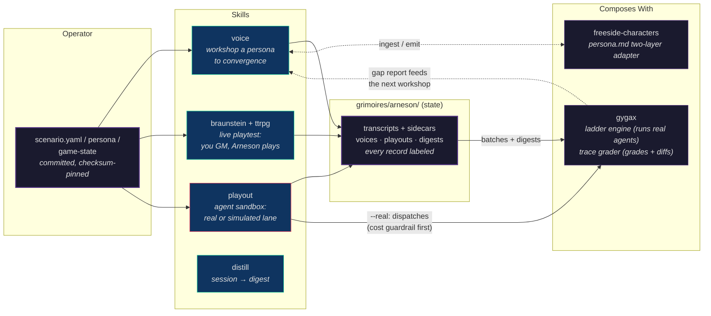
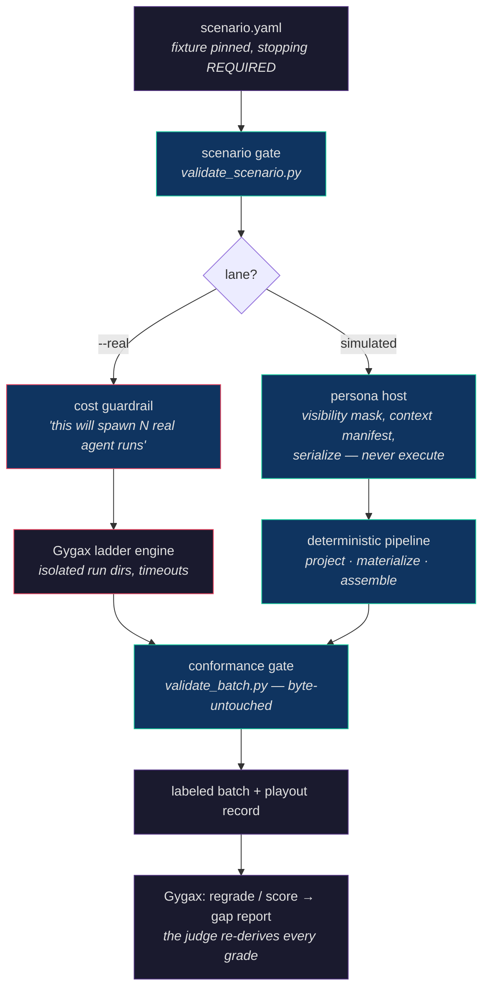
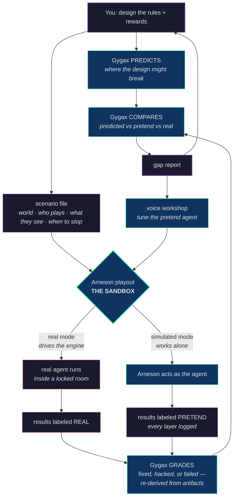

# construct-arneson

*"The practitioner directs. I perform. Every session leaves evidence."*

A creative persona engine — and, since v4.0, **the agent sandbox**. Arneson hosts personas grounded in structured state (characters, NPCs, archetypes, agents-under-incentive), plays them out, and emits structured data alongside every piece of prose. It is the house where behavior happens: simulated personas hosted directly, real agents driven through Gygax's engine inside locked rooms — every layer logged, every record labeled with how it was made.

Named for [Dave Arneson](https://en.wikipedia.org/wiki/Dave_Arneson) — co-creator of D&D, who brought improvisation, campaign structure, and collaborative fiction-within-rules to the hobby.

**Pairs with [construct-gygax](https://github.com/0xHoneyJar/construct-gygax).** Gygax forecasts where a system breaks. Arneson plays it out. Gygax measures the gap. Apart, each works on its own.



---

## What Arneson Does

Arneson generates fiction that is grounded in your structured state and instrumented for analysis. Every session produces two outputs:

- A **prose transcript** — the session itself, readable as a standalone document
- A **structured sidecar** — every decision, signal, and friction point tagged with state references

The practitioner always directs. Arneson always performs. The canonical mode is **iterative workshop** — converging a persona's voice across multiple sessions until it locks.

## Core Skills (Domain-Agnostic)

| Command | What it does |
|---------|-------------|
| `/voice {persona}` | Workshop a persona's voice iteratively until it converges. The canonical Arneson flow. |
| `/distill {session}` | Compress a session into a downstream-consumable digest shaped by the domain's consumer spec. |
| `/arneson` | Status dashboard — active sessions, personas, domains. |

## TTRPG Skills (Reference Vertical)

| Command | What it does |
|---------|-------------|
| `/braunstein` | **Flagship.** Live playtest. You GM, Arneson plays an archetype. Dialogue, dice, structured sidecar. |
| `/scene {seed}` | Generate a scene from game-state + seed. Grounded in your world. |
| `/narrate {outcome}` | When a mechanic fires, generate the fiction that flows from it. |
| `/improvise` | Inverse of `/braunstein` — Arneson GMs, you play a PC. |
| `/fragment {scope}` | Generate setting material — locations, factions, histories, items. |

## Agent-Systems Skills (The Sandbox, v4.0)

| Command | What it does |
|---------|-------------|
| `/playout --real` | Run a **real agent** (Claude, an Ollama-backed agentic CLI, anything) through an incentive scenario via Gygax's engine. Cost guardrail, locked rooms, byte-untouched batches. |
| `/playout` | The preview lane: Arneson **hosts the agent persona** itself. Same batch shape, honestly labeled `simulation-derived`. Works without Gygax. |

The pipeline through `/playout`:



Docs: [quickstart](domains/agent-systems/docs/quickstart.md) · [walls of the room](domains/agent-systems/docs/walls-of-the-room.md) · [importing your agent](domains/agent-systems/docs/importing-an-agent.md) · [the pairing workflow](domains/agent-systems/docs/pairing-workflow.md)

## Domain Extensibility

Arneson v2 is built around a **domain extension interface**. New creative domains (game writing, agent persona development, worldbuilding) can be added without touching core code:

```
domains/{your-domain}/
  schemas/       # Extend core schemas
  skills/        # Domain-specific skills
  resources/     # Domain resources
```

See `docs/EXTENSION-GUIDE.md` for the step-by-step guide. The TTRPG vertical (`domains/ttrpg/`) is the reference implementation.

## How to Use Arneson

There are two valid shapes. See `docs/CONSUMER-PATTERNS.md` for details.

1. **Workshop tool** (canonical) — invoke `/voice` iteratively across sessions until voice converges. This is what Arneson is designed for.
2. **Doctrine reference** (consumer) — serialize a locked voice-state into a static prompt. Valid only AFTER the workshop has converged.

## The Workbench Loop (with Gygax)

One loop: design → predict → play → grade → compare → improve → repeat. The same
diagram lives in both repos — if they ever differ, that's a bug.



Three rules keep it honest: the judge never produces the evidence it judges; every
file says how it was made; pretend is a preview, real is the proof. Full workflow:
[pairing-workflow](domains/agent-systems/docs/pairing-workflow.md).

## Architecture

```
schemas/core/             # Domain-agnostic schemas (voice-base, events-base, digest-base, safety)
protocols/                # Behavioral contracts all skills follow
skills/                   # Core skills (arneson, distill, voice)
domains/ttrpg/            # TTRPG reference vertical (schemas, skills, resources)
domains/character-voice/  # Persona authoring vertical (freeside adapter, ingest/emit scripts)
domains/agent-systems/    # The agent sandbox (playout, validators, vendored Gygax contract)
examples/test-domain/     # Extension story validation
grimoires/arneson/        # Runtime state (sessions, voices, playouts, digests)
```

## Quick Start

```
/braunstein --newcomer
```

Starts a live playtest session with the Newcomer archetype against your game-state.

## License

See LICENSE file.
