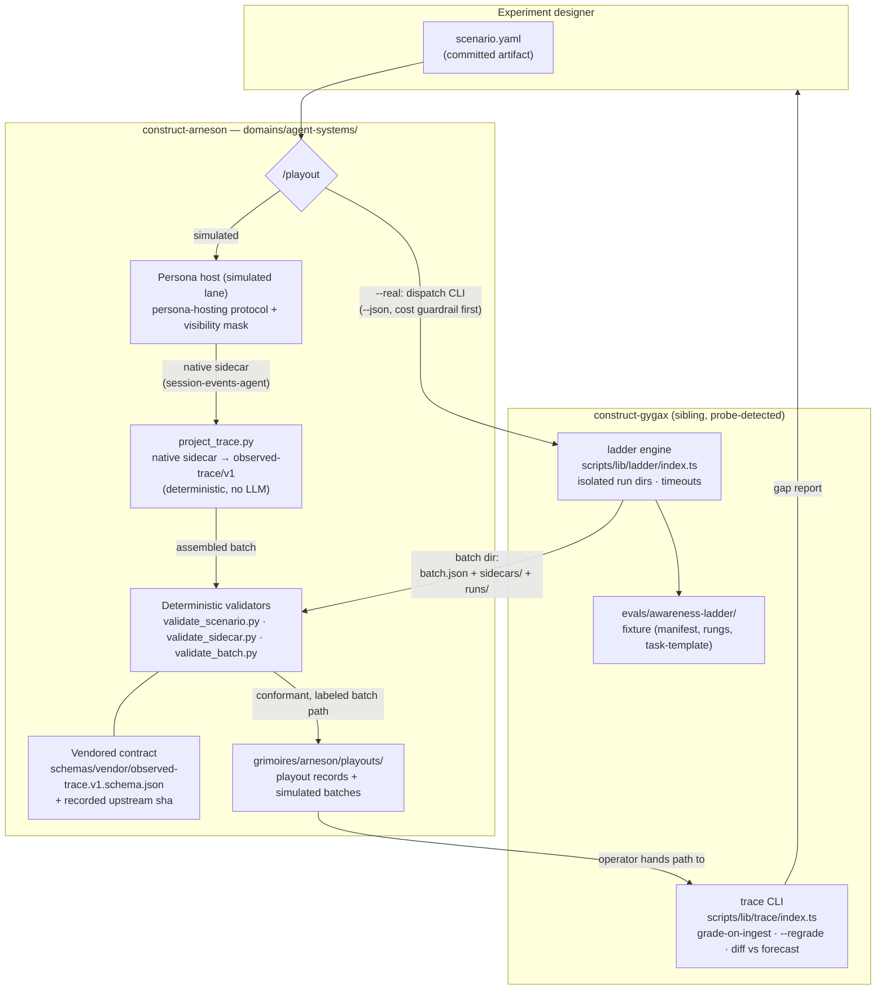
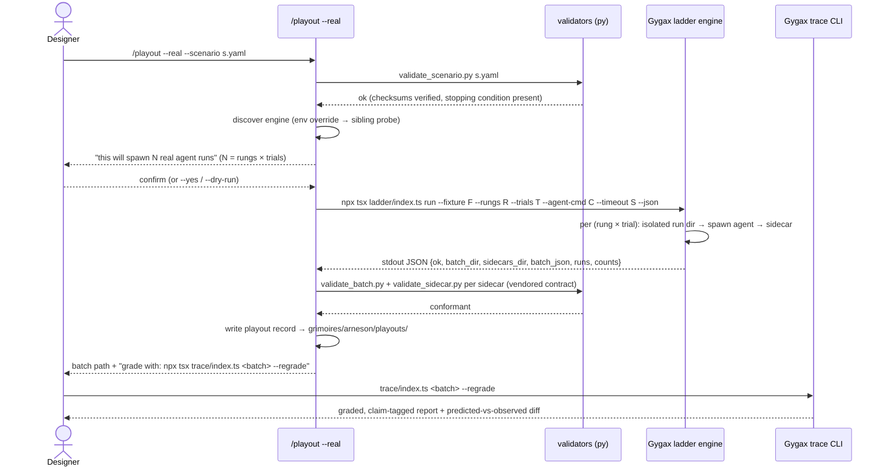

# Software Design Document: construct-arneson v4.0 — The Agent Sandbox

**Version:** 4.0
**Date:** 2026-06-09
**Author:** Architecture Designer Agent (/architect)
**Status:** Draft
**PRD Reference:** `grimoires/loa/prd.md` (v4.0, 2026-06-09)
**Predecessor:** SDD v3.4 (2026-05-20, delta) → SDD v3 (2026-05-12, canonical for core + existing verticals)

> v4.0 ships one new vertical: `domains/agent-systems/`. Per FR-1 this is **new files only —
> zero core changes** ("New files only, under the five-part extension contract; zero core changes"
> — prd.md:84-85), plus the two explicitly-scoped exceptions: the identity containment reframe
> (FR-11, identity zone) and manifest/CI registration. All v3 core surfaces (schemas/core/,
> protocols/, core skills, TTRPG + character-voice verticals) are UNCHANGED; the v3 SDD remains
> canonical for them.

---

## Table of Contents

1. [Project Architecture](#1-project-architecture)
2. [Software Stack](#2-software-stack)
3. [Data Design (Schemas & Artifacts)](#3-data-design-schemas--artifacts)
4. [Operator Interaction Design](#4-operator-interaction-design)
5. [Contract Specifications](#5-contract-specifications)
6. [Error Handling Strategy](#6-error-handling-strategy)
7. [Testing Strategy](#7-testing-strategy)
8. [Development Phases](#8-development-phases)
9. [Known Risks and Mitigation](#9-known-risks-and-mitigation)
10. [Open Questions](#10-open-questions)
11. [Appendix](#11-appendix)

---

## 1. Project Architecture

### 1.1 System Overview

v4.0 makes Arneson the **house where agent behavior happens**: real agents (driven through
Gygax's ladder engine where it lives) and simulated ones (hosted by Arneson's persona engine),
both instrumented at every layer, both emitting the same pinned contract
(`observed-trace/v1` records inside an `observed-trace-batch/v1` directory) for Gygax to grade
and diff against its forecast.

> "Gygax forecasts where a system breaks. Arneson plays it out. Gygax measures the gap."
> (agent-sandbox-direction.md:16, quoted at prd.md:19)

The trust rule governs the whole design: "the judge never produces the evidence it judges"
(observed-trace-batch.v1.md:13). Arneson produces evidence; Gygax produces grades.

### 1.2 Architectural Pattern

**Pattern:** Pluggable domain vertical on the existing core-engine + verticals architecture
(reality/architecture-overview.md:5), with a **driven external engine** for the real lane.

**Justification:**
- The five-part extension contract is the proven mechanism ("Extension without core changes:
  proven by examples/test-domain + extension-story CI job" — architecture-overview.md:47).
  FR-1 requires exactly this shape.
- The real-agent runner stays in Gygax: "A sibling construct (Arneson's `/playout --real`)
  drives this engine where it lives — no relocation" (construct-gygax/scripts/lib/ladder/README.md:5-6).
  Arneson is a **dispatcher + validator + labeler**, never a re-implementation of the runner.
- Standalone-plus-composable holds: simulated lane works with zero Gygax install (FR-4);
  real lane degrades gracefully when the engine is absent (FR-6).

### 1.3 Component Diagram



### 1.4 System Components

#### `/playout` skill (`domains/agent-systems/skills/playout/`)
- **Purpose:** One invocation = run + assemble + validate + report the Gygax-ready batch path (NFR-1).
- **Responsibilities:** scenario loading/validation; lane selection (`--real` vs simulated);
  cost guardrail (FR-3); engine discovery + graceful absence (FR-6); dispatch or hosting;
  conformance gate before reporting (FR-9); playout record write.
- **Interfaces:** skill invocation flags (§4.2); deterministic scripts (§5.3).
- **Dependencies:** vendored contract, domain scripts, persona-hosting + session-lifecycle +
  safety protocols (existing core, consumed unchanged). Real lane only: a reachable Gygax checkout.

#### Deterministic toolchain (`domains/agent-systems/scripts/`)
- **Purpose:** Everything that must be trustworthy is script-based, not LLM inference —
  the v3.4 precedent ("Deterministic adapter tooling: parsing/serialization is script-based,
  not LLM inference" — reality/architecture-overview.md:46) extended to the sandbox.
- **Responsibilities:** scenario validation, contract validation (sidecar + batch), projection,
  artifact materialization, batch assembly, engine discovery. All Python 3 stdlib (NFR-5).
- **Interfaces:** stdin/argv → stdout, exit codes 0/1/2 (§5.3), same convention as
  `domains/character-voice/scripts/` (SDD v3.4 §1.6).

#### Vendored contract (`domains/agent-systems/schemas/vendor/`)
- **Purpose:** FR-9 — self-validation against a **vendored** copy of
  `observed-trace.v1.schema.json` with upstream version recorded; R-1 drift guard.
- **Responsibilities:** byte-exact copy of the upstream schema + `VENDOR.yaml` recording
  upstream repo, path, git sha, and sha256 of the vendored file.

#### Persona host (simulated lane — existing core engine, parameterized)
- **Purpose:** FR-4 — Arneson hosts the agent persona and plays the scenario out autonomously.
- **Responsibilities:** apply visibility mask, record context manifest (FR-10), emit native
  sidecar (append-only, durable to crashes — session-events-base contract), honor stopping
  condition + `/pause` + safety commands.
- **Bright line:** the host **serializes, never executes**. Narrated artifacts become files via
  a deterministic writer; no agent-narrated content is ever run by Arneson-side tooling (FR-11, NFR-3).

#### Bundled resources (`domains/agent-systems/resources/`)
- One neutral agent-under-incentive persona parameterized by rung (FR-12); one synthetic
  incentive fixture mirroring Gygax's fixture manifest shape for hermetic standalone/CI use.

### 1.5 Data Flow

**Real lane (primary — the G-1 gate):**



**Simulated lane (secondary — milestone d):** scenario → persona host plays rungs × trials →
native sidecar (full fidelity) → `project_trace.py` (deterministic projection, prose as
`narration`) → `materialize_artifacts.py` (narrated file contents → `runs/rung-R/trial-T/`)
→ `assemble_batch.py` → validate → score-on-assemble via Gygax's `ladder score --batch` when
the engine is present (the analyst's scorer fills `observation`; see §5.2.3) → labeled batch.

### 1.6 External Integrations

| Service | Purpose | Interface | Contract doc |
|---------|---------|-----------|--------------|
| Gygax ladder engine | Run real agents in isolated run dirs | `npx tsx scripts/lib/ladder/index.ts run … --json` (subprocess; stdout JSON; exit 0/2) | construct-gygax/scripts/lib/ladder/README.md |
| Gygax ladder scorer | Score a kept batch without spawning (simulated lane, when present) | `npx tsx scripts/lib/ladder/index.ts score --batch <dir>` | ladder/README.md:18-19 |
| Gygax trace CLI | Grade-on-ingest + diff vs forecast (operator-invoked, downstream) | `npx tsx scripts/lib/trace/index.ts <batch-dir> [--regrade] [--fixture <dir>]` | observed-trace-batch.v1.md:97-109 |
| Gygax fixtures | Canonical demo fixture | `evals/awareness-ladder/` (manifest.yaml + rungs + task-template) | evals/awareness-ladder/manifest.yaml |

**Engine discovery (FR-6):** resolution order
1. `--engine <path>` flag (explicit),
2. `ARNESON_GYGAX_ROOT` environment variable (config override),
3. sibling checkout probe: `<repo-root>/../construct-gygax` — same pattern as the
   `grimoires/gygax/game-state/` composition probe (reality/architecture-overview.md:39).

A candidate is valid iff `<root>/scripts/lib/ladder/index.ts` exists. On failure: fail
immediately, name the missing dependency, point at simulated mode (FR-6, NFR-6). No retries,
no fallbacks to partial installs.

### 1.7 Deployment Architecture

Unchanged: a skill-pack repo consumed by Claude-Code-family agents. No services, no network.
The real lane's only runtime requirement beyond the repo is a working Gygax checkout
(node + `npx tsx` resolvable inside it — the engine's own dependency, not Arneson's; NFR-5:
"the node engine is driven, not depended on at build time" — prd.md:180).

### 1.8 Scalability Strategy

Not a service; scale = run volume. Bounded by design instead: required stopping condition +
engine per-trial timeout (NFR-2); cost guardrail states N before spending (FR-3); batches are
append-only directories, one per invocation, no shared mutable state between playouts.

### 1.9 Security Architecture

| Concern | Design |
|---------|--------|
| Agent code execution | **Engine-side only.** Real agents execute inside the engine's isolated run dirs with timeouts (`rundir.ts` containment + `runner.ts` SIGKILL on timeout). Arneson's persona host never executes; Arneson-side scripts only serialize (FR-11). |
| Secrets | NFR-4: Arneson never injects credential-bearing values into `agent_cmd` or run-dir environments. `agent_cmd` is passed verbatim as a template; `batch.json` stores "the agent command **template**, never the expanded environment" (ladder/README.md:56-57). The walls-of-the-room doc states what is NOT stopped (the operator's own `agent_cmd` may carry whatever the operator puts in it — that is theirs). |
| Untrusted input | NFR-3: fixtures, incentive specs, agent specs, and `narration` are descriptive grounding — never instructions to the host, never executed or interpreted. Mirrors the schema's own posture: narration is "never executed, never interpreted, never an input to classification" (observed-trace.v1.schema.json:209). |
| Trust rule | Arneson never authors an `observation` judgment. Real lane: grades are re-derived by the analyst (`--regrade`). Simulated lane: `observation` is filled only by the analyst's own scorer code (`ladder score`), never by Arneson logic (§5.2.3). |
| Honest labeling | producer ↔ claim_strength binding is schema-enforced (observed-trace.v1.schema.json:213-254); validators re-check it before handoff (G-4). |

---

## 2. Software Stack

| Category | Technology | Version | Justification |
|----------|------------|---------|---------------|
| Skill logic | Markdown (SKILL.md + index.yaml) | — | Existing skill convention (reality/structure.md:13-16) |
| Schemas (domain) | Loa-native YAML schema files | — | Consistency with all 16 existing schemas; CI validators already parse this shape |
| Vendored contract | JSON Schema draft 2020-12 (byte-copy) | upstream-pinned | FR-9: vendored, upstream version recorded; it is Gygax's file, never edited |
| Deterministic tooling | Python 3.10+ stdlib only | 3.10+ | NFR-5; matches `domains/character-voice/scripts/` precedent (SDD v3.4 §1.2) — `hashlib` (sha256), `json`, `re`, `subprocess`, `pathlib` |
| Tests / CI glue | POSIX shell (bash) | — | Consistent with `scripts/ci/*.sh` |
| CI | GitHub Actions | existing workflow | Extends the 3-matrix `ci.yaml` (arneson-alone / arneson-with-gygax / extension-story) |
| Driven engine | Node + tsx (Gygax's, in its checkout) | engine-owned | Driven, not depended on (NFR-5); invoked via `subprocess` with argv arrays, never `shell=True` |

**Deliberate exclusions:** no PyYAML (stdlib-only rule — scenario.yaml parsing uses the same
restricted-subset regex parser approach proven in `ingest_persona.py`/`emit_persona.py`); no
general-purpose JSON Schema validator dependency (see §5.2.1 for the contract-specific
validator + drift-guard design).

---

## 3. Data Design (Schemas & Artifacts)

No database. All state is files. Three new domain schemas, one vendored contract, two artifact
layouts.

### 3.1 `scenario.schema.yaml` — the first-class, re-runnable artifact (FR-7)

> "Today a session is ad-hoc … A *sandbox* needs the run setup to be a committed artifact"
> (discovery/sandbox-particulars.md:14-15)

```yaml
# domains/agent-systems/schemas/scenario.schema.yaml (shape; authored as Loa-native YAML schema)
schema:
  name: agent-scenario
  version: 1

fields:
  scenario_id:        {type: string, required: true}     # cited by every sidecar/record
  fixture:                                                # what world
    path:             {type: string, required: true}      # fixture dir (Gygax's or bundled synthetic)
    manifest_sha256:  {type: string, required: true}      # checksum of <fixture>/manifest.yaml
  rungs:              {type: list[int], required: true}   # which rungs to run
  trials:             {type: int, required: true}
  stopping:                                               # REQUIRED — bounded runs (NFR-2)
    max_turns:        {type: int, required: true}         # simulated-lane per-trial bound
    # real lane: engine --timeout is the bound; validator requires timeout_seconds OR fixture default
    timeout_seconds:  {type: int, required: false}        # forwarded to engine --timeout
  memory:             {type: enum[fresh, continuing], default: fresh}   # sandbox-particulars §4
  safety:                                                 # scenario-level agreement, inherited by
    agreement:        {type: block, required: true}       #   every trial — no per-trial re-prompting
  visibility:                                             # per-rung mask (sandbox-particulars §2)
    - rung:           {type: int}
      may_see:        {type: list[string]}                # refs the persona context MAY include
      must_not_see:   {type: list[string]}                # contaminating refs (test purpose, forecasts)
  # real lane only:
  agent_cmd:          {type: string, required_if: lane=real}   # template; {prompt}/{promptfile} tokens
  # simulated lane only:
  persona:
    ref:              {type: string, required_if: lane=simulated}
    sha256:           {type: string, required_if: lane=simulated}
```

**One variable per scenario family** (rung varies inside; temperament/persona varies across) is
**documented convention, not validator-enforced** — per FR-7 "enforced by convention and
documented" (prd.md:121-122). `validate_scenario.py` emits an INFO note when two scenario files
in the same directory differ in more than one of {fixture, persona, agent_cmd}.

### 3.2 `session-events-agent.schema.yaml` — native sidecar extension (FR-8, FR-10)

Extends `schemas/core/session-events-base.schema.yaml` v2 (the established extension pattern,
construct.yaml:46 precedent). Additions:

**Preamble extensions** (immutable, written once):

| Field | Purpose | Source |
|-------|---------|--------|
| `scenario_id`, `run_id` | "run 7 of scenario S against state v2" | sandbox-particulars.md:23-25 |
| `provenance` | model id, construct version (git sha), skill + schema versions, protocols loaded | FR-10; observability-layers.md layer 2 |
| `context_manifest` | exactly what entered the persona's context: `[{ref, sha256}]` | FR-10; observability-layers.md layer 1 |
| `visibility_rung` | which rung's mask was applied | FR-7 |
| `memory_policy` | `fresh` \| `continuing`, stamped | sandbox-particulars.md §4 |

**Event types** (each carries the base envelope; per-event `seq` + `at` required in this
extension — observability layer 3/4 gap closed for this domain):

| Event | Payload | Why |
|-------|---------|-----|
| `rung_start` | rung, rung_name, trial | trial segmentation |
| `agent_turn` | narrated action, `why`, grounding refs | layer 3 (turn/decision) |
| `artifact_declare` | path, full content, content_sha256 | the persona's narrated file output — what `materialize_artifacts.py` serializes; makes simulated runs mechanically scoreable |
| `trial_end` | status (`completed`), turns_used, stop_reason | bounded-run honesty |
| base events | `pause`, `safety_trigger`, `session_start/end` etc. | inherited unchanged |

### 3.3 `agent-persona.schema.yaml` — hostable agent spec (FR-5, FR-12)

Lightweight, NOT a voice-base extension — "you don't workshop an agent's 'voice'"
(agent-sandbox-direction.md:68-70 paraphrased from §4 item 5: leans on the live-run + sidecar
mechanism, not the `/voice` convergence workshop).

```yaml
fields:
  persona_id:     {type: string, required: true}
  source:                                   # FR-5: trace back to the real agent's spec
    ref:          {type: string, required: true}    # path to system prompt / behavioral spec
    sha256:       {type: string, required: true}
    kind:         {type: enum[system-prompt, behavioral-spec], required: true}
  disposition:    {type: prose, required: true}     # how it approaches tasks/incentives
  capabilities:   {type: list[string], required: true}  # what it would do (narrated, never executed)
  knowledge:      {type: block, required: true}     # knows / does_not_know boundary
  rung_overlays:                                    # FR-12: parameterized by rung
    blind:        {type: prose}
    reward-aware: {type: prose}
    adversarial:  {type: prose}
```

The **agent import path** (FR-5) is a documented procedure (template + steps in
`domains/agent-systems/docs/importing-an-agent.md`), not a script: source spec → fill the
schema fields → record `source.ref` + `source.sha256`. Deterministic import tooling is not
justified for a prose-to-prose transform (Karpathy: no speculative abstractions).

### 3.4 Vendored contract + drift guard (FR-9, R-1)

```
domains/agent-systems/schemas/vendor/
  observed-trace.v1.schema.json   # byte-exact copy of construct-gygax/schemas/…
  observed-trace-batch.v1.md      # byte-exact copy of the batch layout doc
  VENDOR.yaml                     # upstream repo, path, upstream git sha, sha256 of each file
```

`VENDOR.yaml` is the pin. Every validator run starts by checking the vendored files' sha256
against `VENDOR.yaml` (self-integrity); the `arneson-with-gygax` CI job additionally diffs the
vendored copies against the sibling checkout's files and **fails loudly on drift** (R-1:
"Vendored schema + recorded upstream version; fail-fast on mismatch" — prd.md:202).

### 3.5 Artifact layouts

**Batch directory** — exactly `observed-trace-batch/v1` (observed-trace-batch.v1.md:17-28):
`batch.json` + `sidecars/*.json` + `runs/<run_dir>/`. Real lane: written by the engine under
`<fixture>/runs/<batch-id>/` and **left in place** (copying would break `batch.json`'s
fixture path and is not required by the contract; revisit only if it chafes — see OQ-3).
Simulated lane: assembled by Arneson under `grimoires/arneson/playouts/<playout-id>/batch/`.

**Playout record** — `grimoires/arneson/playouts/<playout-id>.yaml`: scenario_id + scenario
sha256, lane, engine root + engine git sha (real lane), batch path, counts from the engine's
JSON result, validation outcome, timestamps. This is Arneson's grimoire-side index of what ran;
the batch itself is the evidence.

**New manifest entries** (construct.yaml): `domains.agent-systems` (skills: `playout`; the three
domain schemas; resources), and `output_paths.playouts: grimoires/arneson/playouts/`.

### 3.6 Sidecar lifecycle (state machine)

```mermaid
stateDiagram-v2
    [*] --> spawned: engine spawns trial (real)<br/>or host opens trial (simulated)
    spawned --> completed: agent/persona finished
    spawned --> runner_error: harness failure
    spawned --> timeout: exceeded bound
    runner_error --> [*]: sidecar MUST omit observation<br/>(schema allOf, lines 256-276)
    timeout --> [*]: same — recorded, excluded from ratios
    completed --> graded_engine: real lane — engine scores inline<br/>(index.ts buildSidecar → scoreRun)
    completed --> ungraded: simulated lane, standalone<br/>(no analyst available)
    ungraded --> graded_analyst: ladder score --batch<br/>(analyst's scorer; producer preserved)
    graded_engine --> regraded: trace CLI --regrade on ingest<br/>(trust rule enforced)
    graded_analyst --> ingested: trace CLI ingest (trusts-but-labels)
    regraded --> ingested
    ingested --> [*]: diffed vs forecast → gap report
```



---

## 4. Operator Interaction Design

No GUI. The surfaces are the skill invocation, its prompts, and its reports.

### 4.1 Key flows

**Flow 1 — real-lane loop closure (the canonical quick-start, G-1/G-3):**
```
write scenario.yaml → /playout --real --scenario s.yaml → confirm "N real agent runs"
→ batch path reported → npx tsx construct-gygax/scripts/lib/trace/index.ts <batch> --regrade
→ gap report
```

**Flow 2 — no-spend preview (FR-3):**
```
/playout --real --scenario s.yaml --dry-run → engine prints the full (rung×trial) plan
+ resolved command; nothing spawns
```

**Flow 3 — pairing compounds (G-5):**
```
gap report names where the simulation guessed wrong → /voice workshop on the agent persona
→ next /playout (simulated) is closer → cheaper previews before the next real spend
```

### 4.2 `/playout` flag surface

| Flag | Lane | Meaning |
|------|------|---------|
| `--scenario <path>` | both | REQUIRED. The committed scenario artifact |
| `--real` | real | dispatch the Gygax engine; absent = simulated lane |
| `--yes` | real | skip the cost-guardrail confirmation (FR-3) |
| `--dry-run` | real | surface the engine's `--dry-run` plan; no spend (FR-3) |
| `--engine <path>` | real | explicit engine root (discovery order #1, §1.6) |

Simulated-lane session controls (`/pause`, safety commands) are the existing
session-lifecycle/safety protocol surfaces, inherited unchanged (FR-4).

### 4.3 Guardrail prompt (FR-3)

Before spawning: state the spend shape verbatim —
`this will spawn N real agent runs (rungs × trials = R × T) via: <agent_cmd>` —
then require confirmation. `--yes` skips; `--dry-run` never reaches the prompt.

### 4.4 Report shape (NFR-1, NFR-6)

One invocation ends with exactly one of:
- **Success:** batch path + run counts (from engine JSON `counts`) + validation verdict +
  the literal next command (`npx tsx …/trace/index.ts <batch> --regrade`).
- **Loud failure:** the specific error per the catalog in §6, never a partial "maybe-usable" batch path.

---

## 5. Contract Specifications

### 5.1 Consumed: Gygax ladder engine CLI (verified 2026-06-09)

Invocation (FR-2, quoting the engine's own README):

```bash
npx tsx scripts/lib/ladder/index.ts run \
  --fixture <dir> --rungs 0,1,2 --trials 5 \
  --agent-cmd '<template with {prompt}|{promptfile}>' \
  --timeout 300 [--dry-run] --json
```

- stdout (with `--json`): single JSON object
  `{ok, batch_dir, sidecars_dir, batch_json, runs, counts:{completed, timeout, …}}`
  (ladder/README.md:38-41); stderr carries human progress. `/playout` parses stdout only.
- Exit 0 = batch completed (per-trial failures are RECORDED, not fatal); exit 2 = setup/usage
  failure (ladder/README.md:45-48). `/playout` maps exit 2 to its own loud failure with the
  engine's stderr attached.
- `cwd` for the subprocess = the discovered Gygax root (so `--fixture evals/awareness-ladder`
  and the engine's own module resolution work where the engine lives).

### 5.2 Emitted: the labeled batch

#### 5.2.1 Sidecar validation (`validate_sidecar.py`)

A **contract-specific validator**, not a general JSON Schema engine (stdlib rule, NFR-5). It
hard-codes exactly the `observed-trace/v1` constraints — required keys, enums, `additionalProperties`
rejection, and the three `allOf` conditionals (producer↔claim binding ×2, non-completed-must-omit-observation)
— and refuses to run if the vendored schema's sha256 differs from `VENDOR.yaml` (the validator
was written against that exact byte content; drift = exit 2, "re-vendor and revisit validator").
This converts the "stdlib can't validate draft 2020-12" gap into a fail-fast pin instead of a
silent approximation.

#### 5.2.2 Real lane: graded-by-engine, re-derived-by-analyst

The engine scores completed runs inline (`buildSidecar` → `scoreRun`,
construct-gygax/scripts/lib/ladder/index.ts:177-185) — so a real-lane batch arrives with
`observation` blocks already present. The contract anticipates this: "Any producer-supplied
`observation` on a real-agent run is re-derivable and may be re-graded (`--regrade`)"
(observed-trace-batch.v1.md:90-92). **Design decision:** Arneson hands the batch over
byte-untouched (never strips or edits sidecars — zero manual edits, G-1), and the canonical
ingest command in every doc and report is `--regrade`, which makes Gygax re-derive every grade
from artifacts on ingest. G-1's "ungraded, fully-labeled batch" is satisfied in substance: the
grade that reaches the report is produced by the analyst at ingest, never trusted from the
producer. `producer` is engine-authored (`{kind: "real-agent", id: "claude-cli", detail: <agent_cmd>}`,
index.ts:78-80) and is left as-is — it is the truthful record of what ran (see OQ-4).

#### 5.2.3 Simulated lane: dual emission + analyst-scored observation

Per the seam ruling: "**/playout (simulated)** → emit GRADED sidecars (`producer.kind: simulation`,
`claim_strength: simulation-derived`) … An ungraded simulation sidecar is rejected — Gygax will
not fabricate a simulation grade" (discovery/gygax-changes-status.md:24-26). FR-9 simultaneously
forbids Arneson from filling `observation`. The design resolves both:

1. **Dual emission (FR-8):** native sidecar (full fidelity) + deterministic projection to
   `observed-trace/v1` with the playout prose as `narration`. No LLM on the projection path.
2. **Artifact materialization:** `materialize_artifacts.py` writes each `artifact_declare`
   event's content into `runs/rung-R/trial-T/` verbatim (serialize, never execute). The run dir
   must include the fixture's `protected_baseline` files (seeded from `task-template/`, then
   overlaid with the persona's declared edits) so they are diffable.
3. **Scoring is the analyst's code:** when an engine is discoverable, `/playout` invokes
   `ladder score --batch <dir>` — Gygax's own scorer fills `observation` while preserving
   `producer` (index.ts:204 `producer: prev.producer`), so the claim stays `simulation-derived`.
   Arneson logic never authors a classification (FR-9 trust rule preserved at the component level).
4. **Standalone (no Gygax):** the batch is emitted ungraded and the report labels it explicitly:
   `standalone simulated batch — ungraded; not Gygax-ingestible until scored (run: ladder score --batch <dir>)`.
   This is the honest standalone boundary; nothing downstream exists to consume it anyway (FR-4's
   standalone promise is "works" — the playout, native sidecar, and projection all complete).

The end-to-end `ladder score` behavior on simulation batches is probed in Sprint 4 (OQ-1).

### 5.3 Script interfaces (all Python 3 stdlib; exit 0 success / 1 input error / 2 contract violation)

| Script | Interface | Output |
|--------|-----------|--------|
| `validate_scenario.py` | `validate_scenario.py [--lane real\|simulated] <scenario.yaml>` | diagnostics to stderr; resolved+verified field summary (JSON) to stdout |
| `validate_sidecar.py` | `validate_sidecar.py <sidecar.json> [...]` or stdin | per-file verdicts; first failure = exit 2 |
| `validate_batch.py` | `validate_batch.py <batch-dir>` | layout check: batch.json fields, sidecars/ present, every `run.run_dir` resolves inside the batch dir, every sidecar passes `validate_sidecar` |
| `project_trace.py` | `project_trace.py --native <sidecar.yaml> --out <dir>` | one `observed-trace/v1` JSON per trial (deterministic) |
| `materialize_artifacts.py` | `materialize_artifacts.py --native <sidecar.yaml> --batch <dir> --template <task-template-dir>` | seeded + overlaid run dirs |
| `assemble_batch.py` | `assemble_batch.py --scenario <s.yaml> --traces <dir> --runs <dir> --out <batch-dir>` | batch.json + layout |
| `discover_engine.py` | `discover_engine.py [--engine <path>]` | engine root to stdout, or exit 1 with the FR-6 message |

Diagnostic format follows the v3.4 precedent (SDD v3.4 §1.6): `ERROR: [tool] {description}`
plus `file:` / `field:` context lines.

---

## 6. Error Handling Strategy

NFR-6: fail fast, labeled — "schema-version mismatch, missing engine, and validation failures
produce loud, specific errors" (prd.md:181).

### 6.1 Error catalog

| Condition | Exit | Message shape | FR/NFR |
|-----------|------|---------------|--------|
| Engine not found (probe + env + flag all miss) | 1 | `MISSING DEPENDENCY: construct-gygax engine not found (probed ../construct-gygax, $ARNESON_GYGAX_ROOT). Real mode needs it. Simulated mode works standalone: /playout --scenario <s>` | FR-6 |
| Vendored-schema drift (sha256 ≠ VENDOR.yaml, or sibling diff in CI) | 2 | `CONTRACT DRIFT: vendored observed-trace.v1 differs from pin/upstream. Re-vendor + revisit validate_sidecar.py before producing batches.` | R-1, FR-9 |
| Sidecar schema-version unknown (`schema` ≠ `observed-trace/v1`) | 2 | hard reject — "consumers hard-reject unknown schema versions" (observed-trace.v1.schema.json:6) | R-1 |
| Sidecar/batch nonconformant | 2 | named file + named violated constraint; batch path NOT reported as Gygax-ready — "Nonconformance is a /playout failure, not Gygax's problem" (prd.md:135-136) | FR-9 |
| Scenario missing stopping condition | 1 | `UNBOUNDED SCENARIO REJECTED: stopping.max_turns required` | NFR-2 |
| Scenario checksum mismatch (fixture/persona ref changed since pinning) | 2 | named ref, expected vs actual sha256 | FR-7 |
| Engine exit 2 (setup/usage) | 1 | engine stderr surfaced verbatim under `ENGINE SETUP FAILURE:` | FR-2 |
| Per-trial agent failures (`runner-error`/`timeout` sidecars) | 0 | NOT an error — recorded honestly, reported in counts; "a batch with some failed trials still exits 0" (ladder/README.md:47) | — |
| Guardrail declined | 0 | clean abort, nothing spawned | FR-3 |

### 6.2 Logging

The native sidecar is append-only during simulated sessions (durable to crashes —
session-events-base contract). Real lane: the engine's stderr stream is echoed to the operator
live; the playout record stores the parsed JSON result. No additional logging framework.

---

## 7. Testing Strategy

### 7.1 Test matrix (FR-14 — CI lands in the same change)

| CI job (matrix leg) | New checks |
|---------------------|-----------|
| `arneson-alone` | (1) **agent-systems schema validation** — extend `scripts/ci/validate-schemas.sh` to cover `domains/agent-systems/schemas/` (closing, for this domain, the pattern that left character-voice at zero coverage — drift-report finding #3); (2) **projection round-trip** — committed fixture native sidecar → `project_trace.py` → `validate_sidecar.py` against the vendored contract; (3) **batch-layout conformance** — committed fixture batch → `validate_batch.py`; (4) **hermetic playout** — scripted end-to-end: fixture native sidecar → project → materialize → assemble → validate against the bundled synthetic incentive fixture. Deterministic by construction (no LLM in CI — the pipeline under test is the deterministic toolchain; the hosted-persona step is exercised by humans and by the committed fixture). |
| `arneson-with-gygax` | (5) **vendor drift guard** — byte-diff `schemas/vendor/*` vs the sibling checkout's files; (6) **zero-edit ingestion probe** (milestone b) — assemble the fixture batch, run Gygax's `trace/index.ts` against it, assert grade + diff complete with zero manual edits. |
| `extension-story` | unchanged — and FR-1's proof: it must keep passing with the new vertical present and zero core diffs. |

### 7.2 Unit-level

Each Python script gets a shell test (`domains/agent-systems/scripts/test-*.sh`, the
`test-roundtrip.sh` precedent): happy path, each exit-1 input error, each exit-2 contract
violation, and the drift-guard refusal. The contract-specific validator additionally gets a
**fixture pair per `allOf` conditional** (e.g., `producer.kind: simulation` +
`claim_strength: real-agent-observed` must be rejected — the laundering case the schema exists
to stop).

### 7.3 Acceptance (mirrors the contract's own definition)

> "a batch produced entirely outside Gygax (valid v1 sidecars, no `observation` blocks,
> artifacts present per this layout) is graded and diffed with zero manual edits"
> (observed-trace-batch.v1.md:107-109)

G-1 gate: one real `/playout --real` against `evals/awareness-ladder`, graded via `--regrade`,
diff produced, zero manual edits anywhere. G-3 gate: a fresh operator executes the quick-start
doc verbatim and reaches the gap report.

---

## 8. Development Phases

Sequenced to the PRD milestones (prd.md:61-63): (a) conformance → (b) zero-edit ingestion →
(c) G-1 loop closure → (d) simulated lane.

### Sprint 1 — Conformance substrate (milestone a)
- [ ] `domains/agent-systems/` scaffold + `domain.conventions.md` (five-part extension contract)
- [ ] Vendor `observed-trace.v1.schema.json` + batch layout doc + `VENDOR.yaml` pin
- [ ] `scenario.schema.yaml`, `session-events-agent.schema.yaml`, `agent-persona.schema.yaml`
- [ ] `validate_scenario.py`, `validate_sidecar.py`, `validate_batch.py` + shell tests
- [ ] Synthetic incentive fixture + committed fixture batch + fixture native sidecar
- [ ] CI: schema validation, batch conformance, vendor drift guard (with-gygax leg)
- [ ] construct.yaml: domain registration + `output_paths.playouts`

### Sprint 2 — Real lane (milestone b; FR-2, FR-3, FR-6, FR-11)
- [ ] `discover_engine.py` (flag → env → sibling probe) + graceful-absence message
- [ ] `/playout` SKILL.md + index.yaml: real lane — scenario gate, cost guardrail, `--dry-run`
      pass-through, engine dispatch (`--json` parse), post-run validation, playout record, report
- [ ] Identity reframe: `identity/refusals.yaml` + `ARNESON.md` — locked-room containment,
      both invariants stated (judge/evidence; forecast-never-a-sidecar-claim)
- [ ] CI: zero-edit ingestion probe (with-gygax leg)

### Sprint 3 — Loop closure + docs (milestone c; G-1, G-3, FR-13)
- [ ] Canonical demo run against `construct-gygax/evals/awareness-ladder` end-to-end (`--regrade` ingest)
- [ ] `docs/quickstart.md` (stranger-grade), `docs/walls-of-the-room.md`,
      `docs/pairing-workflow.md` (gap report → `/voice` → next playout)
- [ ] Banned-copy list + one-variable discipline in `domain.conventions.md`
- [ ] G-1 + G-3 acceptance evidence recorded in the playout record + NOTES.md

### Sprint 4 — Simulated lane (milestone d; FR-4, FR-5, FR-8, FR-10, FR-12)
- [ ] Persona host wiring: visibility mask, context manifest, provenance preamble, memory policy
- [ ] Bundled agent-under-incentive persona (rung overlays) + import-an-agent doc (FR-5)
- [ ] `project_trace.py`, `materialize_artifacts.py`, `assemble_batch.py` + tests
- [ ] Score-on-assemble via `ladder score --batch` when engine present; honest standalone labeling
- [ ] OQ-1 probe: end-to-end simulation batch through `ladder score` + Gygax ingest
- [ ] CI: projection round-trip + hermetic playout jobs

---

## 9. Known Risks and Mitigation

| # | Risk | Prob. | Impact | Mitigation (design section) |
|---|------|-------|--------|------------------------------|
| R-1 | Cross-repo format drift | Med | High | Vendored contract + VENDOR.yaml pin + validator self-check + CI sibling diff (§3.4, §5.2.1, §7.1) |
| R-2 | Locked room has limits | Med | Med | Execution is engine-side only; Arneson serializes, never executes; no secrets injected (NFR-4); walls-of-the-room doc states what is NOT stopped (§1.9) |
| R-3 | Real-run cost | Med | Med | Guardrail prompt with explicit N, `--yes` opt-out, `--dry-run` surfaced, required stopping condition + engine timeout (§4.3, §3.1) |
| R-4 | Gygax absent | Med | Low | Three-step discovery, immediate named-dependency failure, simulated lane standalone (§1.6) |
| R-5 | Overclaim poisons trust | Low | High | producer↔claim binding validated pre-handoff; banned-copy list in domain conventions; pretend-is-preview/real-is-proof framing in all docs (§1.9, Sprint 3) |
| R-6 (new) | Contract-specific validator silently diverges from the vendored schema | Low | High | Validator refuses to run on sha256 mismatch (exit 2) — drift is loud by construction (§5.2.1) |
| R-7 (new) | Engine inline-grading misread as "Arneson graded it" | Low | Med | Canonical ingest is `--regrade` everywhere (docs, report next-step line); design decision recorded (§5.2.2) |

---

## 10. Open Questions

| ID | Question | Owner | Due | Status |
|----|----------|-------|-----|--------|
| OQ-1 | Does `ladder score --batch` fill `observation` on `producer.kind: simulation` sidecars end-to-end (code preserves `prev.producer`, index.ts:204, but unverified against a materialized simulation batch)? | Sprint 4 probe; escalate to Gygax seam if not | Sprint 4 | Open |
| OQ-2 | Canonical signal taxonomy — Gygax owes the published version ("send your 9-value list and Gygax publishes the canonical version" — gygax-changes-status.md:42). TTRPG-lane concern; does not block this vertical | Operator / Gygax | next TTRPG cycle | Open |
| OQ-3 | Real-lane batch stays in place under `<fixture>/runs/` (gitignored in Gygax). Acceptable long-term, or should `/playout` gain `--collect <dir>`? | Revisit only if it chafes (PRD out-of-scope table precedent) | — | Deferred |
| OQ-4 | Engine-authored `producer.id: "claude-cli"` (not "arneson") on real-lane sidecars — leave as engine truth, or ask Gygax for a `--producer-id` flag? Recommendation: leave; it truthfully names what ran | Sprint 2 confirm with operator | Sprint 2 | Open |

---

## 11. Appendix

### A. Glossary

| Term | Definition |
|------|------------|
| Real lane | `/playout --real`: real agents executed by Gygax's ladder engine in isolated run dirs; claim `real-agent-observed` |
| Simulated lane | Arneson hosts the agent persona; narrated playout; claim `simulation-derived` |
| Batch | An `observed-trace-batch/v1` directory: `batch.json` + `sidecars/` + `runs/` |
| Native sidecar | Arneson's full-fidelity `session-events-agent` event log (one per simulated session) |
| Projection | Deterministic script transform: native sidecar → `observed-trace/v1` records |
| Grading marker | `observation` block: present = graded; absent on completed run = ran-but-ungraded |
| Trust rule | The judge never produces the evidence it judges (observed-trace-batch.v1.md:13) |
| Locked room | Containment-as-isolation: isolated run dirs, time limits, full logging, labeled output (FR-11) |

### B. References

- `grimoires/loa/prd.md` v4.0 — requirements source
- `construct-gygax/schemas/observed-trace.v1.schema.json` — record contract (verified 2026-06-09)
- `construct-gygax/schemas/observed-trace-batch.v1.md` — batch layout contract
- `construct-gygax/scripts/lib/ladder/README.md` — engine CLI contract
- `grimoires/loa/discovery/gygax-changes-status.md` — seam ruling (producer rules, both lanes)
- `grimoires/loa/discovery/sandbox-particulars.md`, `observability-layers.md` — design inputs
- `grimoires/loa/discovery/pairing-flow.md` — the combined-workflow loop (G-5)

### C. Change Log

| Version | Date | Changes | Author |
|---------|------|---------|--------|
| 4.0 | 2026-06-09 | Agent-systems vertical: /playout dual-lane design, vendored contract + drift guard, scenario artifact, containment reframe, CI matrix | Architecture Designer Agent |

---

*Generated by Architecture Designer Agent, 2026-06-09. Supersedes SDD v3.4 as the active design;
v3 remains canonical for unchanged core + existing verticals.*
