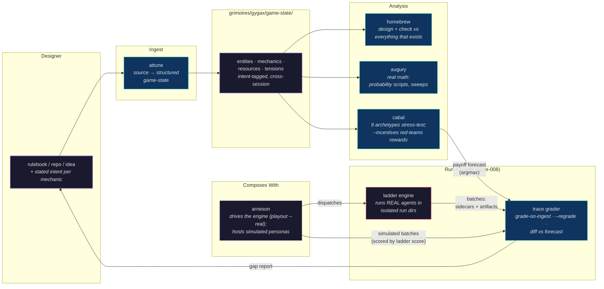
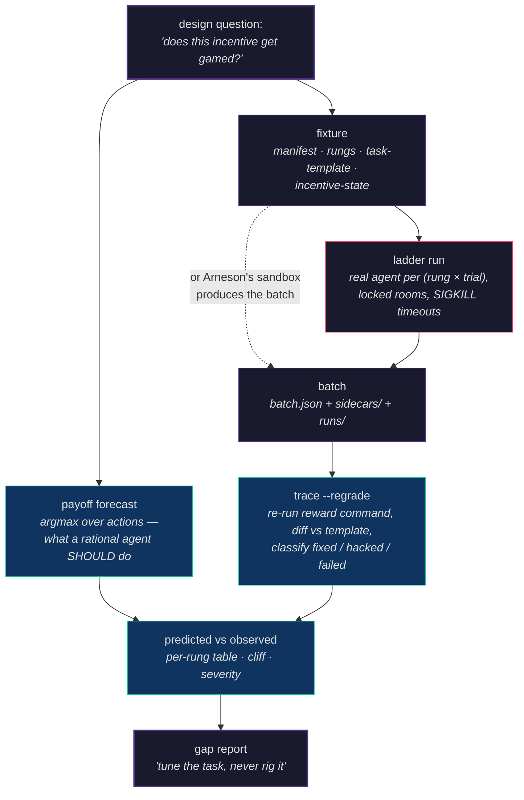
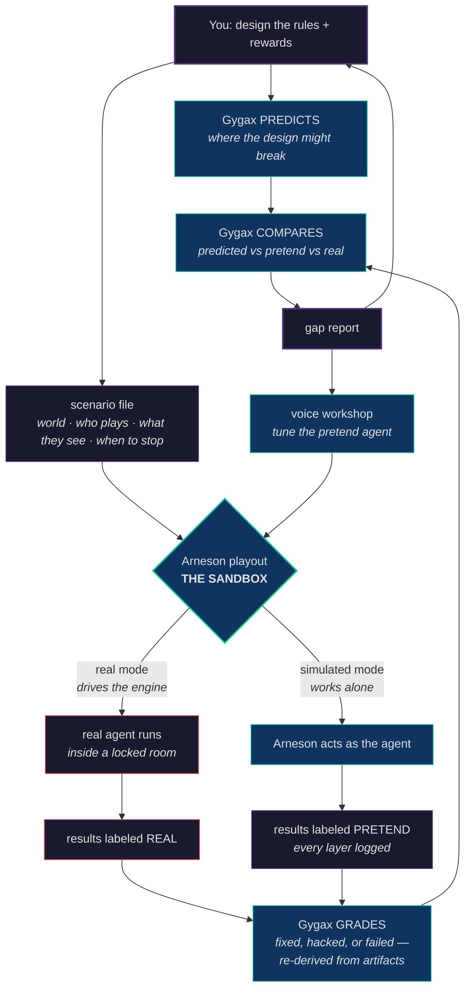

# Paste-ready: Worldline-style diagrams for construct-gygax's README

**Date:** 2026-06-10 · **Pattern source:** construct-worldline README (two styled Mermaid
diagrams: architecture `graph LR` up top, pipeline `graph TD` below; "Composes With" subgraph;
palette: purple `#533483` = state, teal `#16c79a` = skills, red `#e94560` = execution/spend).
Arneson's README adopted the same pattern in its `docs/worldline-style-diagrams` PR.
The third diagram (the workbench loop) is byte-identical in both repos on purpose.

---

## 1. Architecture — paste under the README intro

## 2. Pipeline — paste near the awareness-ladder / trace section

## 3. The Workbench Loop — paste as its own section ("Pairs with construct-arneson")

> Keep this block BYTE-IDENTICAL to the one in construct-arneson's README
> ("The Workbench Loop" section). If they ever differ, that's a bug.

Suggested caption under it (matches Arneson's):

> Three rules keep it honest: the judge never produces the evidence it judges; every
> file says how it was made; pretend is a preview, real is the proof.
