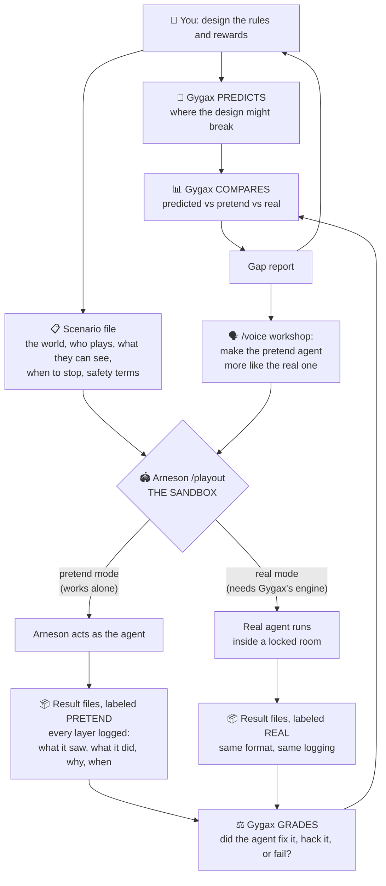

# How Gygax and Arneson Work Together

**Date:** 2026-06-09 · One loop: design → predict → play → grade → compare → improve → repeat.

## The three rules that keep it honest

1. **Gygax never produces the evidence it grades** — Arneson runs, Gygax judges.
2. **Every file says how it was made** — pretend and real can never be confused.
3. **Pretend is a preview, real is the proof** — the compare step is where credibility lives.

## Why the loop compounds

Each pass around the loop makes both constructs better: the gap report shows where the
pretend agent guessed wrong, the workshop fixes it, and the next preview is cheaper and
closer to reality.
