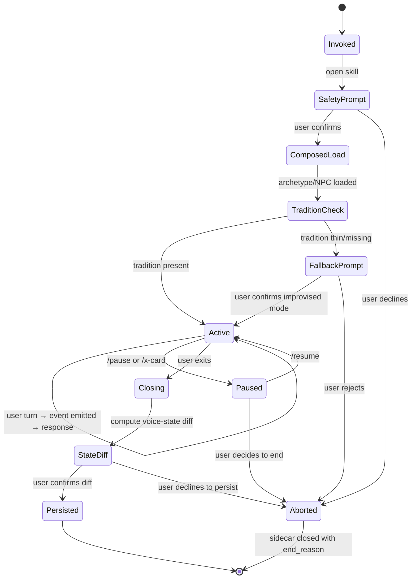

# Software Design Document: construct-arneson v1

**Version:** 1.0
**Date:** 2026-04-13
**Author:** Architecture Designer Agent (/architect)
**Status:** Draft
**PRD Reference:** `grimoires/loa/prd.md`

> The PRD defines what Arneson must do. This document defines how.
> Every architectural decision traces back to a specific PRD requirement (FR-N, G-N, R-N)
> or to NOTES.md decision-log entries from /plan-and-analyze.

---

## Table of Contents

1. [Project Architecture](#1-project-architecture)
2. [Software Stack](#2-software-stack)
3. [Filesystem Schema Design](#3-filesystem-schema-design)
4. [Interaction Design](#4-interaction-design)
5. [Inter-Skill Contracts](#5-inter-skill-contracts)
6. [Error Handling Strategy](#6-error-handling-strategy)
7. [Testing Strategy](#7-testing-strategy)
8. [Development Phases](#8-development-phases)
9. [Known Risks and Architectural Mitigations](#9-known-risks-and-architectural-mitigations)
10. [Open Questions](#10-open-questions)
11. [Appendix](#11-appendix)

---

## 1. Project Architecture

### 1.1 System Overview

construct-arneson is a **Loa-framework skill-pack construct** (schema_version 3) for tabletop-RPG designers. It has no traditional backend, frontend, or database. The "runtime" is the Claude Code + Loa harness. The "database" is the user's filesystem under `grimoires/arneson/`. The "UI" is the terminal interaction mediated by eight skill entry points. State is YAML and markdown.

Arneson is the **fiction-generating and fiction-instrumenting half** of a design-and-play workbench. Its sibling [Gygax v3](https://github.com/0xHoneyJar/construct-gygax) is the structural-analysis half. The constructs compose bidirectionally through shared-filesystem handoffs — but per the standalone-plus-composable design principle (NOTES.md decision log, 2026-04-13), each works independently.

### 1.2 Architectural Pattern

**Pattern:** Filesystem-first skill graph with shared-state grimoire.

**Justification:** This is not microservices vs monolith — Arneson has no services. It is a collection of Skills that share state through append-only session files, atomic YAML state writes, and cross-skill file handoffs. The pattern is forced by the Loa framework: every user-facing capability is a `SKILL.md` under a `skills/` directory, and every durable state is a file under `grimoires/`. Within this constraint, the architectural choice is **how skills share data** — we choose **file-handoff with structured schemas**, not in-memory inter-skill calls, because sessions must survive interruption and be inspectable by humans and by Gygax analyzers.

**Alternative considered and rejected**: in-memory shared state via a runtime service. Rejected because (a) Loa does not provide such a service, (b) would violate grimoire-as-deliverable principle (issue-3:135), (c) would couple skills tightly enough to break standalone operation.

### 1.3 Component Diagram

```mermaid
graph TB
    subgraph "construct-arneson"
        direction TB
        Manifest[construct.yaml]
        Identity[identity/<br/>ARNESON.md<br/>persona.yaml<br/>expertise.yaml<br/>refusals.yaml]
        Schemas[schemas/<br/>experiential_intent<br/>voice-base + extensions<br/>session-events<br/>digest]
        Fallback[resources/archetypes-fallback/<br/>9 archetype YAMLs<br/>used when Gygax absent]
        Fixture[examples/synthetic-fixture/<br/>neutral reference game]

        subgraph "Skills Layer"
            direction LR
            Braunstein["/braunstein<br/>(session)"]
            Voice["/voice<br/>(session)"]
            Scene["/scene<br/>(one-shot)"]
            Narrate["/narrate<br/>(one-shot, primitive)"]
            Improvise["/improvise<br/>(session)"]
            Arneson["/arneson<br/>(status)"]
            Fragment["/fragment<br/>(one-shot)"]
            Distill["/distill<br/>(batch)"]
        end
    end

    subgraph "Grimoire State"
        Sessions[sessions/<br/>*.md + *.events.yaml pairs]
        Voices[voices/archetypes,npcs,pcs/]
        Scenes[scenes/]
        Fragments[fragments/]
        Digests[digests/]
        SafetyLog[safety-findings.md]
    end

    subgraph "Gygax v3 (optional)"
        GygaxGS[grimoires/gygax/game-state/]
        GygaxID[identity/persona.yaml<br/>identity/expertise.yaml]
        GygaxCabal[skills/cabal/resources/archetypes.yaml]
        GygaxLore[skills/lore/resources/]
    end

    Manifest --> Skills
    Identity --> Skills
    Schemas --> Skills

    Braunstein -.->|writes| Sessions
    Improvise -.->|writes| Sessions
    Voice -.->|writes| Voices
    Scene -.->|writes| Scenes
    Fragment -.->|writes| Fragments
    Distill -.->|reads Sessions, writes| Digests
    Braunstein -.->|logs| SafetyLog
    Voice -.->|logs| SafetyLog
    Improvise -.->|logs| SafetyLog

    Braunstein -.->|reads when present| GygaxGS
    Braunstein -.->|reads when present, else| Fallback
    Braunstein -.->|reads when present| GygaxID
    Braunstein -.->|reads when present| GygaxLore
```



### 1.4 System Components

#### 1.4.1 Construct Manifest (`construct.yaml`)
- **Purpose**: Loa-framework construct declaration
- **Responsibilities**: Slug identity (`arneson`), schema_version (3), type (`skill-pack`), domain (`design`), skill enumeration, composition paths, quick-start command (`/braunstein`)
- **Interfaces**: Read by Loa at construct-load time
- **Dependencies**: none

#### 1.4.2 Identity Layer (`identity/`)
- **Purpose**: Define Arneson's character, voice, expertise, and refusals
- **Responsibilities**:
  - `ARNESON.md` — prose identity narrative (distinct from Gygax's)
  - `persona.yaml` — warm, improvisational, collaborative voice parameters
  - `expertise.yaml` — voice work, scene framing, narrative causality, oracle interpretation, campaign continuity
  - `refusals.yaml` — structural analysis, probability math, mechanical recommendations, pattern-matching
- **Interfaces**: Read by every skill at invocation
- **Dependencies**: none

#### 1.4.3 Schema Layer (`schemas/`)
- **Purpose**: Structured data contracts
- **Responsibilities**: Seven schemas (see §3)
- **Interfaces**: Referenced by skills and by Gygax composition layer
- **Dependencies**: none

#### 1.4.4 Skills Layer (`skills/*/`)
- **Purpose**: User-facing capabilities
- **Responsibilities**: Each of 8 skills has its own `SKILL.md` + `index.yaml` pair
- **Interfaces**: User invocation via slash-command; inter-skill file handoff
- **Dependencies**: Identity, Schemas, optionally Gygax composition

#### 1.4.5 Fallback Resources (`resources/archetypes-fallback/`)
- **Purpose**: Standalone-mode archetype bundle
- **Responsibilities**: Minimal mirror of Gygax's 9 archetype definitions, marked as fallback
- **Interfaces**: Loaded when filesystem probe fails to find Gygax
- **Dependencies**: Kept semantically in sync with Gygax SSOT (CI check)

#### 1.4.6 Synthetic Fixture (`examples/synthetic-fixture/`)
- **Purpose**: Reference game-state for testing, demos, and acceptance
- **Responsibilities**: Exercise all 8 skills; contain full intent schema; provide multiple scene/NPC/archetype test fixtures
- **Interfaces**: Loaded as `--game-state examples/synthetic-fixture/` by acceptance tests
- **Dependencies**: none — explicitly HEKATE-free per NOTES.md directive

#### 1.4.7 Grimoire Runtime State (`grimoires/arneson/`)
- **Purpose**: Persistent artifacts produced by skill invocations
- **Responsibilities**: See §3.3 directory structure
- **Interfaces**: Append-only for sessions; atomic-rename for state files; plain read for consumers (including Gygax)
- **Dependencies**: Skills write, users + Gygax read

### 1.5 Data Flow

```mermaid
sequenceDiagram
    actor Designer
    participant Braunstein as /braunstein
    participant GS as game-state.yaml
    participant Session as {session}.md
    participant Sidecar as {session}.events.yaml
    participant Distill as /distill
    participant Digest as {session}.digest.yaml
    participant Gygax as Gygax /cabal<br/>--from-session

    Designer->>Braunstein: invoke with --newcomer
    Braunstein->>GS: read mechanical_intent<br/>+ experiential_intent
    Braunstein->>Braunstein: detect Gygax presence;<br/>load archetype SSOT or fallback
    Braunstein->>Designer: safety agreement prompt
    Designer->>Braunstein: confirm
    loop Each turn
        Designer->>Braunstein: GM action / roll result
        Braunstein->>Sidecar: append event (archetype_decision,<br/>dice_roll, signal_flag, etc.)
        Braunstein->>Session: append prose
        Braunstein->>Designer: in-character response
    end
    Designer->>Braunstein: exit or /x-card
    Braunstein->>Sidecar: write session-end marker
    Designer->>Distill: invoke with {session}
    Distill->>Session: read prose
    Distill->>Sidecar: read events
    Distill->>Digest: write structured findings
    opt Gygax installed
        Designer->>Gygax: /cabal --from-session {digest}
        Gygax->>Digest: read and analyze
    end
```

### 1.6 External Integrations

| System | Integration Type | Direction | Purpose |
|--------|-----------------|-----------|---------|
| Gygax v3 `grimoires/gygax/game-state/` | filesystem read | Arneson reads | Mechanics, stats, intent fields |
| Gygax v3 `identity/persona.yaml` + `expertise.yaml` | filesystem read | Arneson reads (with fallback) | Archetype SSOT |
| Gygax v3 `skills/cabal/resources/archetypes.yaml` | filesystem read | Arneson reads (with fallback) | Cabal archetype definitions |
| Gygax v3 `skills/lore/resources/{tradition}.yaml` | filesystem read | Arneson reads (with fallback) | Tradition conventions |
| Gygax v3 probability scripts | subprocess | Arneson invokes | Dice mode `arneson` resolution |
| Gygax v3 `/cabal --from-session` | file handoff | Gygax reads Arneson's digest | Closed-loop composition |
| Loa framework | skill harness | Arneson hosted within | Skill loading, hooks, memory, trajectory, beads |

### 1.7 Deployment Architecture

No deployment in the traditional sense. Arneson is installed as a construct in a consumer repository via the Loa-framework pattern: the consumer copies or symlinks the construct into their project. No servers, no containers, no cloud infrastructure.

CI runs on GitHub Actions as a two-matrix build:
- **arneson-alone**: Gygax is NOT present; verifies standalone viability (G-4)
- **arneson-with-gygax**: Gygax v3 is present as a test fixture; verifies composition (G-5)

### 1.8 Scalability Strategy

Scalability is not a v1 concern. The construct is designed for one designer's workstation operating on a single game-state at a time. Scalability concerns that do apply:

- **Per-turn sidecar size cap** (FR-14) prevents Chaos Agent context-window blow-up
- **Session archive discipline**: sessions older than the 3-session sliding window are retained but not loaded into archetype-memory context
- **Digest compression**: `/distill` produces a dense summary (target <10% of sidecar size)

---

## 2. Software Stack

This is a skill-pack construct, not a traditional application. The "stack" is the toolchain required to author, validate, and execute the skills.

| Category | Technology | Version | Justification |
|----------|-----------|---------|---------------|
| Runtime | Loa Framework (via Claude Code) | v1.71.1+ | Mounted as `.loa/` submodule; provides skill harness, hooks, beads, memory |
| Skill format | Markdown + YAML frontmatter | n/a | Loa convention — each skill is `SKILL.md` + `index.yaml` |
| Schema validation | yq | v4+ | Required by Loa; validates YAML schemas |
| Task tracking | Beads (beads_rust) | present | Sprint lifecycle tracking per CLAUDE.loa.md |
| State storage | Filesystem under `grimoires/arneson/` | n/a | YAML + markdown; append-only sessions; atomic state writes |
| CI | GitHub Actions | n/a | Two-matrix: arneson-alone + arneson-with-gygax |
| Composition target | Gygax v3 | v3.x | Optional; filesystem read-only + subprocess for probability |
| Version control | Git | n/a | Submodules for Loa; regular commits for construct work |

No NPM, no pip, no Docker, no Terraform, no cloud. If the user can run Claude Code with Loa mounted, they can run Arneson.

### 2.1 Loa Framework Dependencies

The construct relies on the following Loa subsystems (all already mounted):

- Skill harness (loads `SKILL.md` + `index.yaml`)
- Trajectory logging (`grimoires/loa/a2a/trajectory/`)
- Structured memory (`grimoires/loa/NOTES.md`)
- Beads integration (`.beads/`)
- Safety hooks (from `.claude/hooks/`)
- Context-engineering patterns (clearing protocol in discovery/implementation)
- Permission prompts (AskUserQuestion, skill opt-in)

---

## 3. Filesystem Schema Design

This is the section that most diverges from a conventional SDD's "Database Design." Arneson has no database; state is a structured filesystem tree.

### 3.1 Schema Catalog

| Schema File | Purpose | Consumers |
|-------------|---------|-----------|
| `schemas/experiential_intent.schema.yaml` | Arneson-owned axis of intent | all skills reading game-state |
| `schemas/voice-base.schema.yaml` | Shared voice fields | voice-archetype, voice-npc, voice-pc |
| `schemas/voice-archetype.schema.yaml` | Archetype-instance state extension | `/braunstein`, `/improvise`, `/arneson` |
| `schemas/voice-npc.schema.yaml` | NPC workshop state extension | `/voice`, `/braunstein`, `/improvise` |
| `schemas/voice-pc.schema.yaml` | PC voice extension | `/improvise` |
| `schemas/session-events.schema.yaml` | Sidecar event types | `/braunstein`, `/improvise` (write), `/distill` (read) |
| `schemas/digest.schema.yaml` | `/distill` output format | `/distill` (write), Gygax `/cabal --from-session` (read) |

### 3.2 Key Schemas (Detailed)

#### 3.2.1 `experiential_intent.schema.yaml`

Owned by Arneson (NOTES.md 2026-04-13 decision).

```yaml
# Controlled vocabulary for the experiential axis of intent
# Referenced by game-state mechanic entries under: experiential_intent: <key>
schema_version: 1
fields:
  tone:
    type: enum
    values: [desperate, heroic, tragic, absurd, mundane, uncanny, tender, cruel, comic]
    required: true
  pacing:
    type: enum
    values: [rushed, steady, languid, punctuated]
    required: false
  stakes:
    type: enum
    values: [personal, communal, cosmic, professional, trivial]
    required: false
  register:
    type: enum
    values: [formal, colloquial, archaic, technical, mythic, intimate]
    required: false
  notes:
    type: string
    description: "Designer-authored free text. Read by Arneson for voicing context."
    required: false
```

Extensible: traditions MAY add tradition-specific enum values via `experiential_intent_extensions: {tradition}` in their lore YAML. Arneson reads extensions when present; falls back to base vocabulary otherwise.

#### 3.2.2 `voice-base.schema.yaml`

```yaml
schema_version: 1
fields:
  voice_id:
    type: string
    required: true
    description: "Stable id; matches filename stem"
  display_name:
    type: string
    required: true
  speech_patterns:
    type: object
    fields:
      sentence_length:
        type: enum
        values: [terse, clipped, varied, verbose, rambling]
      vocabulary_register:
        type: enum
        values: [formal, colloquial, archaic, technical, mythic, intimate]
      distinctive_markers:
        type: array
        items: {type: string}
        description: "Verbal tics, catchphrases, patterns that mark this voice"
  reaction_tempo:
    type: enum
    values: [immediate, pause-then-respond, slow-burn, interruptive]
  emotional_register:
    type: object
    fields:
      baseline:
        type: string
      triggers:
        type: array
        items:
          type: object
          fields:
            stimulus: {type: string}
            response: {type: string}
  memory_slots:
    type: array
    items:
      type: object
      fields:
        slot_id: {type: string}
        content: {type: string}
        session_source: {type: string}
        retention_priority: {type: enum, values: [high, medium, low]}
    description: "Explicit memory items the voice retains across sessions"
  known_facts:
    type: array
    items:
      type: object
      fields:
        fact: {type: string}
        source: {type: string}
        confidence: {type: enum, values: [certain, believed, rumored]}
  created_at: {type: timestamp}
  updated_at: {type: timestamp}
```

#### 3.2.3 `voice-archetype.schema.yaml`

Extends `voice-base`.

```yaml
schema_version: 1
extends: voice-base
additional_fields:
  archetype_ref:
    type: string
    required: true
    description: "Stable id matching Gygax's archetype key (e.g., 'newcomer', 'optimizer', 'chaos-agent'); archetype definition SSOT lives in Gygax identity files or Arneson fallback bundle"
  experiential_intent_weights:
    type: object
    description: "How this archetype responds to each experiential tone; map of tone -> weight"
    fields:
      desperate: {type: number, range: [0, 1]}
      heroic: {type: number, range: [0, 1]}
      # ... one per tone enum value
  memory_window_size:
    type: integer
    default: 3
    description: "Sliding window (sessions); default per PRD FR-10"
  chaos_axis_config:
    type: object
    description: "Per-axis bounding (FR-14). Required for chaos-agent archetype; optional for others."
    fields:
      structural:
        type: enum
        values: [bounded, unbounded]
      narrative:
        type: enum
        values: [bounded, unbounded]
      per_turn_sidecar_event_cap:
        type: integer
        description: "Hard cap on events emitted per turn; prevents context blow-up. Empirically set in M1."
```

#### 3.2.4 `voice-npc.schema.yaml`

Extends `voice-base`.

```yaml
schema_version: 1
extends: voice-base
additional_fields:
  npc_ref:
    type: string
    required: true
  location:
    type: string
    description: "Game-state location where NPC is found; free text"
  faction:
    type: string
  workshop_state:
    type: object
    fields:
      stage:
        type: enum
        values: [drafting, refining, locked]
      iteration_count:
        type: integer
      last_workshop_session:
        type: string
```

#### 3.2.5 `voice-pc.schema.yaml`

Extends `voice-base`. Used only for `/improvise` mode.

```yaml
schema_version: 1
extends: voice-base
additional_fields:
  pc_ref:
    type: string
    required: true
  pc_class:
    type: string
    description: "Class/role/archetype label in tradition-appropriate vocabulary"
  player_consent_metadata:
    type: object
    fields:
      lines:
        type: array
        items: {type: string}
        description: "User-declared topics that must not appear"
      veils:
        type: array
        items: {type: string}
        description: "User-declared topics that must be handled off-stage"
      x_card_active:
        type: boolean
        default: true
```

#### 3.2.6 `session-events.schema.yaml`

**The most architecturally critical schema.** It is what makes admissibility (G-1) mechanically verifiable.

```yaml
schema_version: 1
session_preamble:
  mode: {type: enum, values: [braunstein, improvise]}
  archetype: {type: string, required_if: {mode: braunstein}}
  pc_ref: {type: string, required_if: {mode: improvise}}
  started_at: {type: timestamp}
  game_state_path: {type: string}
  game_state_checksum: {type: string}
  gygax_present: {type: boolean}
  tradition: {type: string}
  tradition_fallback_mode: {type: boolean}
  dice_mode: {type: enum, values: [user, arneson, hybrid]}
  safety_agreement:
    lines: {type: array, items: {type: string}}
    veils: {type: array, items: {type: string}}
    x_card_active: {type: boolean}

event_types:
  scene_frame:
    fields:
      scene_id: {type: string}
      setting: {type: string}
      immediate_stakes: {type: string}
      game_state_refs: {type: array, items: {type: string}, required: true}

  dice_roll:
    fields:
      roll_id: {type: string}
      mechanic_id: {type: string, description: "game-state mechanic reference"}
      outcome: {type: string}
      mode: {type: enum, values: [user, arneson, hybrid]}
      mechanical_intent_observed: {type: string}
      experiential_intent_observed: {type: string}

  archetype_decision:
    fields:
      decision_id: {type: string}
      archetype_ref: {type: string, required: true}
      decision_text: {type: string, required: true}
      classification:
        type: array
        items: {type: enum, values: [fictional_friction, mechanical_bottleneck]}
        required: true
        description: "Why this decision, in Gygax-analyzable terms"
      game_state_refs: {type: array, items: {type: string}, required: true}
      scene_frame_ref: {type: string}

  signal_flag:
    fields:
      flag_id: {type: string}
      signal_type: {type: enum, values: [confusion, friction, bottleneck, delight, surprise, boredom]}
      source: {type: enum, values: [user, arneson]}
      text: {type: string}
      scene_frame_ref: {type: string}

  intent_conflict:
    fields:
      conflict_id: {type: string}
      mechanic_ref: {type: string}
      mechanical_intent: {type: string}
      experiential_intent: {type: string}
      conflict_description: {type: string}
      resolution: {type: enum, values: [preserved_mechanical, user_arbitrated, flagged_for_review]}

  gm_prompt:
    fields:
      prompt_id: {type: string}
      text: {type: string, description: "e.g., 'I don't know how this mechanic resolves'"}
      scene_frame_ref: {type: string}

  safety_trigger:
    fields:
      trigger_id: {type: string}
      trigger_type: {type: enum, values: [x_card, line, veil, script_change_pause]}
      content_category: {type: string}
      action: {type: enum, values: [immediate_halt, off_stage, tone_shift]}
      dead_design_space_flag: {type: boolean, default: true}
      scene_frame_ref: {type: string}

  rule_of_cool:
    fields:
      override_id: {type: string}
      rule_ref: {type: string}
      what_was_ignored: {type: string}
      why_it_was_ignored: {type: string}
      mode: {type: enum, values: [braunstein_user_as_gm, improvise_arneson_as_gm]}

  clarifying_question:
    fields:
      question_id: {type: string}
      asker: {type: enum, values: [user, archetype, pc]}
      question_text: {type: string}
      rule_or_mechanic_ref: {type: string}

session_end:
  ended_at: {type: timestamp}
  end_reason: {type: enum, values: [completed, user_interrupt, crash, safety_halt]}
  summary_counts:
    dice_rolls: {type: integer}
    archetype_decisions: {type: integer}
    signal_flags: {type: integer}
    intent_conflicts: {type: integer}
    safety_triggers: {type: integer}
    rule_of_cool: {type: integer}
    clarifying_questions: {type: integer}
```

#### 3.2.7 `digest.schema.yaml`

Output of `/distill`. Must be Gygax-ingestible AND self-describing (standalone-valuable).

```yaml
schema_version: 1
digest_preamble:
  source_session: {type: string}
  source_sidecar: {type: string}
  digested_at: {type: timestamp}
  gygax_ingestible: {type: boolean, description: "True if schema matches current Gygax /cabal --from-session contract"}
  compatibility_note: {type: string}

findings:
  rule_invocations:
    type: array
    items:
      rule_ref: {type: string}
      invocation_count: {type: integer}
      contexts: {type: array, items: {type: string}}
      outcomes: {type: array}

  rule_of_cool_overrides:
    type: array
    items:
      rule_ref: {type: string}
      count: {type: integer}
      patterns: {type: array, items: {type: string}}

  clarifying_questions:
    type: array
    items:
      rule_or_mechanic_ref: {type: string}
      question_text: {type: string}
      frequency: {type: integer}

  signal_flags:
    type: object
    fields:
      confusion: {type: array}
      friction: {type: array}
      bottleneck: {type: array}
      delight: {type: array}
      surprise: {type: array}
      boredom: {type: array}

  intent_conflicts:
    type: array
    items:
      mechanic_ref: {type: string}
      conflict_description: {type: string}
      resolution: {type: string}

  dead_design_space:
    type: array
    description: "Safety triggers as design findings (per teammate feedback in NOTES.md)"
    items:
      content_category: {type: string}
      trigger_type: {type: string}
      count: {type: integer}
      game_state_region: {type: string}

  experiential_intent_observations:
    type: array
    items:
      experiential_intent_declared: {type: string}
      observed_resonance: {type: enum, values: [aligned, misaligned, ambiguous]}
      notes: {type: string}

archetype_memory_updates:
  type: array
  description: "What the archetype instance learned this session; feeds voice-archetype memory_slots"
```

### 3.3 Grimoire Directory Structure

```
grimoires/arneson/
  voices/
    archetypes/
      newcomer.state.yaml         # instance state (memory, scars)
      optimizer.state.yaml        # — archetype DEFINITION lives in Gygax SSOT
      chaos-agent.state.yaml      #   or Arneson fallback bundle
      # ... 9 total
    npcs/
      {npc-id}.yaml               # full voice-npc.schema.yaml instances
    pcs/
      {pc-id}.yaml                # full voice-pc.schema.yaml instances
  sessions/
    {date}-braunstein-{archetype}.md          # prose transcript
    {date}-braunstein-{archetype}.events.yaml # sidecar (session-events schema)
    {date}-improvise-{pc-ref}.md
    {date}-improvise-{pc-ref}.events.yaml
    # Unified directory: /improvise sessions distinguished by preamble mode,
    # NOT by separate directory (decision: §10 Open Questions resolution)
  scenes/
    {date}-{scope}.md
  fragments/
    {date}-{scope}.md
    improvised-tradition-{tradition}-{date}.md
  digests/
    {source-session}.digest.yaml
  safety-findings.md              # append-only project-level log
  changelog/
    CHANGELOG.md
```

Note: `grimoires/arneson/improv/` (mentioned in issue-3:120 and PRD) is **dropped** in favor of unified `sessions/` directory. Rationale: (1) reduces duplication, (2) `/distill` and session-browsers don't need to check two directories, (3) preamble `mode: improvise` is already the mode distinguisher.

---

## 4. Interaction Design

### 4.1 Interaction Pattern Taxonomy

| Pattern | Skills | Characteristics |
|---------|--------|-----------------|
| **Session-length** | `/braunstein`, `/voice`, `/improvise` | Safety agreement at open. Multi-turn dialogue. State persistence at close. Supports `/pause` / `/x-card`. |
| **One-shot** | `/scene`, `/narrate`, `/fragment` | Single input → single output. Re-invoke for variation. Inherits project-level safety config. |
| **Meta** | `/arneson`, `/distill` | Read or batch-process. No user interaction beyond invocation. |

### 4.2 Session-Length Skill State Machine



### 4.3 One-Shot Skill Flow

```mermaid
sequenceDiagram
    actor Designer
    participant Skill as /scene, /narrate, or /fragment
    participant GS as game-state.yaml
    participant Output as output file

    Designer->>Skill: invoke with prompt/scope
    Skill->>GS: read relevant context
    Skill->>Skill: tradition-present? check; intent read
    Skill->>Output: write grounded output
    Skill->>Designer: display output + path
```

### 4.4 Meta Skill Flow

- **`/arneson`**: Walks `grimoires/arneson/` tree; reports state; never writes.
- **`/distill`**: Reads `{session}.md` + `{session}.events.yaml`; emits `{session}.digest.yaml`.

### 4.5 Accessibility

Text-only. Markdown + YAML output. No timing-sensitive interaction. All skills operate from a terminal without visual-only cues.

---

## 5. Inter-Skill Contracts

### 5.1 File-Handoff Contracts

| Producer | Artifact | Consumer |
|----------|----------|----------|
| `/braunstein` | `sessions/{date}-braunstein-*.md` | Human reader, `/distill` |
| `/braunstein` | `sessions/{date}-braunstein-*.events.yaml` | `/distill` |
| `/improvise` | `sessions/{date}-improvise-*.md` + `.events.yaml` | `/distill`, human reader |
| `/voice` | `voices/npcs/{id}.yaml` | `/braunstein`, `/voice` (next invocation), human reader |
| `/scene` | `scenes/{date}-{scope}.md` | Human reader, `/braunstein` (as scene seed) |
| `/narrate` | stdout + optional sidecar fragment | `/braunstein`, `/improvise`, human reader |
| `/fragment` | `fragments/{date}-{scope}.md` | Human reader, game-state (via explicit user action) |
| `/distill` | `digests/{session}.digest.yaml` | Gygax `/cabal --from-session`, human reader |
| (session-length skills) | `safety-findings.md` | Human reader, future cross-session analyzers |

### 5.2 Composition-Detection Protocol

Every skill that reads Gygax files probes detection at invocation:

```
IF filesystem path `grimoires/gygax/game-state/` EXISTS:
    IF filesystem path `skills/cabal/resources/archetypes.yaml` EXISTS:
        composition_mode = "composed-with-gygax"
    ELSE:
        composition_mode = "partial-gygax"  # degrade to fallback for archetypes
ELSE:
    composition_mode = "standalone"
    use Arneson fallback bundle for archetypes
    skip Gygax-specific paths gracefully
LOG detection result to trajectory
EMIT banner in user-visible output when in standalone mode
```

### 5.3 Intent Reading Protocol

```
game_state = load(game_state_path)
FOR each mechanic referenced in session:
    mechanical_intent = game_state.mechanic.mechanical_intent  # Gygax-owned
    experiential_intent = game_state.mechanic.experiential_intent  # Arneson-owned

    IF both present:
        use both as voicing + validation constraints
    ELIF only single-axis `intent` present (pre-split Gygax):
        treat as mechanical_intent
        set experiential_intent to neutral default
        LOG degradation in sidecar
    ELIF only experiential_intent present:
        LOG sidecar entry; proceed with experiential shaping, no mechanical validation

Arneson NEVER fudges fiction to overrule mechanical_intent.
Intent conflicts (fiction and mechanics pulling apart) are logged as intent_conflict events.
```

### 5.4 Digest Schema Version Negotiation

```
digest_preamble:
  schema_version: 1
  gygax_ingestible: bool
  compatibility_note: string

Rules:
- /distill ALWAYS writes schema_version: 1 for v1 Arneson
- Gygax /cabal --from-session reads schema_version and applies appropriate parser
- When Arneson bumps digest schema (v2+), older Gygax versions may flag compatibility_note
- Breaking changes require coordinated minor version bumps in both constructs
```

---

## 6. Error Handling Strategy

### 6.1 Graceful Degradation

| Missing Dependency | Fallback Behavior |
|-------------------|-------------------|
| Gygax not installed | Use Arneson fallback archetype bundle; standalone banner in output |
| Tradition YAML missing | Prompt user; proceed in "improvised tradition" mode; save notes to `fragments/improvised-tradition-*.md` |
| `mechanical_intent` missing (only single-axis `intent`) | Treat as mechanical_intent; default experiential to neutral; log degradation |
| `experiential_intent` missing | Proceed with neutral experiential; log to sidecar |
| Gygax probability scripts missing (dice mode `arneson`) | Fall back to built-in RNG; log to sidecar |
| Game-state file invalid / missing | Skill aborts with clear error; no partial writes |

### 6.2 Crash Recovery

- **Sessions**: `.md` and `.events.yaml` are append-only during session. On crash, a partial transcript is left on disk — readable, parseable by `/distill` (which tolerates missing session_end marker by emitting partial digest flag).
- **Voice state files**: written atomically (write-to-temp + rename). No partial-write corruption.
- **Fallback bundle sync**: if fallback bundle diverges from Gygax SSOT, CI catches it and flags in release notes.

### 6.3 Safety Halts

- **X-card / Line / Veil triggered**: immediate halt of generation; session enters Paused state; event logged as `safety_trigger` with `dead_design_space_flag: true`; appended to project-level `safety-findings.md`.
- **User `/pause`**: halts generation; explicit `/resume` required.
- **Unrecoverable input**: skill aborts; sidecar closed with `end_reason: crash` or `safety_halt`.

### 6.4 Identity-Refusal Violations

Identity audit (per `/audit-sprint`) greps output for structural-analysis vocabulary. If violation detected:
- Test fails
- Triggers review of the producing skill's prompt
- No runtime enforcement in v1 (caught at review + audit time)

---

## 7. Testing Strategy

### 7.1 Test Matrix

| Test Category | Purpose | Mode | Tied Goal |
|--------------|---------|------|-----------|
| Round-trip admissibility | `/braunstein` → `/distill` → Gygax `/cabal --from-session` ingests without manual reformatting | arneson-with-gygax | G-1 |
| Identity-refusal audit | Grep outputs for structural-analysis vocabulary | both | G-2 |
| Intent-flip A/B | Same game-state, experiential_intent flipped → materially different voicing | both | G-3 |
| Standalone viability | All 8 skills execute successfully without Gygax | arneson-alone | G-4 |
| Composition amplification | Bidirectional scry-fork → braunstein → distill → cabal round-trip | arneson-with-gygax | G-5 |
| Blind-attribution | Archetype voice distinctness test | both | G-6 |
| Safety machinery | Opt-in agreement; /pause; /x-card; dead_design_space logging | both | FR-15 |
| HEKATE audit | Grep entire construct for "MIBERA" or "HEKATE" → zero hits | both | NOTES directive |
| Schema validation | All YAML validates against its schema | both | all FRs |
| Crash recovery | Interrupted session leaves readable partial transcript | both | 6.2 |

### 7.2 Test Data

- **Synthetic reference fixture** (`examples/synthetic-fixture/`): a minimal public-shippable testbed game. Single-directory containing `game-state.yaml`, tradition lore, and 1-2 scene seeds. Exercises intent (both axes), archetypes, multiple mechanics.
- **Fixture design constraints**: HEKATE-free; readable in <30 minutes; covers dice modes, safety triggers, tradition fallback, Chaos Agent bounding.

### 7.3 CI Configuration

```yaml
# .github/workflows/ci.yaml (outline)
jobs:
  arneson-alone:
    steps:
      - checkout arneson
      - (do NOT install gygax)
      - run 8-skill smoke test against synthetic fixture
      - run identity-refusal audit
      - run HEKATE audit
      - run schema validation
      - run intent-flip A/B
      - run standalone banner verification
  arneson-with-gygax:
    steps:
      - checkout arneson
      - install gygax v3 as test fixture
      - run full test suite including round-trip admissibility
      - run composition amplification tests
      - run blind-attribution protocol
```

### 7.4 Blind-Attribution Protocol (G-6)

- Designer (or external rater) reads N transcript excerpts, each ~100-200 words, drawn from ≥3 archetypes
- Attributes each excerpt to an archetype
- Accuracy significantly above chance (chance = 1/N_archetypes) ⇒ G-6 passes
- v1 relies on designer self-test per assumption A-5; external rater is a v2 upgrade

---

## 8. Development Phases

Following the **vertical-slice-first** ordering from PRD §9 and NOTES.md Decision Log (2026-04-13). Eight development phases, each mapped to a PRD milestone.

### Phase 0 — M0: Foundation
**Deliverables**:
- `construct.yaml` with slug `arneson`, schema_version 3, type `skill-pack`, domain `design`, 8 skills declared, composition paths to Gygax
- `identity/ARNESON.md`, `identity/persona.yaml`, `identity/expertise.yaml`, `identity/refusals.yaml`
- `schemas/experiential_intent.schema.yaml`, `schemas/voice-base.schema.yaml` + 3 extensions, `schemas/session-events.schema.yaml`, `schemas/digest.schema.yaml`
- `resources/archetypes-fallback/*.yaml` (9 archetype fallback bundle, mirrored from Gygax v3)
- `examples/synthetic-fixture/` (single-directory neutral test game)
- `grimoires/arneson/` directory scaffold (empty subdirectories with `.gitkeep`)
- CI scaffold (both modes, minimal smoke tests)

**Exit criteria**: Construct loads in Loa; all schemas validate; synthetic fixture validates; CI green (even if empty).

### Phase 1 — M1: Vertical Slice (`/braunstein`)
**Deliverables**:
- `skills/braunstein/SKILL.md` + `skills/braunstein/index.yaml`
- FR-1 implemented end-to-end with: safety agreement (FR-15), archetype loading with composition detection (FR-17), intent reading both axes (FR-9), dice mode (FR-11), sidecar event emission (FR-16), memory window (FR-10)
- Session transcript + sidecar writing (append-only, atomic for state)
- Empirical Chaos Agent per-turn cap determined during this phase

**Exit criteria**: `/braunstein` runs a full session against the synthetic fixture in both CI modes. Sidecar is schema-valid. Safety machinery works. Intent-flip A/B passes (partial — needs /distill for full automation).

### Phase 2 — M2: Admissibility (`/distill`)
**Deliverables**:
- `skills/distill/SKILL.md` + `skills/distill/index.yaml`
- FR-8 implemented
- Digest schema finalized
- Gygax `/cabal --from-session` PR filed (external dependency)
- Round-trip admissibility test green

**Exit criteria**: G-1 launch criterion green.

### Phase 3 — M3: Primitives Extracted (`/narrate`, `/voice`, `/scene`)
**Deliverables**:
- Refactor `/braunstein` code to call `/narrate` as a primitive (FR-4)
- `skills/voice/SKILL.md` (FR-2) — NPC workshop mode
- `skills/scene/SKILL.md` (FR-3) — one-shot scene generation
- Voice schema fully utilized (FR-13)

**Exit criteria**: 4 skills operational; primitives tested independently and as components of `/braunstein`.

### Phase 4 — M4: GM-Side (`/improvise`)
**Deliverables**:
- `skills/improvise/SKILL.md` + `skills/improvise/index.yaml`
- FR-5 implemented using `/braunstein`'s infrastructure
- voice-pc schema utilized
- rule_of_cool and clarifying_question events implemented

**Exit criteria**: `/improvise` symmetric in capability to `/braunstein`; round-trip to `/distill` clean.

### Phase 5 — M5: World-Building (`/fragment`, `/arneson`)
**Deliverables**:
- `skills/fragment/SKILL.md` + `skills/fragment/index.yaml` (FR-7)
- `skills/arneson/SKILL.md` + `skills/arneson/index.yaml` (FR-6 — status dashboard)
- Tradition fallback (FR-12) fully integrated across skills that need it
- All 8 skills operational

**Exit criteria**: Full v1 skill surface area implemented.

### Phase 6 — M6: Composition Hardening
**Deliverables**:
- CI matrix stable; both modes green on every PR
- Identity-refusal audit integrated into `/audit-sprint` workflow
- Composition tests (bidirectional scry-fork round-trip) passing
- Fallback bundle sync check with Gygax v3 release
- Blind-attribution protocol documented; self-test data collected

**Exit criteria**: G-2, G-4, G-5 green; G-6 verified.

### Phase 7 — M7: Launch
**Deliverables**:
- All launch criteria from PRD §10 green
- README, published demo transcript + digest
- v1 release tag + changelog
- Gygax schema split PR merged (A-1 resolved)

**Exit criteria**: v1 shipped.

---

## 9. Known Risks and Architectural Mitigations

Directly from PRD §11; this section records the **architectural level** mitigations.

| PRD Risk | Architectural Mitigation |
|----------|-------------------------|
| R-1 (identity drift) | `identity/refusals.yaml` is a structured list parsed by the identity-refusal audit; audit runs on every acceptance output |
| R-2 (hollow fiction) | `session-events.schema.yaml` requires `game_state_refs` on every `archetype_decision` and `scene_frame`; /distill counts and validates grounding references |
| R-3 (intent contract violation) | §5.3 intent protocol explicitly states "Arneson NEVER fudges fiction to overrule mechanical_intent"; intent-flip A/B detects violations automatically |
| R-4 (Chaos Agent blow-up) | `voice-archetype.schema.yaml::chaos_axis_config.per_turn_sidecar_event_cap` enforces hard cap; value empirically set in M1 |
| R-5 (tradition coverage gap) | FR-12 structural-improvisation fallback + user confirmation; improvised-tradition notes saved for review |
| R-6 (safety failure) | Safety-agreement is a mandatory state in session state machine (§4.2); events logged to both sidecar and project-level file |
| R-7 (Gygax schema bump coord) | FR-9 degradation path allows Arneson to ship before Gygax's schema PR merges |
| R-8 (LLM voice drift) | v1 mitigation: pin identity prose; regression-test voices periodically against recorded baselines (manual) — automation is v2 |
| R-9 (persona memory leakage) | Session boundaries are explicit state-machine transitions (§4.2); voice-state diff shown at exit; cross-voice isolation test in acceptance |
| R-10 (composition coupling bit-rot) | CI matrix REQUIRES arneson-alone green on every PR; it is first-class, not supplementary |
| R-11 (N=1 founder effect) | v1 ships demo transcript + digest publicly; external-designer report is post-launch success criterion (not launch blocker) |
| R-12 (scope ballooning) | Phase 1 vertical slice is shippable on its own — `/braunstein` + safety + sidecar + `/distill` at M2 already demonstrates admissibility |

---

## 10. Open Questions

Most open questions from the /architect synthesis are resolved in this SDD. The remaining truly open items:

1. **Chaos Agent per-turn sidecar event cap (exact number)** — left to empirical determination in Phase 1. The schema field exists (`voice-archetype.schema.yaml::chaos_axis_config.per_turn_sidecar_event_cap`); value TBD. Expected range: 5–15 events per turn.

2. **Gygax schema-split PR timing** — assumption A-1 in PRD. If Gygax delays, Arneson ships with single-axis degradation per FR-9; no architectural blocker.

3. **Digest schema v2 triggers** — what changes in v2 would require a breaking schema bump. Defer to post-v1 experience.

4. **External rater protocol for G-6** — v2 concern per A-5; v1 relies on designer self-test.

5. **Fallback bundle sync mechanism** — we commit the 9 archetype YAMLs as a bundle; how often do we diff against Gygax v3 and bump? Propose: check at each minor Gygax release; CI warning if diverged.

**Resolved in this SDD** (architect had flagged these):

- ✓ Skill file layout: `skills/{name}/SKILL.md` + `skills/{name}/index.yaml` at construct root (matches Gygax pattern)
- ✓ `construct.yaml` shape: slug `arneson`, schema_version 3, type `skill-pack`, domain `design`
- ✓ Sidecar event schema: fully specified in §3.2.6
- ✓ Voice schema inheritance: fully specified in §3.2.2–3.2.5
- ✓ Composition detection: filesystem probe protocol in §5.2
- ✓ `/improvise` sessions directory: UNIFIED with `/braunstein` under `sessions/`; mode distinguished by preamble (see §3.3 rationale)
- ✓ Synthetic fixture shape: single-directory `examples/synthetic-fixture/` with `game-state.yaml` + supporting files

---

## 11. Appendix

### 11.A construct.yaml Sketch

```yaml
# construct.yaml
schema_version: 3
slug: arneson
name: construct-arneson
version: 1.0.0
type: skill-pack
domain: design

identity:
  prose: identity/ARNESON.md
  persona: identity/persona.yaml
  expertise: identity/expertise.yaml
  refusals: identity/refusals.yaml

quick_start:
  command: /braunstein
  description: "Start a live playtest session with an archetype from the cabal"

skills:
  - braunstein
  - voice
  - scene
  - narrate
  - improvise
  - arneson
  - fragment
  - distill

composition:
  siblings:
    - slug: gygax
      required: false  # standalone-plus-composable principle
      read_paths:
        - grimoires/gygax/game-state/
        - identity/persona.yaml
        - identity/expertise.yaml
        - skills/cabal/resources/archetypes.yaml
        - skills/lore/resources/
  fallbacks:
    archetypes: resources/archetypes-fallback/

schemas:
  - schemas/experiential_intent.schema.yaml
  - schemas/voice-base.schema.yaml
  - schemas/voice-archetype.schema.yaml
  - schemas/voice-npc.schema.yaml
  - schemas/voice-pc.schema.yaml
  - schemas/session-events.schema.yaml
  - schemas/digest.schema.yaml

output_paths:
  grimoire_root: grimoires/arneson/
  sessions: grimoires/arneson/sessions/
  voices: grimoires/arneson/voices/
  scenes: grimoires/arneson/scenes/
  fragments: grimoires/arneson/fragments/
  digests: grimoires/arneson/digests/
  safety_log: grimoires/arneson/safety-findings.md
```

### 11.B Example Game-State Intent Block

```yaml
# Example mechanic entry in the synthetic fixture's game-state.yaml
mechanics:
  first-watch-roll:
    type: skill_check
    difficulty: 3
    mechanical_intent:  # owned by Gygax schema (post-split)
      severity: moderate
      resource_cost: low
      failure_mode: complication_not_lethality
    experiential_intent:  # owned by Arneson
      tone: uncanny
      pacing: languid
      stakes: personal
      register: intimate
      notes: >
        This is the first time the PC sees the sky at night in this setting.
        The roll should feel less like a test and more like a threshold being crossed.
```

### 11.C Mermaid Diagrams Index

- Figure 1.3: Component diagram (§1.3)
- Figure 1.5: Data flow sequence diagram (§1.5)
- Figure 4.2: Session-length skill state machine (§4.2)
- Figure 4.3: One-shot skill flow (§4.3)

> **Preview**: Mermaid diagrams render natively in GitHub. For local preview, use any Mermaid-aware viewer.

### 11.D Reference Files

- **PRD**: `grimoires/loa/prd.md`
- **Decision log**: `grimoires/loa/NOTES.md`
- **Original proposal**: `grimoires/loa/context/00-READ-FIRST-proposal-issue-3.md`
- **Concept doc**: `grimoires/loa/context/arneson-v1-concept.md`
- **Gygax construct pattern**: `.loa/.claude/skills/autonomous-agent/construct.yaml` (for layout reference only; Gygax is the true reference construct)
- **Loa skill pattern**: `.loa/.claude/skills/implementing-tasks/index.yaml`

### 11.E Glossary

See PRD §13.D — same glossary applies.

---

*Generated by Architecture Designer Agent (/architect), 2026-04-13*
*Traces to PRD v1.0 (2026-04-13) and NOTES.md Decision Log*
