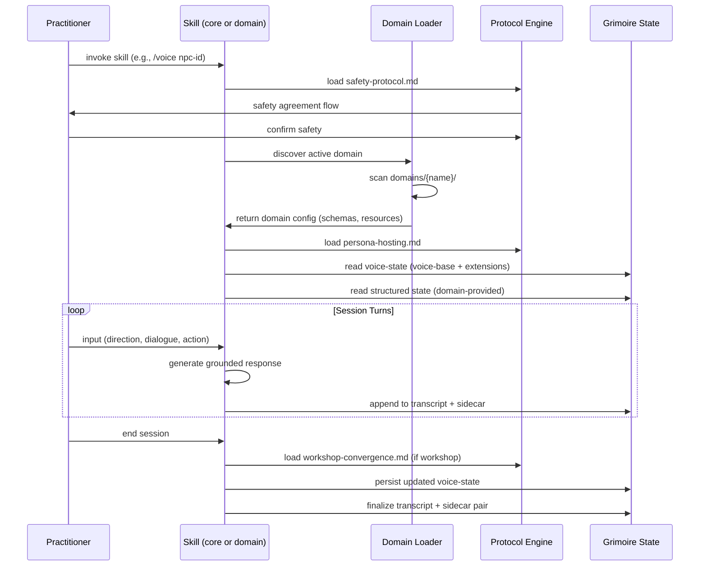
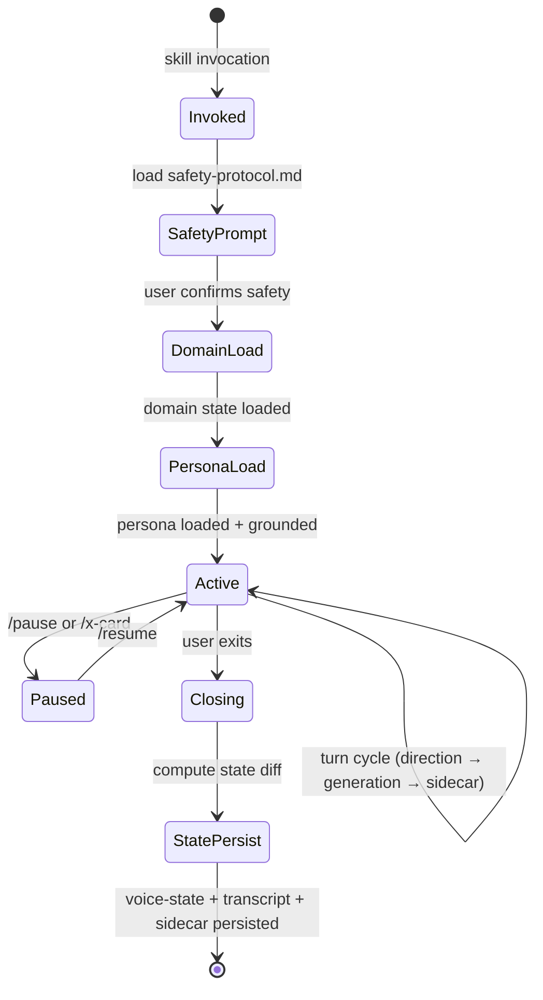
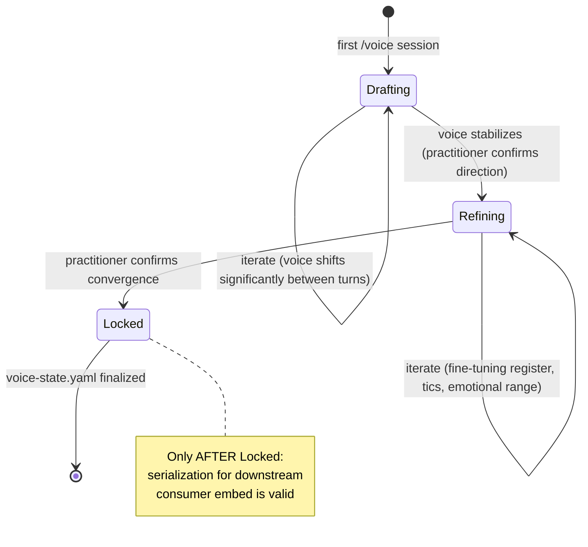

# Software Design Document: construct-arneson v2

**Version:** 2.0
**Date:** 2026-05-12
**Author:** Architecture Designer Agent (/architect)
**Status:** Draft
**PRD Reference:** `grimoires/loa/prd.md` (v2, 2026-05-12)

> The PRD defines what Arneson must do. This document defines how.
> Every architectural decision traces back to a specific PRD requirement (FR-CN, FR-TN, FR-XN, G-N, R-N)
> or to NOTES.md decision-log entries.

---

## Table of Contents

1. [Project Architecture](#1-project-architecture)
2. [Software Stack](#2-software-stack)
3. [Filesystem Schema Design](#3-filesystem-schema-design)
4. [Core/Vertical Separation](#4-corevertical-separation)
5. [Domain Extension Interface](#5-domain-extension-interface)
6. [Interaction Design](#6-interaction-design)
7. [Inter-Skill Contracts](#7-inter-skill-contracts)
8. [Error Handling Strategy](#8-error-handling-strategy)
9. [Testing Strategy](#9-testing-strategy)
10. [Development Phases](#10-development-phases)
11. [Known Risks and Architectural Mitigations](#11-known-risks-and-architectural-mitigations)
12. [Open Questions](#12-open-questions)
13. [Appendix](#13-appendix)

---

## 1. Project Architecture

### 1.1 System Overview

construct-arneson is a **creative persona engine** built as a Loa-framework skill-pack construct (schema_version 3). It hosts personas grounded in practitioner-provided structured state and emits structured data from creative sessions. TTRPG design is the first and reference vertical, not the identity.

Like v1, there is no traditional backend, frontend, or database. The "runtime" is the Claude Code + Loa harness. The "database" is the user's filesystem under `grimoires/arneson/`. The "UI" is the terminal interaction mediated by skill entry points. State is YAML and markdown.

The v2 architectural shift is the introduction of a **core/vertical boundary**: a domain-agnostic core provides persona hosting, session management, safety infrastructure, sidecar emission, and distillation. Domain verticals (starting with TTRPG as the reference implementation) provide structured state formats, persona definitions, event taxonomy extensions, resolution mechanics, and consumer specifications.

> **Sources**: PRD Executive Summary (prd.md:L36-41); Phase 1 vision; G-3 (domain extensibility)

### 1.2 Architectural Pattern

**Pattern:** Domain-extensible filesystem-first skill graph with core/vertical split.

**Justification:** The v1 pattern (filesystem-first skill graph with shared-state grimoire) remains correct. The v2 shift introduces a **layered architecture within that pattern**: domain-agnostic core layer + domain vertical layers. The extension point is convention-based filesystem discovery, not a plugin API.

This is the right pattern because:
1. "Adding a domain vertical requires zero modifications to core Arneson files" (PRD FR-C6)
2. "Convention-based discovery with maximum practitioner flexibility" (PRD Technical Considerations)
3. The filesystem-first principle is proven in v1 — the grimoire IS persistence
4. No new runtime dependencies needed — Loa framework + YAML + markdown remain sufficient

**Alternative considered and rejected:** Formal plugin manifest (`domain.yaml`) required per vertical. Rejected for v2: convention-based discovery is lower friction for practitioners. If insufficient, a manifest can be added in v3 with small effort (PRD Assumption 2).

**Alternative considered and rejected:** Abstract core skills with domain-specific thin wrappers. Rejected per user decision: keep existing skill names, parameterize internals. `/braunstein` stays `/braunstein`; new domains introduce new skill names.

### 1.3 Component Diagram

```mermaid
graph TB
    subgraph "construct-arneson v2"
        direction TB
        Manifest[construct.yaml v2]
        Identity[identity/<br/>ARNESON.md v2<br/>persona.yaml<br/>expertise.yaml<br/>refusals.yaml]

        subgraph "Core Layer (domain-agnostic)"
            CoreSchemas[schemas/core/<br/>voice-base<br/>session-events-base<br/>digest-base<br/>safety<br/>experiential_intent]
            CoreProtocols[protocols/<br/>persona-hosting.md<br/>session-lifecycle.md<br/>safety-protocol.md<br/>workshop-convergence.md]
            CoreSkills[Core Skills<br/>/arneson (status)<br/>/distill (distillation)<br/>/voice (workshop)]
        end

        subgraph "TTRPG Vertical (reference)"
            TTRPGSchemas[domains/ttrpg/schemas/<br/>voice-archetype<br/>voice-npc · voice-pc<br/>session-events-ttrpg<br/>digest-ttrpg]
            TTRPGSkills[domains/ttrpg/skills/<br/>/braunstein · /improvise<br/>/scene · /narrate · /fragment]
            TTRPGResources[domains/ttrpg/resources/<br/>archetypes-fallback/]
        end

        subgraph "Future Vertical (extension point)"
            FutureDomain["domains/{name}/<br/>schemas/ · skills/ · resources/"]
        end
    end

    subgraph "Grimoire State"
        Sessions[sessions/<br/>*.md + *.events.yaml pairs]
        Voices[voices/archetypes,npcs,pcs/]
        Scenes[scenes/]
        Fragments[fragments/]
        Digests[digests/]
        SafetyLog[safety-findings.md]
    end

    subgraph "Gygax v3 (optional sibling)"
        GygaxGS[grimoires/gygax/game-state/]
        GygaxCabal[skills/cabal/resources/archetypes.yaml]
        GygaxLore[skills/lore/resources/]
    end

    Manifest --> CoreSkills
    Manifest --> TTRPGSkills
    Identity --> CoreSkills
    Identity --> TTRPGSkills
    CoreSchemas --> CoreSkills
    CoreSchemas --> TTRPGSkills
    TTRPGSchemas --> TTRPGSkills
    CoreProtocols --> CoreSkills
    CoreProtocols --> TTRPGSkills

    CoreSkills -.->|writes| Sessions
    CoreSkills -.->|writes| Voices
    CoreSkills -.->|reads Sessions, writes| Digests
    TTRPGSkills -.->|writes| Sessions
    TTRPGSkills -.->|writes| Scenes
    TTRPGSkills -.->|writes| Fragments
    TTRPGSkills -.->|reads when present| GygaxGS
    TTRPGSkills -.->|reads when present, else| TTRPGResources
```

### 1.4 System Components

#### 1.4.1 Construct Manifest (`construct.yaml`)
- **Purpose**: Loa-framework construct declaration
- **Responsibilities**: Slug identity (`arneson`), schema_version (3), type (`skill-pack`), domain (`creative-persona`), skill enumeration (core + domain), composition paths, quick-start command, domain vertical discovery
- **v2 changes**: Domain broadened from `design` to `creative-persona`. Skills list includes both core skills and domain-registered skills. New `domains:` section enumerates discovered verticals.
- **Interfaces**: Read by Loa at construct-load time
- **Dependencies**: none

#### 1.4.2 Identity Layer (`identity/`)
- **Purpose**: Define Arneson's character, voice, expertise, and refusals
- **v2 changes**: Reframed from "Gygax's inverse" to "creative persona engine." Gygax-inversion becomes one contextual facet, not the defining relationship. Refusals generalize beyond TTRPG vocabulary. Expertise adds domain-agnostic items.
- **Files**:
  - `ARNESON.md` — prose identity narrative (creative persona engine, not TTRPG-specific)
  - `persona.yaml` — warm, improvisational, collaborative voice parameters (generalized)
  - `expertise.yaml` — voice work, persona hosting, workshop convergence, session instrumentation, safety-as-data, scene framing (TTRPG items retained as reference examples)
  - `refusals.yaml` — structural analysis, probability math, mechanical recommendations (generalized; TTRPG-specific vocabulary items move to domain context)
- **Interfaces**: Read by every skill at invocation
- **Dependencies**: none

#### 1.4.3 Core Schema Layer (`schemas/core/`)
- **Purpose**: Domain-agnostic structured data contracts
- **Responsibilities**: Base schemas that all domains inherit from
- **Files**:
  - `voice-base.schema.yaml` — persona voice definition (speech patterns, reaction tempo, emotional register, memory, workshop_state). **v2 change**: gains `workshop_state` from voice-npc (FR-C8)
  - `session-events-base.schema.yaml` — **NEW**: base event types extracted from v1 session-events (dialogue, signal, decision, pause, scene_transition, state_reference, safety_trigger)
  - `digest-base.schema.yaml` — **NEW**: base digest format extracted from v1 digest
  - `safety.schema.yaml` — **NEW**: domain-agnostic safety configuration (agreement flow, safety commands, content boundaries)
  - `experiential_intent.schema.yaml` — MOVED from `schemas/` (Arneson-owned intent axis, applicable beyond TTRPG)
- **Interfaces**: Referenced by core skills and extended by domain schemas
- **Dependencies**: none

#### 1.4.4 Core Skills (`skills/`)
- **Purpose**: Domain-agnostic capabilities
- **Skills**:
  - `/arneson` — Status dashboard. **v2 change**: domain-aware (shows sessions grouped by domain, persona status per domain, domain health)
  - `/distill` — Session distillation. **v2 change**: reads domain's consumer spec to shape output format; falls back to generic structured summary when no consumer spec exists
  - `/voice` — Persona workshop. **v2 change**: elevated to core skill (used across TTRPG, agent-dev, and future domains). Loads domain-specific persona definitions via voice-base + extensions. Implements workshop-then-serialize convergence tracking (FR-C8).
- **Interfaces**: User invocation via slash-command; file handoff to grimoire
- **Dependencies**: Identity, Core Schemas, Core Protocols

#### 1.4.5 Core Protocols (`protocols/`)
- **Purpose**: Documented behavioral contracts that domain skills MUST follow
- **Files**:
  - `persona-hosting.md` — **NEW**: how to load voice-base + extensions, manage memory window, ground against structured state, maintain voice consistency, persist state at session close
  - `session-lifecycle.md` — **NEW**: the generalized session state machine (Invoked → SafetyPrompt → DomainLoad → PersonaLoad → Active → Closing → Persisted)
  - `safety-protocol.md` — **NEW**: mandatory safety agreement, in-session commands (/pause, /x-card, /resume), safety-as-data logging
  - `workshop-convergence.md` — **NEW**: the workshop-then-serialize pattern. Iteration tracking, convergence criteria, when serialization is valid (FR-C8)
- **Interfaces**: Referenced by all skill SKILL.md files
- **Dependencies**: Core Schemas

#### 1.4.6 TTRPG Vertical (`domains/ttrpg/`)
- **Purpose**: Reference implementation of a domain vertical
- **Responsibilities**: All TTRPG-specific schemas, skills, and resources
- **Structure**:
  ```
  domains/ttrpg/
    domain.conventions.md     # How this vertical works (IS the extension interface docs)
    schemas/
      voice-archetype.schema.yaml    # extends core/voice-base
      voice-npc.schema.yaml          # extends core/voice-base
      voice-pc.schema.yaml           # extends core/voice-base
      session-events-ttrpg.schema.yaml  # extends core/session-events-base
      digest-ttrpg.schema.yaml       # extends core/digest-base
    skills/
      braunstein/       # Live playtest (user GMs, Arneson plays archetype)
      improvise/        # Arneson GMs, user plays PC
      scene/            # Scene generation from game-state
      narrate/          # Fiction-mechanics-fiction bridge
      fragment/         # Setting material generation
    resources/
      archetypes-fallback/    # 9 archetype YAMLs (standalone mode)
  ```
- **Interfaces**: Discovered by Arneson core via convention. Registered in construct.yaml.
- **Dependencies**: Core schemas (extends), optionally Gygax v3 (sibling composition)

#### 1.4.7 Grimoire Runtime State (`grimoires/arneson/`)
- **Purpose**: Persistent artifacts produced by skill invocations
- **Structure**: Unchanged from v1
  ```
  grimoires/arneson/
    sessions/       # *.md + *.events.yaml pairs
    voices/
      archetypes/   # Archetype-as-character state
      npcs/         # Workshop NPCs
      pcs/          # PC voices
    scenes/
    fragments/
    digests/
    safety-findings.md
    changelog/
  ```
- **Write patterns**: Append-only for sessions; atomic-rename for state files; plain read for consumers
- **Dependencies**: Skills write, practitioners + downstream tools read

#### 1.4.8 Synthetic Fixture (`examples/synthetic-fixture/`)
- **Purpose**: Reference game-state for TTRPG vertical testing and demos
- **v2 change**: Remains TTRPG-specific. A second fixture (`examples/test-domain/`) is added for extension story validation.
- **Dependencies**: none — explicitly free of private game references

### 1.5 Data Flow


```mermaid
sequenceDiagram
    participant P as Practitioner
    participant S as Skill (core or domain)
    participant DL as Domain Loader
    participant PR as Protocol Engine
    participant G as Grimoire State

    P->>S: invoke skill (e.g., /voice npc-id)
    S->>PR: load safety-protocol.md
    PR->>P: safety agreement flow
    P->>PR: confirm safety
    S->>DL: discover active domain
    DL->>DL: scan domains/{name}/
    DL->>S: return domain config (schemas, resources)
    S->>PR: load persona-hosting.md
    S->>G: read voice-state (voice-base + extensions)
    S->>G: read structured state (domain-provided)
    loop Session Turns
        P->>S: input (direction, dialogue, action)
        S->>S: generate grounded response
        S->>G: append to transcript + sidecar
    end
    P->>S: end session
    S->>PR: load workshop-convergence.md (if workshop)
    S->>G: persist updated voice-state
    S->>G: finalize transcript + sidecar pair
```

---

## 2. Software Stack

| Layer | Technology | Justification |
|-------|-----------|---------------|
| Runtime | Claude Code + Loa framework | Construct runtime environment |
| Skill definitions | SKILL.md + index.yaml per skill | Loa skill-pack standard |
| Structured data | YAML | Human-readable, version-controllable, ecosystem standard |
| Prose output | Markdown | Grimoire-as-deliverable; presentable standalone |
| Schema validation | Loa CI + custom validation scripts | Automated in CI |
| Version control | Git | Standard |
| CI | GitHub Actions | Two-matrix: arneson-alone, arneson-with-gygax, plus extension-story |

No new technologies introduced in v2. The domain-extensible architecture is achieved through filesystem conventions, not new runtime dependencies.

---

## 3. Filesystem Schema Design

### 3.1 Core Schemas

#### 3.1.1 `voice-base.schema.yaml` (core, domain-agnostic)

The foundation all persona voices inherit from. Unchanged from v1 EXCEPT for the addition of `workshop_state` (FR-C8).

```yaml
# Core fields (all domains)
voice_id: string (required)
display_name: string (required)
speech_patterns:
  vocabulary_level: enum [simple, moderate, advanced, archaic, technical]
  sentence_structure: enum [terse, balanced, elaborate, stream_of_consciousness]
  verbal_tics: list[string]
  catchphrases: list[string]
reaction_tempo: enum [instant, measured, deliberate, glacial]
emotional_register:
  baseline: enum [warm, neutral, guarded, volatile]
  range: enum [narrow, moderate, wide]
  triggers: map[string -> string]
memory_slots:
  recent_events: list[object]
  known_facts: list[string]
  relationships: map[string -> string]
known_facts: list[string]
grounding_state_path: string (optional)  # path to the structured state this voice grounds against

# v2 addition (FR-C8: workshop-then-serialize)
workshop_state:
  required: false  # not all voices go through workshop (archetypes may not)
  fields:
    stage: enum [drafting, refining, locked]
    iteration_count: integer (default 0)
    last_workshop_session: string (ISO8601 date)
    convergence_notes: list[string]  # practitioner notes on what's converging
```

#### 3.1.2 `session-events-base.schema.yaml` (NEW, core)

Extracted from v1 `session-events.schema.yaml`. Defines the event envelope and base event types that apply to ALL domains.

```yaml
session_preamble:
  session_id: string (required)
  domain: string (required)  # which vertical produced this session
  mode: string (required)    # skill that produced the session
  started_at: string (ISO8601, required)
  state_path: string (optional)
  state_checksum: string (optional, sha256)
  safety_agreement: object (required)
    agreed_at: string (ISO8601)
    boundaries: list[string]

events:
  type: list[event]
  event:
    timestamp: string (ISO8601, required)
    event_type: enum (required)
    actor: string (required)  # who triggered this event
    grounding_refs: list[string] (optional)  # references to structured state

# Base event types (present in every domain)
base_event_types:
  dialogue:           # persona speaks
    speaker: string
    content: string
    grounding_refs: list[string]
    tone: string (optional)
  signal:             # practitioner or persona flags something
    source: string
    classification: enum [safety, insight, concern, friction, praise]
    content: string
  decision:           # a creative decision
    what: string
    why: string
    alternatives_considered: list[string] (optional)
  pause:              # session paused
    reason: string
    initiated_by: string
  scene_transition:   # context shifts
    from_context: string
    to_context: string
    trigger: string
  state_reference:    # output references structured state
    path: string
    field: string
    how_used: string
  safety_trigger:     # safety event (X-card, pause, boundary)
    trigger_type: enum [x_card, line, veil, pause, boundary_violation]
    content: string (optional)
    resolution: string (optional)
```

#### 3.1.3 `digest-base.schema.yaml` (NEW, core)

Base format for distilled session output. Domain verticals extend with domain-specific finding types.

```yaml
digest_id: string (required)
session_ref: string (required)  # session_id of source
domain: string (required)
distilled_at: string (ISO8601)
summary: string (required)  # human-readable session summary

key_moments: list[object]
  timestamp: string
  type: string
  description: string
  significance: string

persona_signals: list[object]
  persona: string
  signal_type: string
  content: string
  grounding_ref: string (optional)

state_conflicts: list[object] (optional)
  claim: string
  conflicts_with: string
  resolution: string (optional)

unresolved_questions: list[string] (optional)
safety_findings: list[object] (optional)
```

#### 3.1.4 `safety.schema.yaml` (NEW, core)

Domain-agnostic safety configuration.

```yaml
pre_session:
  agreement_required: true  # non-negotiable (NFR-5)
  default_boundaries: list[string]
  domain_boundaries: list[string] (optional)  # domain can add specific boundaries

in_session:
  commands:
    pause: {trigger: "/pause", action: "halt session, log event"}
    x_card: {trigger: "/x-card", action: "retract last content, log finding"}
    resume: {trigger: "/resume", action: "resume from last safe point"}
  
logging:
  safety_as_data: true  # safety events are findings, not just interruptions (NFR-6)
  finding_format: session-events-base.safety_trigger
```

#### 3.1.5 `experiential_intent.schema.yaml` (MOVED to core)

Unchanged from v1. Arneson-owned intent axis. Applicable beyond TTRPG — any domain where creative work should feel a certain way.

```yaml
# Already defined: tone (9 values), pacing (4), stakes (5), register (6)
# No changes needed — schema is already domain-agnostic
```

### 3.2 TTRPG Vertical Schemas

#### 3.2.1 `session-events-ttrpg.schema.yaml` (NEW, extends base)

TTRPG-specific event types and preamble extensions.

```yaml
extends: schemas/core/session-events-base.schema.yaml

preamble_extensions:
  archetype: string (optional)
  pc_ref: string (optional)
  composition_mode: enum [standalone, composed]
  tradition: string (optional)
  tradition_fallback_mode: enum [structural_improvisation, user_prompted]
  dice_mode: enum [user_rolls, arneson_rolls, hybrid]

additional_event_types:
  dice_roll:
    roller: string
    dice: string
    result: integer
    context: string
    mechanical_intent_ref: string (optional)
  archetype_decision:
    archetype: string
    decision: string
    reasoning: string
    grounding_refs: list[string]
  intent_conflict:
    mechanic: string
    mechanical_intent: string
    experiential_intent: string
    resolution: string
  gm_prompt:
    content: string
    context: string
  rule_of_cool:
    what_happened: string
    rule_overridden: string (optional)
    justification: string
  clarifying_question:
    asker: string
    question: string
    about: string
```

#### 3.2.2 `voice-archetype.schema.yaml`, `voice-npc.schema.yaml`, `voice-pc.schema.yaml`

Unchanged from v1 except `voice-npc.schema.yaml` loses its local `workshop_state` (now inherited from voice-base).

#### 3.2.3 `digest-ttrpg.schema.yaml` (NEW, extends base)

```yaml
extends: schemas/core/digest-base.schema.yaml

ttrpg_findings:
  rule_invocations: list[object]
  rule_of_cool_overrides: list[object]
  dead_design_space: list[object]  # from safety findings
  archetype_memory_updates: list[object]
  intent_conflicts_encountered: list[object]
  gygax_consumption_ready: boolean  # admissibility flag
```

### 3.3 Grimoire Directory Structure

Unchanged from v1:

```
grimoires/arneson/
  voices/
    archetypes/       # {archetype-id}.yaml
    npcs/             # {npc-id}.yaml
    pcs/              # {pc-id}.yaml
  scenes/             # {date}-{scope}.md
  sessions/           # {date}-{mode}-{persona}.md + .events.yaml
  fragments/          # {date}-{type}-{ref}.md
  digests/            # {date}-{session-ref}.yaml
  safety-findings.md  # append-only safety log
  changelog/          # CHANGELOG.md
```

---

## 4. Core/Vertical Separation

### 4.1 Directory Structure

```
construct-arneson/
  construct.yaml                # manifest (core + domain skill registration)
  identity/                     # construct identity (v2: creative persona engine)
  
  schemas/
    core/                       # domain-agnostic schemas
      voice-base.schema.yaml
      session-events-base.schema.yaml
      digest-base.schema.yaml
      safety.schema.yaml
      experiential_intent.schema.yaml
  
  protocols/                    # behavioral contracts for all skills
    persona-hosting.md
    session-lifecycle.md
    safety-protocol.md
    workshop-convergence.md
  
  skills/                       # core skills (domain-agnostic)
    arneson/                    # status dashboard
    distill/                    # session distillation
    voice/                      # persona workshop (core, domain-parameterized)
  
  domains/                      # domain verticals
    ttrpg/                      # reference implementation
      domain.conventions.md
      schemas/
      skills/
      resources/
  
  examples/
    synthetic-fixture/          # TTRPG reference fixture
    test-domain/                # extension story validation fixture
  
  grimoires/arneson/            # runtime state
  
  .github/workflows/            # CI
```

### 4.2 Separation Principles

| Concern | Core | Domain Vertical |
|---------|------|-----------------|
| **Persona hosting** (load, voice, persist, memory) | Core protocol | Domain provides persona definitions |
| **Session lifecycle** (start, safety, active, close) | Core protocol | Domain extends preamble + events |
| **Safety** (agreement, commands, findings) | Core — non-negotiable | Domain may add domain-specific boundaries |
| **Output format** (transcript + sidecar pair) | Core — every session | Domain configures event types in sidecar |
| **Distillation** | Core engine | Domain provides consumer spec |
| **Status dashboard** | Core — domain-aware | Domain registers its status fields |
| **Structured state** | Core reads whatever path is provided | Domain defines state format |
| **Persona definitions** | Core provides voice-base | Domain extends with voice-{type} schemas |
| **Event taxonomy** | Core provides base events | Domain extends with domain-specific events |
| **Resolution mechanics** | Not in core | Domain skills implement resolution (dice, rubric, oracle) |
| **Downstream consumer spec** | Core distill reads it | Domain provides it |
| **Workshop convergence** (FR-C8) | Core protocol | Domain skills invoke the protocol |

### 4.3 What Stays in Core vs What Moves to TTRPG

| Current v1 Location | v2 Location | Rationale |
|---------------------|-------------|-----------|
| `schemas/voice-base.schema.yaml` | `schemas/core/voice-base.schema.yaml` | Already domain-agnostic |
| `schemas/voice-archetype.schema.yaml` | `domains/ttrpg/schemas/` | TTRPG-specific persona type |
| `schemas/voice-npc.schema.yaml` | `domains/ttrpg/schemas/` | TTRPG-specific (though workshop pattern generalizes via voice-base) |
| `schemas/voice-pc.schema.yaml` | `domains/ttrpg/schemas/` | TTRPG-specific persona type |
| `schemas/session-events.schema.yaml` | Split: base → `schemas/core/`, TTRPG events → `domains/ttrpg/schemas/` | Monolithic in v1, needs base/extension split |
| `schemas/digest.schema.yaml` | Split: base → `schemas/core/`, TTRPG findings → `domains/ttrpg/schemas/` | Same as above |
| `schemas/experiential_intent.schema.yaml` | `schemas/core/` | Arneson-owned axis, applicable beyond TTRPG |
| `skills/arneson/` | `skills/arneson/` (stays core) | Domain-aware status dashboard |
| `skills/distill/` | `skills/distill/` (stays core) | Domain-aware distillation |
| `skills/voice/` | `skills/voice/` (elevated to core) | Used across domains (FR-C8, UC-4) |
| `skills/braunstein/` | `domains/ttrpg/skills/braunstein/` | TTRPG-specific session mode |
| `skills/improvise/` | `domains/ttrpg/skills/improvise/` | TTRPG-specific session mode |
| `skills/scene/` | `domains/ttrpg/skills/scene/` | TTRPG-specific generation |
| `skills/narrate/` | `domains/ttrpg/skills/narrate/` | TTRPG-specific fiction bridge |
| `skills/fragment/` | `domains/ttrpg/skills/fragment/` | TTRPG-specific generation |
| `resources/archetypes-fallback/` | `domains/ttrpg/resources/archetypes-fallback/` | TTRPG-specific standalone bundle |

---

## 5. Domain Extension Interface

### 5.1 The Five-Part Contract

A domain vertical provides five things. The TTRPG vertical is the reference implementation and documentation of each part.

| # | Part | Convention | TTRPG Example |
|---|------|-----------|---------------|
| 1 | **Structured state** | `domains/{name}/resources/` — any YAML/MD the domain needs | Game-state YAML (mechanics, locations, factions, intent) |
| 2 | **Persona definitions** | `domains/{name}/schemas/voice-*.schema.yaml` extending `core/voice-base` | voice-archetype, voice-npc, voice-pc |
| 3 | **Event taxonomy** | `domains/{name}/schemas/session-events-{name}.schema.yaml` extending base | dice_roll, archetype_decision, intent_conflict, etc. |
| 4 | **Resolution mechanics** | `domains/{name}/skills/` — domain skills that implement resolution | /braunstein (user GMs), /improvise (Arneson GMs), /narrate (fiction bridge) |
| 5 | **Consumer specification** | `domains/{name}/schemas/digest-{name}.schema.yaml` or consumer config | digest-ttrpg with rule_invocations, dead_design_space, gygax_consumption_ready |

### 5.2 Convention-Based Discovery

Arneson discovers domain verticals by scanning `domains/*/`:

1. Directory exists at `domains/{name}/` → domain `{name}` is present
2. `domains/{name}/schemas/` → domain has schema extensions
3. `domains/{name}/skills/` → domain has skills to register
4. `domains/{name}/resources/` → domain has resources (persona bundles, state templates, etc.)
5. `domains/{name}/domain.conventions.md` → human-readable documentation of the vertical (optional but recommended)

**Skill registration**: Domain skills are declared in `construct.yaml` under a `domains.{name}.skills` key. This is the one required change when adding a domain — updating the manifest's skill list. All other discovery is automatic.

**[ASSUMPTION]** Updating construct.yaml to register domain skills is acceptable as "zero core changes" because construct.yaml is a configuration file, not core logic. If this violates the spirit of FR-C6, alternative: Loa auto-discovers skills in `domains/*/skills/` directories. Requires Loa framework validation.

### 5.3 Extension Story Validation

The proof of the extension interface is a **test domain** (`examples/test-domain/`) that:

1. Provides all 5 parts of the contract using a trivial domain (e.g., "character-interview" — a minimal persona workshop for character development)
2. Is loaded as `domains/test-domain/` during CI
3. Validates: domain discovered, persona loads via voice-base, session runs with base events + domain events, distill produces domain-shaped output
4. Requires zero changes to any file outside `domains/test-domain/` and `construct.yaml`

---

## 6. Interaction Design

### 6.1 Session State Machine (Generalized)


```mermaid
stateDiagram-v2
    [*] --> Invoked: skill invocation
    Invoked --> SafetyPrompt: load safety-protocol.md
    SafetyPrompt --> DomainLoad: user confirms safety
    DomainLoad --> PersonaLoad: domain state loaded
    PersonaLoad --> Active: persona loaded + grounded
    Active --> Active: turn cycle (direction → generation → sidecar)
    Active --> Paused: /pause or /x-card
    Paused --> Active: /resume
    Active --> Closing: user exits
    Closing --> StatePersist: compute state diff
    StatePersist --> [*]: voice-state + transcript + sidecar persisted
```

**v2 changes from v1:**
- `ComposedLoad` (Gygax-specific) → `DomainLoad` (any domain's state loading)
- `TraditionCheck` → moved into TTRPG vertical (domain-internal)
- `ArchetypeSelect` → moved into TTRPG vertical (domain-internal)
- Safety remains in core lifecycle — non-negotiable, every domain

### 6.2 Workshop Convergence Flow (FR-C8)


```mermaid
stateDiagram-v2
    [*] --> Drafting: first /voice session
    Drafting --> Drafting: iterate (voice shifts significantly between turns)
    Drafting --> Refining: voice stabilizes (practitioner confirms direction)
    Refining --> Refining: iterate (fine-tuning register, tics, emotional range)
    Refining --> Locked: practitioner confirms convergence
    Locked --> [*]: voice-state.yaml finalized

    note right of Locked
        Only AFTER Locked:
        serialization for downstream
        consumer embed is valid
    end note
```

The `workshop_state.stage` field in voice-base tracks this progression. Skills that implement workshop patterns (core `/voice`, and any domain workshop skill) MUST follow the `workshop-convergence.md` protocol.

### 6.3 TTRPG-Specific State Extensions

The TTRPG vertical extends the generalized state machine with domain-specific states:

```
DomainLoad includes:
  - CompositionDetect (probe grimoires/gygax/)
  - TraditionCheck (load tradition lore)
  - GameStateLoad (read game-state YAML)
  - IntentRead (load experiential + mechanical intent)

PersonaLoad includes:
  - ArchetypeSelect (for /braunstein)
  - NPCLoad (for /voice in TTRPG mode)
  - DiceMode configuration
```

These are internal to TTRPG skills and invisible to core.

---

## 7. Inter-Skill Contracts

### 7.1 Core Contracts

| Contract | Producer | Consumer | Format | Path |
|----------|----------|----------|--------|------|
| Session transcript + sidecar | Any session skill | /distill, practitioner, downstream tools | .md + .events.yaml pair | `grimoires/arneson/sessions/` |
| Voice state | /voice (any domain) | Any session skill, /arneson | voice-base + extensions YAML | `grimoires/arneson/voices/{type}/` |
| Safety findings | Any session skill | /arneson, practitioner | Append to safety-findings.md | `grimoires/arneson/safety-findings.md` |
| Distilled digest | /distill | Downstream tools (Gygax, etc.) | digest-base + extensions YAML | `grimoires/arneson/digests/` |

### 7.2 TTRPG-Specific Contracts

| Contract | Producer | Consumer | Format | Path |
|----------|----------|----------|--------|------|
| Archetype memory | /braunstein | /braunstein (next session) | voice-archetype YAML | `grimoires/arneson/voices/archetypes/` |
| Game-state grounding | Practitioner (or Gygax) | /braunstein, /scene, /improvise, /narrate | Game-state YAML | `grimoires/gygax/game-state/` or user-provided path |
| Scene output | /scene | /braunstein (as context), practitioner | Markdown | `grimoires/arneson/scenes/` |
| Fragment output | /fragment | Practitioner, /scene (as context) | Markdown | `grimoires/arneson/fragments/` |

### 7.3 Cross-Domain Contracts

| Contract | Description | Mechanism |
|----------|-------------|-----------|
| Persona portability (FR-X1) | Voice-base fields readable by any domain | voice-base schema is the portable subset; domain extensions are gracefully ignored |
| Session domain tagging | Every session declares its domain in preamble | `session_preamble.domain` field (required in base schema) |
| Distill domain routing | /distill loads correct consumer spec per domain | Reads `domains/{domain}/schemas/digest-{domain}.schema.yaml` |

---

## 8. Error Handling Strategy

### 8.1 Domain Discovery Errors

| Error | Handling |
|-------|---------|
| `domains/` directory missing | No domains loaded. Core skills work (status, voice workshop). Warn practitioner. |
| Domain directory exists but incomplete (missing schemas/) | Warn: "Domain {name} has no schema extensions. Using base schemas only." Proceed. |
| Domain skill references missing resource | Graceful degradation: warn + use structural improvisation (NFR-3) |
| Unknown domain in session preamble | /distill warns: "Unknown domain. Using base digest format." |

### 8.2 Persona Loading Errors

| Error | Handling |
|-------|---------|
| Voice file doesn't conform to voice-base | Reject load. "Voice {id} missing required field {field}." |
| Domain extension fields not recognized | Ignore gracefully (forward-compatible). Log info. |
| Memory window references missing sessions | Load available sessions. Warn if fewer than window size. |
| Grounding state path doesn't exist | Warn: "Structured state not found at {path}. Proceeding ungrounded." |

### 8.3 Session Errors

Same as v1: safety agreement failure halts; /x-card retracts + logs; interrupted session produces partial transcript + sidecar (recoverable).

### 8.4 Composition Errors (TTRPG)

Same as v1: Gygax not found → fallback bundle. Archetype mismatch → warn + use fallback. Intent field missing → default to neutral experiential intent.

---

## 9. Testing Strategy

### 9.1 CI Matrix

| Matrix | What it tests | Domain | Gygax |
|--------|---------------|--------|-------|
| `arneson-alone` | Core + TTRPG standalone | TTRPG | Absent |
| `arneson-with-gygax` | Core + TTRPG composed | TTRPG | Present |
| `extension-story` | Extension interface validation | test-domain | Absent |

### 9.2 Schema Validation

All schemas validated in CI:
- Core schemas: `schemas/core/*.schema.yaml` (well-formed, required fields present)
- TTRPG schemas: `domains/ttrpg/schemas/*.schema.yaml` (well-formed, correctly extends base)
- Test domain schemas: `examples/test-domain/schemas/*.schema.yaml` (well-formed, correctly extends base)
- Existing fixture data: validates against updated schema paths

### 9.3 Extension Story Test (G-3)

The critical v2 test. In `examples/test-domain/`:

```
examples/test-domain/
  schemas/
    voice-test.schema.yaml          # extends voice-base
    session-events-test.schema.yaml # extends session-events-base
    digest-test.schema.yaml         # extends digest-base
  skills/
    test-workshop/                  # minimal workshop skill following protocols
  resources/
    sample-state.yaml               # minimal structured state
    sample-persona.yaml             # minimal voice definition
```

CI steps:
1. Copy `examples/test-domain/` to `domains/test-domain/`
2. Register skills in construct.yaml (or validate auto-discovery)
3. Validate: persona loads, session starts (safety agreement), turns execute, sidecar captures base + test events, distill produces test-domain digest
4. Assert: zero core files modified (diff check)

### 9.4 Regression Test (G-4)

All v1 TTRPG acceptance criteria pass against the refactored v2 codebase:
- `/braunstein` state machine completes
- Sidecar validates against `session-events-ttrpg` (which extends base)
- Voice schemas validate (archetype, npc, pc)
- Digest validates against `digest-ttrpg`
- Safety flow works
- Intent-awareness works
- Standalone mode works (fallback archetypes)
- Composed mode works (Gygax present)

---

## 10. Development Phases

| Sprint | Milestone | Deliverables | Dependencies |
|--------|-----------|-------------|--------------|
| S-1 | M-1: Core/Vertical Boundary | Directory restructure. `schemas/core/` created. `domains/ttrpg/` created. Files moved (not rewritten). `construct.yaml` updated. Core protocols extracted as empty shells. | — |
| S-2 | M-1 continued + M-3 | `session-events-base.schema.yaml` + `session-events-ttrpg.schema.yaml` extracted from v1 monolith. `digest-base` + `digest-ttrpg` extracted. `safety.schema.yaml` created. `voice-base` gains `workshop_state`. voice-npc drops local workshop_state. | S-1 |
| S-3 | M-2: Identity Reframe | `ARNESON.md` rewritten for creative persona engine. `persona.yaml`, `expertise.yaml`, `refusals.yaml` generalized. Gygax-inversion retained as one facet. | S-1 |
| S-4 | M-4: TTRPG Regression | CI updated for new paths. All v1 acceptance criteria verified. Both standalone and composed modes green. Core protocols populated with content extracted from TTRPG skill SKILL.md files. | S-1, S-2 |
| S-5 | M-5: Extension Story | `examples/test-domain/` created. Extension story CI job added. Validates zero-core-change constraint. `domain.conventions.md` written from TTRPG reference. | S-1, S-2, S-4 |
| S-6 | M-6: Documentation & Governance | Consumer-pattern guide (workshop vs text-embed, per arneson#2). Extension interface reference (from domain.conventions.md). CONTRIBUTING.md, SECURITY.md, CODEOWNERS. | S-5 |
| S-7 | M-7: Release | L0/L1/L2 construct validation. Version tagged. README updated. | All |

---

## 11. Known Risks and Architectural Mitigations

| Risk | Probability | Impact | Architectural Mitigation |
|------|-------------|--------|--------------------------|
| R-1: Over-abstraction breaks TTRPG vertical | Medium | High | TTRPG is reference implementation AND regression gate. If v1 criteria break, the abstraction is wrong. Fix the abstraction, not the tests. |
| R-2: Extension point too narrow (TTRPG-shaped) | Medium | High | Paper-test the interface against game-writing and agent-dev domains before implementing. Extension story test in CI catches regressions. |
| R-3: Extension point too wide (provides nothing) | Medium | Medium | Convention-based with sensible defaults. TTRPG vertical IS the documentation. Base schemas provide useful structure, not empty envelopes. |
| R-4: Identity reframe weakens voice | Low | Medium | Sprint 0 prototype quality (5/5 axes) is the regression bar. Gygax-inversion retained as facet. |
| R-5: More refactoring than expected | Low-Med | Medium | v1 codebase is clean (hygiene A). Changes are primarily file moves + schema splits, not rewrites. |
| R-6: Schema backwards incompatibility | Low | Medium | Base+extension pattern preserves all existing fields. TTRPG fields move to extensions; base fields remain stable. Existing YAML still validates. |
| R-7: construct.yaml registration violates "zero core changes" | Low | Low | construct.yaml is configuration, not core logic. If unacceptable, explore Loa auto-discovery of `domains/*/skills/`. |
| R-8: Directory restructure breaks existing references | Medium | Low | CI validates all paths. Migration sprint (S-1) is pure moves, no logic changes. All inter-file references updated atomically. |

---

## 12. Open Questions

| # | Question | Status | Default Assumption |
|---|----------|--------|--------------------|
| OQ-1 | Does Loa auto-discover skills in `domains/*/skills/`, or must construct.yaml enumerate them? | Open | construct.yaml enumerates. Validated in S-5. |
| OQ-2 | Should `/voice` always be core, or should domains be able to override it with domain-specific workshop behavior? | Decided: Core | `/voice` is core. Domain-specific behavior is loaded from domain's persona definitions and resources. The workshop protocol is the same everywhere; what varies is what's being workshopped. |
| OQ-3 | Does the TTRPG vertical need its own grimoire subdirectory, or does `grimoires/arneson/` serve all domains? | Decided: Shared | `grimoires/arneson/` serves all domains. Session preamble's `domain` field distinguishes. Domain-specific subdirectory naming is a convention, not a requirement. |
| OQ-4 | Should `experiential_intent.schema.yaml` move to core or stay TTRPG? | Decided: Core | It's Arneson-owned (not Gygax-provided) and applicable to any domain where creative work should feel a certain way. |
| OQ-5 | Gygax composition: does Gygax become a "domain" or remain a "sibling"? | Decided: Sibling | Gygax is a separate construct that composes with Arneson's TTRPG vertical. The composition mechanism is unchanged from v1. Gygax is not a domain — it's a sibling construct. |

---

## 13. Appendix

### A. PRD Traceability Matrix

| PRD Requirement | SDD Section | Implementation |
|----------------|-------------|----------------|
| FR-C1: Persona hosting engine | §4.2, §6.1, protocols/persona-hosting.md | Core protocol + voice-base schema |
| FR-C2: Session management | §6.1, protocols/session-lifecycle.md | Core state machine |
| FR-C3: Sidecar event schema | §3.1.2 | session-events-base.schema.yaml |
| FR-C4: Safety infrastructure | §3.1.4, §6.1, protocols/safety-protocol.md | Core, non-negotiable |
| FR-C5: Transcript + sidecar output | §7.1 | Every session skill |
| FR-C6: Domain extension point | §5 | Five-part contract + convention-based discovery |
| FR-C7: Status dashboard | §1.4.4 | /arneson (domain-aware) |
| FR-C8: Workshop-then-serialize | §3.1.1 (workshop_state), §6.2, protocols/workshop-convergence.md | voice-base + convergence protocol |
| FR-C9: Session distillation | §1.4.4 | /distill (domain-aware) |
| FR-T1-T9: TTRPG vertical | §1.4.6, §4.3 | domains/ttrpg/ |
| FR-X1: Persona portability | §7.3 | voice-base as portable subset |
| G-3: Domain extensibility | §9.3 | Extension story CI test |
| G-4: TTRPG regression | §9.4 | Regression CI suite |

### B. Migration Path (v1 → v2)

The v2 refactoring is primarily reorganization:

1. **Sprint 1**: Create directory structure. Move files to new locations. Update all inter-file references. No logic changes.
2. **Sprint 2**: Split monolithic schemas into base + extension. Additive only — no fields removed.
3. **Sprint 3**: Identity rewrite. Prose + YAML, no structural impact.
4. **Sprint 4**: CI validation. Regression gate.
5. **Sprint 5**: Extension story. New files only.
6. **Sprint 6**: Documentation. New files only.
7. **Sprint 7**: Release validation.

At no point does existing TTRPG functionality degrade. The regression gate (S-4) is the architectural safety net.

---

*Generated by Architecture Designer Agent (/architect), 2026-05-12*
