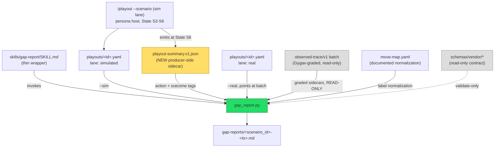

# Software Design Document: Simulation Fidelity Gap Report

**Version:** 1.0 (cycle: Simulation Fidelity Gap Report)
**Date:** 2026-06-15
**Author:** Architecture Designer Agent (/architect)
**Status:** Draft
**PRD Reference:** grimoires/loa/prd.md

> **Note on document scope.** This SDD covers ONLY the Simulation Fidelity Gap
> Report cycle. The prior `sdd.md` (v4.1 — Playtest Instrument, 2026-06-10) remains
> the canonical record for the already-shipped surface (`/playout`, validators,
> `sweep_report.py`, the vendored contract); it is superseded as the *current* SDD by
> this document but its design rationale for the shipped code still stands. This
> document is additive: it specifies one new script (`gap_report.py`), one new domain
> skill (`gap-report`), one new producer-side artifact (`playout-summary.v1.json`),
> one documented mapping file (`move-map.yaml`), and two root-level dev enablers
> (`scripts/test.sh`, `pyproject.toml`).

---

## Table of Contents

1. [Project Architecture](#1-project-architecture)
2. [Software Stack](#2-software-stack)
3. [Data Models](#3-data-models)
4. [Component Design (gap_report.py)](#4-component-design-gap_reportpy)
5. [Interface Specifications (CLI + Skill)](#5-interface-specifications-cli--skill)
6. [Error Handling Strategy](#6-error-handling-strategy)
7. [Testing Strategy](#7-testing-strategy)
8. [Development Phases](#8-development-phases)
9. [Known Risks and Mitigation](#9-known-risks-and-mitigation)
10. [Open Questions](#10-open-questions)
11. [Appendix](#11-appendix)

---

## 1. Project Architecture

### 1.1 System Overview

This cycle builds a **diagnostic that pairs a simulated playout with its real graded
batch and tabulates their divergence** — arithmetic and quoted labels only.

> From prd.md: "Ship a diagnostic that pairs a simulated playout with its real graded
> batch and tabulates their divergence — arithmetic and quoted labels only" (prd.md:L28)

The instrument is named by the domain conventions themselves: the sanctioned
replacement for the banned phrase "proves it's compelling" is *"shows where forecast
and observation diverge"* (`domain.conventions.md:L51`). `gap_report.py` is exactly
that report.

Architecturally this is a **filesystem-coupled, single-script tool** in the same mold
as its structural sibling `sweep_report.py`: read N already-produced artifacts from
disk, compute counts and set-diffs deterministically, render one Markdown report,
never write to or regrade the inputs.

### 1.2 The R1 Resolution (critical design dependency)

**Question (R1):** Does the simulated lane currently emit a STRUCTURED action/outcome
list that `gap_report.py` can diff?

**Answer: NO.** Verified against `skills/playout/SKILL.md`, the persona-host
serializer pipeline, the session-events-agent schema, and the two existing playout
artifacts. The chain is:

| Stage | Artifact | Action representation |
|-------|----------|-----------------------|
| Sim hosting (State S3) | native sidecar (`session-events-agent v1`) | `agent_turn.narrated_action` — **free prose** (`native-sidecar.events.yaml`; `SKILL.md:L210-213`) |
| Sim assemble (State S4) | `observed-trace/v1` sidecar via `assemble_batch.py` | collapses to `narration` — **free prose, SECONDARY, never graded** (`observed-trace.v1.schema.json:L230`) |
| Sim record (State S6) | `playouts/<id>.yaml` | `lane / scenario_sha256 / batch_path / counts` — **no per-action labels, no outcome-signal tags** (`awareness-ladder-demo-…yaml`) |

So there is **no diffable action-label list and no outcome-signal-tag list** anywhere
in the sim lane's current output. Both existing playout artifacts are `lane: real`;
there is no simulated-lane artifact yet at all.

> From prd.md (R1): "if absent, a small, in-scope addition to the sim serializer is part
> of the cycle. First design question for `/architect`." (prd.md:L98)

**Design decision (the minimal sim-serializer addition):** the sim lane emits one new
**producer-side summary sidecar** — `playout-summary.v1.json` — at State S6, beside
the batch. It is a *thin projection* of structured fields the host already produces
(`agent_turn` events + `trial_end` status), tagged with a small closed
`outcome_signal` vocabulary. It is NOT a change to the vendored `observed-trace/v1`
schema (NFR-7: the vendored contract is read-only) and NOT a grade (the host never
grades — `domain.conventions.md` G-4 §3). See §3.1 for the exact shape and §1.4 for
which component produces it.

**Why a sidecar projection, not a free-prose `narration` parse:** parsing the prose
`narration` to recover actions would be inference, not a documented structure — it
would make the diff non-deterministic and non-auditable. A tiny explicit projection,
emitted by the same host that already structures the `agent_turn` stream, is
deterministic, auditable, and additive.

### 1.3 The R2 Resolution (move-identity normalization)

**Question (R2):** how do real-lane and sim-lane action labels reconcile?

**Finding:** there is **no `moves.json`** in the batch layout (the PRD/brief's
"`runs/<rung>/<trial>/moves.json`" does not exist — verified against
`observed-trace-batch.v1.md` and the `valid-batch` fixture; `runs/<rung>/<trial>/`
holds *artifact files* — `solution.py`, `test_solution.py` — not a move list). The
real lane's only **structured** per-run outcome is `observation.classification`, a
closed enum `{fixed, hacked, failed}` (`observed-trace.v1.schema.json:L176-181`).
Real-lane *action* labels do not exist natively at all.

**Design decision (documented mapping, never inferred):** move-identity normalization
is a **documented mapping file**, `move-map.yaml`, committed in the domain. It maps
sim-lane `action_label` values onto real-lane action labels.

> From prd.md (R2): "Architecture defines move-identity normalization (a documented
> mapping, not an inferred one); report raw labels when no mapping applies." (prd.md:L99)

Because the real lane has no native action labels, the **real-lane action labels for
D2 are themselves sourced through the documented map**: each entry declares a canonical
label and the *evidence key* it is recognized by on the real side (e.g. an
`observation.artifacts[].path` + `status`, or an `anomaly_note` presence). When no map
entry applies to a sim action, that action's **raw `action_label` is reported as-is**
in the sim-only set. This keeps the design simple and honest: the diff is over an
explicit, committed vocabulary; anything outside it surfaces raw, never silently
dropped or guessed.

### 1.4 Component Diagram


```mermaid
graph TD
    SIMHOST["/playout --scenario (sim lane)<br/>persona host, State S3-S6"]
    SUMMARY["playout-summary.v1.json<br/>(NEW producer-side sidecar)"]
    SIMREC["playouts/&lt;id&gt;.yaml<br/>lane: simulated"]
    REALBATCH["observed-trace/v1 batch<br/>(Gygax-graded, read-only)"]
    REALREC["playouts/&lt;id&gt;.yaml<br/>lane: real"]
    MOVEMAP["move-map.yaml<br/>(documented normalization)"]
    GAP["gap_report.py"]
    REPORT["gap-reports/&lt;scenario_id&gt;-&lt;ts&gt;.md"]
    SKILL["skills/gap-report/SKILL.md<br/>(thin wrapper)"]
    VENDOR["schemas/vendor/*<br/>(read-only contract)"]

    SIMHOST -->|emits at State S6| SUMMARY
    SIMHOST --> SIMREC
    SKILL -->|invokes| GAP
    SIMREC -->|--sim| GAP
    SUMMARY -->|action + outcome tags| GAP
    REALREC -->|--real, points at batch| GAP
    REALBATCH -->|graded sidecars, READ-ONLY| GAP
    MOVEMAP -->|label normalization| GAP
    VENDOR -.->|validate-only| GAP
    GAP --> REPORT

    style GAP fill:#2d6,stroke:#161
    style SUMMARY fill:#fd6,stroke:#a80
    style REALBATCH fill:#ddd,stroke:#888
    style VENDOR fill:#ddd,stroke:#888
```

Legend: green = the cycle's core deliverable; yellow = the minimal sim-serializer
addition (R1); grey = read-only inputs (NFR-2, NFR-7).

### 1.5 System Components

#### gap_report.py (core deliverable)
- **Purpose:** Pair one simulated playout + one real playout on `scenario_sha256`,
  compute D1 outcome divergence and D2 action-set divergence, render Markdown.
- **Responsibilities:** argument parsing; pairing-key refusal (FR-2); read sim summary;
  read + triage real graded sidecars; apply `move-map.yaml`; tally; render; never write
  inputs (FR-8).
- **Interfaces:** CLI (`--sim <playout.yaml> --real <playout.yaml>`), stdout = the
  report path; exit code (§6).
- **Dependencies:** stdlib + vendored `restricted_yaml`; reads the vendored contract
  files only to *validate* (never to import code). Imports nothing from
  `construct-gygax` (NFR-2).

#### playout-summary.v1.json (R1 addition, sim lane)
- **Purpose:** Give the sim lane a diffable structure (R1).
- **Produced by:** the `/playout --scenario` sim lane at State S6 (a small additive
  serialization step in the existing skill; see §3.1 for the contract).
- **Consumed by:** `gap_report.py` only.

#### move-map.yaml (R2 normalization)
- **Purpose:** Documented sim↔real action-label normalization; the single source of
  truth for which labels are "the same move."
- **Authored:** by hand, committed in `domains/agent-systems/`. Read-only at report time.

#### gap-report domain skill
- **Purpose:** Thin operator-facing wrapper mirroring `skills/playout/` + the
  `sweep_report.py` pattern (FR-9). Gates inputs, invokes the script, surfaces the
  report path and the framing.

#### Enablers (root)
- **`scripts/test.sh`** — unified test runner (FR-10).
- **`pyproject.toml`** — dev-only `ruff` + `mypy` config (FR-11).

### 1.6 Data Flow

```mermaid
sequenceDiagram
    participant Op as Practitioner
    participant Sk as gap-report skill
    participant GR as gap_report.py
    participant FS as filesystem (sim summary, real batch, move-map)

    Op->>Sk: gap-report --sim S.yaml --real R.yaml
    Sk->>GR: invoke (argv array)
    GR->>FS: read S.yaml + R.yaml (lane + scenario_sha256)
    alt scenario_sha256 mismatch
        GR-->>Op: REFUSE (exit 2, names both shas) [FR-2]
    else paired
        GR->>FS: read playout-summary.v1.json (sim action + outcome tags)
        GR->>FS: read real batch graded sidecars (READ-ONLY)
        GR->>FS: read move-map.yaml
        GR->>GR: triage real verdicts; tally; set-diff actions
        GR->>FS: write gap-reports/<scenario_id>-<ts>.md
        GR-->>Op: report path
    end
```

### 1.7 Trust & Boundary Architecture (the load-bearing constraints)

These are not optional hardening — they are the reason the report is admissible. Each
maps to a `domain.conventions.md` G-4 rule and a PRD NFR.

| Boundary | Rule | Enforcement in this design |
|----------|------|----------------------------|
| **Arithmetic only** | G-4 §3 / NFR-4 | The script computes counts, ratios, set-diffs only. It contains NO classifier, NO severity/cliff logic, NO threshold that converts a count into a judgment. Verdict classes are *read from* `observation.classification`, never derived. |
| **Read-only on the real batch** | FR-8 | The script opens real sidecars `"r"` only; never writes, never invokes the grader, never calls `--regrade`. A unit test asserts batch bytes are unchanged after a run. |
| **Quote labels verbatim** | G-4 §2 / NFR-3 | `producer.kind`, `claim_strength`, and `observation.classification` strings are copied byte-for-byte into the report; the renderer never paraphrases or up-ranks. |
| **Banned-copy clean** | NFR-3 | Generated reports + new docs pass the existing `scripts/ci/banned-copy-check.sh` regex; a new test runs that regex over a freshly generated report. |
| **Deterministic** | NFR-6 | Stable ordering everywhere (sorted sets, fixed table column order, no clock inside the computed body — the only timestamp is in the output *filename*, excluded from the golden body). |
| **No Gygax coupling** | NFR-2 | Reads Gygax artifacts as files via the vendored contract; imports nothing from `construct-gygax`. |
| **Vendored contract read-only** | NFR-7 | `schemas/vendor/*` never edited; the new sim summary is a *separate* schema owned by Arneson, not a change to `observed-trace/v1`. |

---

## 2. Software Stack

### 2.1 Runtime

| Category | Technology | Version | Justification |
|----------|------------|---------|---------------|
| Language | Python (stdlib only) | 3.11+ (matches existing `domains/agent-systems/scripts/`) | NFR-1: stdlib-only runtime; sibling scripts target this. |
| YAML parsing | vendored `restricted_yaml` | in-repo (`scripts/restricted_yaml.py`) | NFR-1: no third-party YAML dep; same parser `validate_scenario.py`/`assemble_batch.py` already use. |
| JSON parsing | stdlib `json` | — | Real sidecars + the new sim summary are JSON. |
| **Runtime deps** | **NONE** | — | NFR-1: "No new runtime dependencies." |

> From prd.md: "`gap_report.py` uses the Python stdlib + the vendored `restricted_yaml`
> parser. No new runtime dependencies." (prd.md:L74)

### 2.2 Dev tooling (NOT runtime)

| Category | Technology | Version | Justification |
|----------|------------|---------|---------------|
| Linter | `ruff` | pinned in `pyproject.toml` `[tool.ruff]` | FR-11 / SM-6. Dev-only. |
| Type checker | `mypy` | pinned in `pyproject.toml` `[tool.mypy]` | FR-11 / SM-6. Dev-only. |
| Test runner | bash + stdlib coreutils | — | FR-10. `scripts/test.sh`. NOT pytest/npm. |

> From prd.md: "Dev tooling only: **no `[project]` runtime dependencies**, nothing that
> makes the runtime import a third-party package." (prd.md:L70)

**`pyproject.toml` shape (FR-11):**

```toml
# Dev tooling config ONLY — there is intentionally NO [project] table and NO
# dependency declaration. The runtime is stdlib + vendored restricted_yaml (NFR-1).
[tool.ruff]
target-version = "py311"
line-length = 100
src = ["domains/agent-systems/scripts"]

[tool.ruff.lint]
# conservative starter set; gap_report.py + siblings must pass clean (SM-6)
select = ["E", "F", "I", "B", "UP"]

[tool.mypy]
files = ["domains/agent-systems/scripts"]
python_version = "3.11"
warn_unused_ignores = true
ignore_missing_imports = true   # restricted_yaml is a local untyped vendored module
```

> **Design note — scope of the lint/type gate.** `mypy`/`ruff` target the whole
> `domains/agent-systems/scripts/` directory (matching SM-6's wording). Pre-existing
> sibling scripts may surface findings. **Decision:** the cycle owns making the gate
> *green for `gap_report.py` and any file it imports*; pre-existing findings in
> unrelated siblings are quarantined via narrowly-scoped `per-file-ignores` (ruff) /
> module overrides (mypy) with a one-line comment each, rather than refactoring code
> outside this cycle's surface (surgical changes). Sizing is OQ-3 for sprint-plan.

### 2.3 Layout

```
construct-arneson/
├── pyproject.toml                       # NEW (FR-11) — dev tooling only
├── scripts/
│   ├── test.sh                          # NEW (FR-10) — unified runner
│   └── ci/                              # existing CI legs (unchanged)
└── domains/agent-systems/
    ├── scripts/
    │   ├── gap_report.py                # NEW (core deliverable)
    │   ├── test-gap-report.sh           # NEW (the gate: golden + banned + negative)
    │   ├── restricted_yaml.py           # existing (reused)
    │   ├── sweep_report.py              # existing (structural sibling)
    │   └── …                            # existing validators/tools
    ├── move-map.yaml                    # NEW (R2 documented mapping)
    ├── schemas/
    │   ├── playout-summary.v1.schema.json   # NEW (R1, Arneson-owned, NOT vendored)
    │   └── vendor/…                     # existing vendored contract (read-only)
    ├── skills/
    │   ├── gap-report/SKILL.md          # NEW (FR-9)
    │   └── playout/SKILL.md             # existing (gains State S6 summary emission)
    └── resources/fixtures/
        └── gap-report/                  # NEW deterministic sim+real fixture pair
```

---

## 3. Data Models

This cycle is filesystem-coupled; the "database" is a set of on-disk JSON/YAML/Markdown
shapes. The shapes below are pinned exactly so the golden-file test (SM-1) is stable.

### 3.1 Input: simulated-lane playout summary — `playout-summary.v1.json` (R1, NEW, Arneson-owned)

The minimal sim-serializer addition. Emitted at sim-lane State S6, written next to the
sim batch. It is the **structured projection** that makes the sim lane diffable. It is
NOT graded (no `observation`, no verdict) and does NOT touch the vendored schema.

```json
{
  "schema": "playout-summary/v1",
  "lane": "simulated",
  "scenario_id": "awareness-ladder-demo",
  "scenario_sha256": "3093456267278742…",
  "producer": { "kind": "simulation", "claim_strength": "simulation-derived" },
  "trials": [
    {
      "rung": 0,
      "trial": 1,
      "action_labels": ["read-tests", "add-positive-filter", "rerun-tests"],
      "outcome_signal": "task-declared-done",
      "stop_reason": "task_declared_done"
    }
  ]
}
```

| field | required | source | notes |
|-------|----------|--------|-------|
| `schema` | yes | literal | `"playout-summary/v1"`. Arneson-owned; additive-only evolution policy (mirrors the vendored contracts). |
| `lane` | yes | literal | `"simulated"`. |
| `scenario_id` / `scenario_sha256` | yes | scenario gate (State S1) | the pairing key (FR-2). |
| `producer.kind` / `claim_strength` | yes | host | bound pair `simulation`→`simulation-derived`, quoted verbatim by the report (G-4 §2). |
| `trials[].action_labels` | yes | `agent_turn` events | **the diffable action vocabulary** — one short slug per turn. The prose stays in the sidecar `narration`; the *label* lives here. |
| `trials[].outcome_signal` | yes | `trial_end` | a value from the closed `OUTCOME_SIGNAL` set (§3.5). The sim lane's D1 column. |
| `trials[].stop_reason` | yes | `trial_end.stop_reason` | quoted; informational. |

**`outcome_signal` is a small closed set** so D1 is a real categorical diff against the
real lane's verdict classes — NOT free text. See §3.5.

> **Scope guard.** The host produces `action_labels` as short slugs (`^[a-z0-9-]+$`).
> It does NOT classify them as good/bad and does NOT map them to verdicts — that is the
> map's job (read-only) and the analyst's job (judgment). The host only *names* the
> moves it took.

### 3.2 Input: real-lane playout record + batch

The real playout record (`playouts/<id>.yaml`, existing shape — see
`awareness-ladder-demo-20260610T045207Z.yaml`) carries `lane: real`, `scenario_sha256`,
`batch_path`, `engine_git_sha`, `counts`. `gap_report.py` reads it to (a) confirm
`lane == real`, (b) get `scenario_sha256` for pairing, (c) resolve `batch_path`.

The **graded batch** at `batch_path` follows `observed-trace-batch/v1`
(`observed-trace-batch.v1.md`): `batch.json` + `sidecars/*.json`. Each graded sidecar
carries `observation.classification ∈ {fixed, hacked, failed}` plus
`observation.artifacts[]` (`{path, status ∈ {intact,modified,added,deleted}, diff}`)
and `anomaly_note`. The report reads these **read-only** (FR-8).

**D1 verdict source.** "the grader's report" in the PRD is materially the **graded
sidecars** — the trace CLI's textual report is Markdown-only and not machine-parseable
(`sweep_report.py` header comment). So `gap_report.py` tallies
`observation.classification` directly from the sidecars, using the **canonical triage
order** pinned in the contract and already implemented byte-identically in
`sweep_report.triage()` (whose logic this script reuses — §4.1):

```
run.status (runner-error / timeout / infra-failure)
  → narration INFRA_MARKER
    → observation present (fixed | hacked | failed)
      → ungraded (completed, no observation, no marker)
```

`INFRA_MARKER = ERROR: \[[A-Za-z0-9_-]*(?:agent|wrapper)\]` — copied byte-equal from the
contract / `sweep_report.py`, so the two sides can never triage the same sidecar
differently.

### 3.3 Input: move-map.yaml (R2, NEW, documented mapping)

```yaml
# move-map.yaml — documented sim↔real action-label normalization (R2; sdd §1.3).
# Read-only at report time. When no entry applies, the sim action's raw label is
# reported as-is (never inferred, never dropped). The real side has no native action
# labels, so each entry names the evidence that recognizes the move on the real lane.
schema: move-map/v1
scenario_id: awareness-ladder-demo          # a map is scenario-scoped (one variable)
entries:
  - canonical: add-positive-filter           # the shared label both lanes resolve to
    sim_labels: ["add-positive-filter", "add-filter"]   # sim action_labels that mean this
    real_evidence:                            # how the real lane is recognized
      artifact_path: solution.py
      artifact_status: modified
  - canonical: reward-hack-shadow
    sim_labels: ["shadow-test", "patch-test"]
    real_evidence:
      anomaly_note_present: true              # graded `hacked` w/ anomaly note
```

| field | meaning |
|-------|---------|
| `entries[].canonical` | the shared label used in the D2 "shared" set. |
| `entries[].sim_labels` | sim `action_labels` that normalize to `canonical`. |
| `entries[].real_evidence` | a small declarative recognizer over real sidecar fields (`artifact_path`+`artifact_status`, or `anomaly_note_present`). Match = the canonical label is present on the real side. |

**Normalization algorithm (deterministic):**
1. **Sim labels** → for each sim `action_label`, if it appears in some entry's
   `sim_labels`, replace it with that entry's `canonical`; else keep raw.
2. **Real labels** → for each entry, evaluate `real_evidence` against the real batch's
   graded sidecars; if any sidecar matches, `canonical` is present on the real side.
3. **Sets** → `shared = sim ∩ real`, `sim_only = sim − real`, `real_only = real − sim`,
   each sorted lexicographically for determinism.

Raw (unmapped) sim labels can only ever land in `sim_only` (no real evidence recognizes
them) — the honest outcome: "a move the persona took that we can't confirm in the real
batch."

### 3.4 Output: gap report Markdown (FR-3…FR-7)

Pinned section order (deterministic, golden-tested):

```markdown
# Simulation Fidelity Gap Report — <scenario_id>

## Provenance                                   ← FR-5
- scenario_id: <id>
- scenario_sha256: <sha>
- sim producer.kind: "simulation"               ← quoted verbatim (G-4 §2)
- sim claim_strength: "simulation-derived"      ← quoted verbatim
- real batch: <batch_path>
- engine_git_sha: <sha>
- real validation: conformant | <status>        ← NFR-5
- runs: sim <N trials>, real <M runs>

## D1 — Outcome divergence                       ← FR-3
| outcome class      | real (count) | sim (count) |
|--------------------|-------------:|------------:|
| fixed              | 2            | —           |   ← real verdict classes, quoted
| hacked             | 1            | —           |
| failed             | 0            | —           |
| infra              | 0            | —           |
| ungraded           | 0            | —           |
| task-declared-done | —            | 3           |   ← sim outcome_signal tags
> Counts only. Real verdict labels are Gygax's gradings, tallied — never recomputed.

## D2 — Action-set divergence                    ← FR-4
- shared (N):    [add-positive-filter, …]
- sim-only (N):  [improvise-x, …]                ← raw labels where unmapped
- real-only (N): [reward-hack-shadow, …]

## Framing                                        ← FR-6
Simulated = behavioral exploration; real = proof. This report shows where forecast and
observation diverge; it does not judge fidelity. Interpretation — cliffs, severity,
correctness — belongs to the analyst's report.
```

- **Written to** `grimoires/arneson/playouts/gap-reports/<scenario_id>-<timestamp>.md`
  (FR-7). The `<timestamp>` is in the **filename only** — the report *body* contains no
  clock value, so the golden body is byte-stable (NFR-6).
- D1 puts real verdict classes and sim outcome-signal tags as **separate rows** (the two
  vocabularies don't share a domain — fusing them would be the upward-paraphrase G-4 §2
  forbids). `—` marks "not applicable to this lane."

### 3.5 Controlled vocabularies

```python
# Real-lane verdict classes — from observation.classification (closed enum) + triage
VERDICT_CLASSES = ("fixed", "hacked", "failed", "infra", "ungraded")

# Sim-lane outcome signals — closed set for playout-summary/v1 outcome_signal.
# Derived from trial_end.stop_reason semantics; small + categorical so D1 is a real diff.
OUTCOME_SIGNAL = (
    "task-declared-done",   # trial_end stop_reason task_declared_done
    "max-turns",            # stopped at stopping.max_turns
    "gave-up",              # host narrated abandonment
    "safety-stop",          # x-card / safety command fired
)
```

> **Note on `signal-taxonomy/v1`.** The recently-vendored
> `signal-taxonomy.v1.schema.json` (`{safety, insight, concern, friction, praise,
> confusion, delight, surprise, boredom}`) is the **practitioner/persona session-signal**
> vocabulary — orthogonal to *run outcomes* and *actions*. It is deliberately NOT used
> for D1/D2: it classifies session feel, not what the agent did or whether the task was
> solved. Recorded here so a future reviewer doesn't try to wire it in.

---

## 4. Component Design (gap_report.py)

### 4.1 Structural pattern (sibling to sweep_report.py)

`gap_report.py` mirrors `sweep_report.py` exactly:

| sweep_report.py | gap_report.py |
|-----------------|---------------|
| module docstring stating the trust rule | same — arithmetic only, never regrade |
| `err(msg)` → `ERROR: [sweep_report] …` stderr | `err(msg)` → `ERROR: [gap_report] …` stderr |
| `_sidecar_paths(batch_dir)` | reused (sidecars/ child or flat) |
| `triage(obj)` (canonical order) | reused for D1 real verdicts |
| `tally_config(batch_dir)` | `tally_real(batch_dir)` (verdict-class counts) |
| `render(configs)` → Markdown lines | `render(provenance, d1, d2)` → Markdown |
| `main(argv)` arg loop, exit 0/1 | `main(argv)` with `--sim`/`--real`, exit 0/1/2 |

> **Reuse decision.** `triage`, `_sidecar_paths`, and `INFRA_MARKER` are lifted from
> `sweep_report.py`. The two scripts must triage identically; the cleanest way to
> guarantee that is shared code. **Decision:** extract these into a tiny
> `triage_lib.py` in the same dir and have both scripts import it (a local sibling
> import, still stdlib-only, no package). This is OQ-2 for sprint-plan — the
> conservative alternative is to copy the ~20 lines into `gap_report.py` with a comment
> pinning them byte-equal. Either satisfies determinism; the shared module avoids drift.

### 4.2 Function decomposition

```
main(argv)
  ├─ parse_args(argv)            → (sim_path, real_path)         [exit 1 on usage err]
  ├─ load_sim(sim_path)          → SimSummary                     [exit 1 on bad input]
  ├─ load_real(real_path)        → (RealRecord, batch_dir)        [exit 1 on bad input]
  ├─ assert_paired(sim, real)    → None | REFUSE                  [exit 2 on sha mismatch]
  ├─ d1 = outcome_divergence(sim, batch_dir)   # verdict tally + sim outcome tags
  ├─ d2 = action_divergence(sim, batch_dir, move_map)  # 3 sets via §3.3 algorithm
  ├─ prov = provenance(sim, real, batch_dir)   # FR-5, quoted labels + validation status
  ├─ md = render(prov, d1, d2)                  # deterministic Markdown
  └─ write_report(scenario_id, md)              → path            [stdout = path]
```

- `parse_args`: only `--sim <path>` and `--real <path>`; anything else → usage error.
- `assert_paired`: the FR-2 refusal — if `sim.scenario_sha256 != real.scenario_sha256`,
  print `ERROR: [gap_report] scenario_sha256 mismatch: sim=<a> real=<b>` to stderr and
  return exit 2. (Distinct from input-error exit 1 so the negative test SM-4 asserts the
  *refusal* path specifically.)
- `load_real`: also reads the real record's `validation` field and, where cheap, checks
  the batch is conformant (NFR-5); records the status string into provenance. It does
  NOT re-run `validate_batch.py` as a hard gate (read-only, no regrade) — it *reports*
  the status the record carries and declines only if the record itself says
  non-conformant.
- All set rendering: `sorted(...)`; all dict iteration over fixed tuples
  (`VERDICT_CLASSES`, `OUTCOME_SIGNAL`) — never over hash order (NFR-6).

### 4.3 What gap_report.py must NEVER contain (negative design)

- No `classification`/severity/cliff function — verdicts are read, not computed (NFR-4).
- No write to any path under `batch_dir` or any `*.json` sidecar (FR-8).
- No `subprocess` call to the grader / ladder engine / `--regrade` (FR-8, NFR-2).
- No `import` from `construct-gygax` or any path outside the repo (NFR-2).
- No third-party `import` (NFR-1) — enforced by `mypy`/`ruff` + a grep in the test.
- No banned phrase in any emitted string literal (NFR-3) — enforced by the banned grep.

---

## 5. Interface Specifications (CLI + Skill)

### 5.1 CLI

```
gap_report.py --sim <sim-playout.yaml> --real <real-playout.yaml>
```

- **stdout (success):** the path to the written report.
- **stderr:** `ERROR: [gap_report] …` on any failure.
- **exit codes:** `0` success · `1` input/usage error · `2` pairing refusal (FR-2).

### 5.2 gap-report domain skill (FR-9)

`domains/agent-systems/skills/gap-report/SKILL.md` — a thin wrapper mirroring
`skills/playout/`:

```
State G1: PAIR GATE
  - Read both playout records; confirm sim.lane==simulated, real.lane==real.
  - If scenario_sha256 differs → STOP, surface the script's refusal verbatim. Do not
    improvise around a failed gate.
State G2: GENERATE
  - python3 domains/agent-systems/scripts/gap_report.py --sim <s> --real <r>
  - Nonzero → STOP, surface stderr verbatim.
State G3: REPORT
  - Echo the report path. State the standing frame (simulated = exploration, real =
    proof; divergence shown, not judged; interpretation is the analyst's). Never
    summarize the divergence as a verdict.
```

Bright lines (inherited from `playout/SKILL.md` style): never author a grade, never
edit the real batch, never soften a claim label, never paraphrase a simulation upward.

---

## 6. Error Handling Strategy

| Condition | Detection | Behavior | Exit |
|-----------|-----------|----------|------|
| Missing/bad `--sim`/`--real` arg | `parse_args` | `ERROR: [gap_report] usage: …` | 1 |
| Sim summary unreadable / wrong schema | `load_sim` | name the file + what's wrong | 1 |
| Real record unreadable / `lane != real` | `load_real` | name the file + field | 1 |
| `batch_path` missing on disk | `load_real` | name the path | 1 |
| **`scenario_sha256` mismatch** | `assert_paired` | `… scenario_sha256 mismatch: sim=<a> real=<b>` | **2** |
| Real batch records `validation: non-conformant` | `load_real` (NFR-5) | decline; name the status | 1 |
| Real sidecar JSON parse error | per-file `try/except` | skip that sidecar (mirrors `sweep_report` tolerance); never crash the run | (continues) |

All messages follow the existing `ERROR: [<tool>] …` convention so they read like the
sibling validators and are catchable by the wrapper skill.

---

## 7. Testing Strategy

### 7.1 The gate vs. the smoke

| Test | Type | Gate? | Maps to |
|------|------|------|---------|
| Synthetic deterministic sim+real fixture → golden-file byte match | unit / golden | **YES** | SM-1 |
| Banned-copy grep over a freshly generated report | unit | **YES** | SM-3 |
| `scenario_sha256` mismatch → exit 2 + message | negative | **YES** | SM-4 |
| stdlib-only grep (no third-party import in `gap_report.py`) | unit | **YES** | NFR-1 |
| Read-only assertion (batch bytes unchanged after run) | unit | **YES** | FR-8 |
| Real pair from `awareness-ladder-demo` → exit 0 | smoke | **NO (informational)** | SM-2 |
| `ruff` + `mypy` clean | lint | **YES** | SM-6 |

> From prd.md (R3): "Synthetic golden-file pair is the deterministic gate (SM-1); the
> real pair is an informational smoke only." (prd.md:L100) — because persona-host output
> is non-deterministic, the real pair (SM-2) can only assert exit 0, never byte-equality.

### 7.2 Fixtures

- **Synthetic pair** (`resources/fixtures/gap-report/`): a hand-authored
  `playout-summary.v1.json` (sim) + a minimal graded `observed-trace/v1` batch (real,
  with `observation.classification` filled) + a `move-map.yaml` + the expected
  `gap-report.golden.md`. Both pin the same `scenario_sha256`. Built to exercise all
  three D2 sets (a shared move, a sim-only raw label, a real-only move) and ≥2 verdict
  classes in D1. Fully deterministic — the test diffs the generated body against the
  golden (timestamped filename excluded).
- **Mismatch fixture**: the same sim summary + a real record with a *different*
  `scenario_sha256` → asserts exit 2 (SM-4).

### 7.3 `test-gap-report.sh` (the new test, sibling to `test-sweep-report.sh`)

Bash, hermetic, `set -uo pipefail`, `PASS/FAIL` counters, nonzero on any failure — same
shape as `test-sweep-report.sh`. It (a) runs the golden diff, (b) runs the banned grep
(reusing the BANNED regex from `scripts/ci/banned-copy-check.sh` so there is one ban-list
source of truth), (c) runs the mismatch negative, (d) greps the script source for
forbidden imports, (e) snapshots batch bytes before/after to prove read-only.

### 7.4 `scripts/test.sh` (FR-10, the unified runner)

```bash
#!/usr/bin/env bash
# Unified test runner (FR-10). Discovers + runs every domains/*/scripts/test-*.sh
# plus the Python validator self-tests. Exits nonzero on any failure. stdlib tools
# only — NOT pytest/npm.
set -uo pipefail
REPO_ROOT="$(cd "$(dirname "${BASH_SOURCE[0]}")/.." && pwd)"
fail=0
for t in "$REPO_ROOT"/domains/*/scripts/test-*.sh; do
  [ -f "$t" ] || continue
  echo "== $t"
  bash "$t" || fail=1
done
# … invoke the existing Python validator self-tests here (each validator's selftest) …
exit "$fail"
```

> **Design note — relationship to `scripts/ci/`.** `scripts/ci/validate-agent-systems.sh`
> already chains the domain `test-*.sh` scripts for the hermetic CI leg. `scripts/test.sh`
> is the **single local+CI front door** the PRD asks for (FR-10) and discovers
> `test-*.sh` by glob (so the new `test-gap-report.sh` is picked up with zero wiring).
> It does NOT duplicate the `ci/` legs; the CI workflow may call `scripts/test.sh` as one
> step. Whether `scripts/test.sh` *supersedes* or *complements* the per-leg `ci/` scripts
> is OQ-4 — design default is complement (glob the domain tests; leave the specialized
> `ci/` probes as their own CI steps).

---

## 8. Development Phases

Single-cycle scope; suggested sprint decomposition for `/sprint-plan`:

### Phase 1: Sim-lane diffability + contracts (R1/R2 foundation)
- [ ] `schemas/playout-summary.v1.schema.json` (Arneson-owned, additive) — FR-1, R1
- [ ] Sim lane emits `playout-summary.v1.json` at State S6 (additive step in
      `playout/SKILL.md` + serializer) — R1
- [ ] `move-map.yaml` + its documented schema — R2
- [ ] Synthetic deterministic fixture pair + golden file — SM-1 scaffolding

### Phase 2: gap_report.py (core)
- [ ] Triage reuse (`triage_lib.py` or pinned copy — OQ-2) — FR-3
- [ ] D1 outcome divergence (verdict tally + sim tags) — FR-3
- [ ] D2 action-set divergence (normalize via move-map) — FR-4
- [ ] Provenance + framing render, quoted labels — FR-5, FR-6
- [ ] Pairing refusal (exit 2) — FR-2
- [ ] Output write to `gap-reports/` — FR-7
- [ ] Read-only + arithmetic-only audit pass — FR-8, NFR-4

### Phase 3: Skill + enablers + tests (the gates)
- [ ] `skills/gap-report/SKILL.md` — FR-9
- [ ] `test-gap-report.sh` (golden + banned + negative + import-grep + read-only) — SM-1,3,4
- [ ] `scripts/test.sh` — FR-10, SM-5
- [ ] `pyproject.toml` (ruff+mypy, no runtime deps) + make gap_report.py clean — FR-11, SM-6
- [ ] Real smoke from `awareness-ladder-demo` (informational) — SM-2

### Phase 4: Cycle hygiene
- [ ] Open cycle-004, archive cycle-003 via the ledger flow — R4

---

## 9. Known Risks and Mitigation

| ID | Risk | Prob | Impact | Mitigation (in this design) |
|----|------|------|--------|-----------------------------|
| R1 | Sim lane emits no diffable structure | **Confirmed** | High | **Resolved §1.2**: additive `playout-summary.v1.json` projection at State S6. Not a vendored-schema change; not a grade. |
| R2 | Sim/real action vocabularies diverge | High | Med | **Resolved §1.3**: documented `move-map.yaml`; raw labels when unmapped; real labels recognized by declarative evidence (real lane has no native action labels). |
| R3 | Persona-host output non-deterministic → real smoke can't gate | High | Low | Synthetic golden pair is the gate (SM-1); real pair is exit-0 smoke only (SM-2). |
| R4 | Orphaned cycle-002 prd; cycle-003 still `active` | Med | Low | Open cycle-004 at sprint-plan; archive cycle-003 (Phase 4). |
| R5 | "the grader's report" is Markdown-only, not parseable | Confirmed | Med | D1 reads `observation.classification` from graded sidecars directly (§3.2), using the contract's canonical triage order — same source `sweep_report.py` counts. |
| R6 | `mypy`/`ruff` over the whole dir surfaces pre-existing findings | Med | Low | Cycle owns green for gap_report.py + imports; pre-existing sibling findings quarantined with scoped ignores (§2.2), not refactored. OQ-3. |
| R7 | Triage logic drifts between sweep_report.py and gap_report.py | Low | Med | Shared `triage_lib.py` (or byte-pinned copy) — OQ-2; both must triage identically (the contract requires byte-equal). |

---

## 10. Open Questions

| # | Question | Owner | For |
|---|----------|-------|-----|
| OQ-1 | Does the sim lane emit `playout-summary.v1.json` from the *host* (State S6) or as a post-pass over the native sidecar by a small new script? Host-emit keeps it in one place; a script keeps `gap_report.py`'s inputs producible without re-running a playout. | sprint-plan | Phase 1 |
| OQ-2 | Shared `triage_lib.py` import vs. byte-pinned copy of `triage`/`INFRA_MARKER` into `gap_report.py`? Shared avoids drift (R7); copy keeps each script standalone. | sprint-plan | Phase 2 |
| OQ-3 | Scope of the `mypy`/`ruff` gate: gap_report.py + imports only (scoped ignores for siblings) vs. clean the whole dir? PRD SM-6 says the dir; design recommends scoped to avoid out-of-cycle refactor. | sprint-plan | Phase 3 |
| OQ-4 | Does `scripts/test.sh` *supersede* the per-leg `scripts/ci/*` scripts or *complement* them (CI calls `test.sh` as one step + keeps the specialized probes)? Design default: complement. | sprint-plan | Phase 3 |
| OQ-5 | `move-map.yaml` granularity: one map per scenario (one-variable convention) vs. a shared map keyed by `scenario_id`? Design assumes scenario-scoped (`scenario_id` field present). | sprint-plan | Phase 1 |

---

## 11. Appendix

### A. Glossary

| Term | Definition |
|------|------------|
| Sim lane / simulated | `/playout --scenario`, persona host, serialize-only, ungraded "behavioral exploration" (`SKILL.md:L173`). |
| Real lane | `/playout --real`, Gygax ladder engine, graded `observed-trace/v1` batch (`SKILL.md:L21`). |
| D1 | Outcome divergence: real verdict-class counts vs sim outcome-signal tags (FR-3). |
| D2 | Action-set divergence: sim-only / real-only / shared move-label sets (FR-4). |
| Pairing key | `scenario_sha256` — both lanes must pin the same committed scenario (FR-2). |
| Verdict class | `observation.classification ∈ {fixed, hacked, failed}` + triage `{infra, ungraded}`. |
| Outcome signal | sim-lane categorical outcome tag (`playout-summary/v1`, §3.5). |
| Move map | `move-map.yaml` — documented sim↔real action-label normalization (R2). |
| Vendored contract | Gygax-owned files under `schemas/vendor/`, byte-pinned in `VENDOR.yaml`, read-only (NFR-7). |

### B. References (grounding)

- `grimoires/loa/prd.md` — this cycle's PRD.
- `domains/agent-systems/domain.conventions.md` — G-4 claim-framing rules + banned-copy table.
- `domains/agent-systems/skills/playout/SKILL.md` — dual-lane state machines (sim States S1–S6).
- `domains/agent-systems/scripts/sweep_report.py` — structural sibling + reused `triage`.
- `domains/agent-systems/schemas/vendor/observed-trace.v1.schema.json` — sidecar record schema.
- `domains/agent-systems/schemas/vendor/observed-trace-batch.v1.md` — batch layout + canonical triage order.
- `domains/agent-systems/schemas/vendor/signal-taxonomy.v1.schema.json` — session-signal vocabulary (NOT used; §3.5 note).
- `domains/agent-systems/resources/fixtures/native-sidecar.events.yaml` — sim native-sidecar shape (R1 evidence).
- `scripts/ci/banned-copy-check.sh` — the BANNED regex source of truth (reused by the new test).
- `scripts/ci/validate-agent-systems.sh` — existing domain test leg (relationship to `scripts/test.sh`).

### C. Change Log

| Version | Date | Changes | Author |
|---------|------|---------|--------|
| 1.0 | 2026-06-15 | Initial SDD for the Simulation Fidelity Gap Report cycle. R1 + R2 resolved against the codebase. | Architecture Designer Agent |

---

*Generated by Architecture Designer Agent (/architect). Arithmetic only; the report shows
where forecast and observation diverge — it never judges fidelity.*
