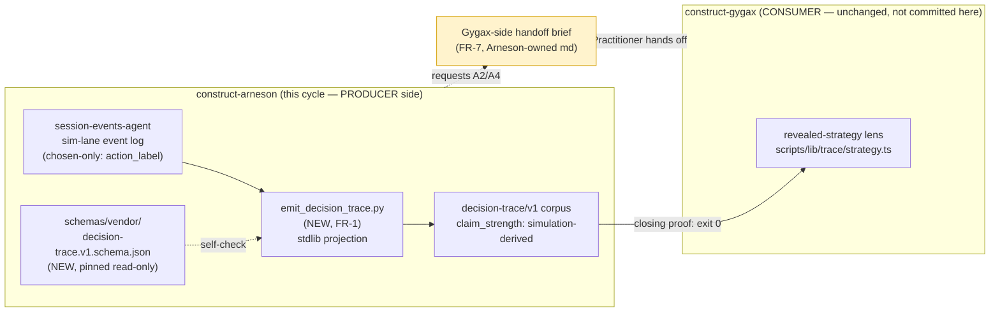
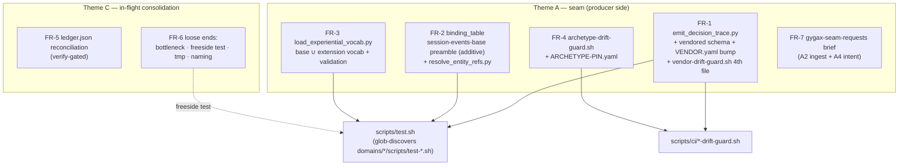
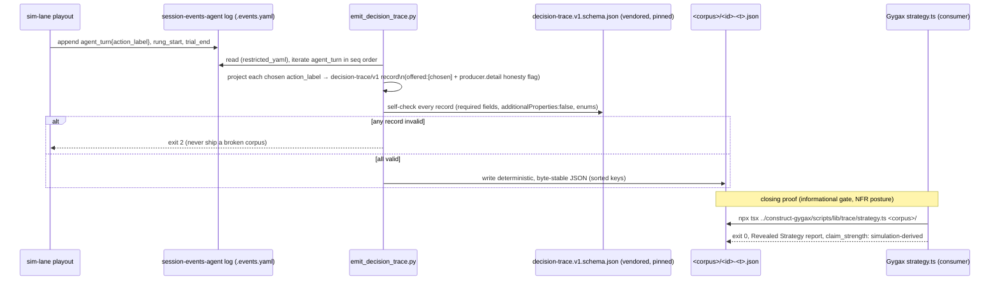

# Software Design Document: cycle-007 — Compounding-Seam Closure & In-Flight Consolidation

> **Cycle:** cycle-007. **Status:** Draft (architect complete). **Date:** 2026-06-25.
> **Author:** designing-architecture / Practitioner.
> **Source PRD:** `grimoires/loa/prd.md` (cycle-007, 7 FRs, 7 NFRs, 6 risks).
> **Supersedes:** cycle-004 "Simulation Fidelity Gap Report" SDD (archived alongside its PRD).
> **Grounding:** Direct cross-repo code analysis of `construct-arneson` + the `../construct-gygax`
> sibling checkout (2026-06-25). Both `/architect` design questions (OQ-1, R-2) resolved empirically
> against live code/fixtures, not prose — see §1.2 and §1.3.

---

## Table of Contents

1. [Project Architecture](#1-project-architecture)
   - 1.1 [System Overview](#11-system-overview)
   - 1.2 [OQ-1 Resolution — the sim log is chosen-only](#12-oq-1-resolution--the-sim-log-is-chosen-only-fr-1)
   - 1.3 [R-2 Resolution — wholesale pin bump](#13-r-2-resolution--wholesale-pin-bump-fr-1)
   - 1.4 [Component map](#14-component-map)
   - 1.5 [Data flow — the producer side of the seam](#15-data-flow--the-producer-side-of-the-seam)
   - 1.6 [Trust & boundary invariants (load-bearing)](#16-trust--boundary-invariants-load-bearing)
2. [Software Stack](#2-software-stack)
3. [Data Models](#3-data-models)
4. [Component Design](#4-component-design)
5. [Interface Specifications (CLI + skill/doc)](#5-interface-specifications-cli--skilldoc)
6. [Error Handling Strategy](#6-error-handling-strategy)
7. [Testing Strategy](#7-testing-strategy)
8. [Development Phases](#8-development-phases)
9. [Known Risks and Mitigation](#9-known-risks-and-mitigation)
10. [Open Questions](#10-open-questions)
11. [Appendix](#11-appendix)

---

## 1. Project Architecture

### 1.1 System Overview

cycle-007 is a **consolidation cycle**, not a new subsystem. It closes the *producer side* of the
Arneson→Gygax compounding seam (Theme A) and restores truth to in-flight project state (Theme C). The
architecture is the construct's existing one — **filesystem-first, stdlib-only projection scripts +
drift guards + schema deltas**, with skills as prompt-driven markdown. No new runtime, no services, no
dependencies.

Seven deliverables, grouped by the two themes:

| FR | Deliverable | Theme | Kind | Priority |
|----|-------------|-------|------|----------|
| FR-1 | `emit_decision_trace.py` + vendored `decision-trace.v1.schema.json` + drift-guard extension | A | new script + vendoring | P0 |
| FR-2 | entity-ref binding table (additive preamble block + resolver + discipline rule) | A | schema delta + script | P0 |
| FR-5 | ledger reconciliation (cycle-005, 3 bug cycles, cycle-006) | C | data reconciliation | P0 |
| FR-7 | Gygax-side handoff brief (A2 ingest + A4 intent) | A | markdown deliverable | P0 |
| FR-3 | experiential-intent extension wiring (effective-vocab loader + test) | A | script + test | P1 |
| FR-4 | archetype SSOT pin + drift guard | A | pin file + guard script | P1 |
| FR-6 | seam-adjacent loose ends (bottleneck, freeside test, tmp file, naming exception) | C | mixed | P1 |

The P0 spine (FR-1/2/5/7) closes the seam's producer side and makes the project's records honest. The
P1 items (FR-3/4/6) make documented-but-dead seams live and clear the loose-end tail. The two design
questions the PRD delegated to `/architect` are resolved decisively below.


```mermaid
flowchart LR
    subgraph Arneson["construct-arneson (this cycle — PRODUCER side)"]
        SE["session-events-agent\nsim-lane event log\n(chosen-only: action_label)"]
        EMIT["emit_decision_trace.py\n(NEW, FR-1)\nstdlib projection"]
        VEN["schemas/vendor/\ndecision-trace.v1.schema.json\n(NEW, pinned read-only)"]
        CORPUS["decision-trace/v1 corpus\nclaim_strength: simulation-derived"]
        SE --> EMIT
        VEN -. self-check .-> EMIT
        EMIT --> CORPUS
    end
    subgraph Gygax["construct-gygax (CONSUMER — unchanged, not committed here)"]
        LENS["revealed-strategy lens\nscripts/lib/trace/strategy.ts"]
    end
    CORPUS -->|closing proof: exit 0| LENS
    GBRIEF["Gygax-side handoff brief\n(FR-7, Arneson-owned md)"]:::brief
    Arneson -. requests A2/A4 .-> GBRIEF
    GBRIEF -. Practitioner hands off .-> Gygax
    classDef brief fill:#fff3cd,stroke:#d39e00;
```

### 1.2 OQ-1 Resolution — the sim log is chosen-only (FR-1)

**Question (PRD R-1 / brief OQ-1):** Does `session-events-agent` carry the **offered** option set at
each decision point, or only the **chosen** `action_label`? This decides whether the emitter is a pure
projection or needs a serializer extension.

**Resolved empirically (2026-06-25), chosen-only:**

- The `agent_turn` event schema defines `narrated_action`, `why`, `action_label` (an optional slug —
  *the chosen move*), and `grounding_refs`. There is **no `offered` field** (`session-events-agent.schema.yaml:79-100`).
- The live committed fixture sidecar carries `action_label: add-positive-filter` and no offered set
  (`native-sidecar.events.yaml:48`).
- The dungeon hint resolves negative too: the task-template `moves.json` is empty (`[]`); the run-time
  `moves.json` is a list of *chosen* moves (`{actor, action, target}`), not a legal-option vocabulary
  (`fixtures/dungeon-crawl/task-template/moves.json`, `fixtures/batches/dungeon-sample/runs/rung-0/trial-1/moves.json`).
- The Gygax contract **requires** `offered` (`minItems: 1`) with `chosen` a subset of `offered`
  ("Each must be in `offered`, matched by type") — `../construct-gygax/schemas/decision-trace.v1.schema.json`.

**Decision: chosen-only honest projection.** `emit_decision_trace.py` emits, per decision,
`offered: [{ "type": <action_label> }]` equal to `chosen`, and stamps an honest marker:

```
"producer": { "kind": "simulation", "detail": "offered-set-unrecorded: chosen-only projection (the sim log captures the move taken, not the legal option set)" }
```

Rationale, in invariant terms:

1. **Producer-never-judges (NFR-2).** Inventing a plausible offered set the host never presented would
   be *interpretation/fabrication*. The emitter may only reshape what was actually recorded. Chosen-only
   is the only honest projection of a chosen-only log.
2. **Contract-valid.** `offered` has `minItems: 1` and `chosen ⊆ offered` holds trivially → the corpus
   validates and the lens consumes it (exit 0, `claim_strength: simulation-derived`) — SM-2 met.
3. **Honest about its own poverty.** `producer.detail` declares the degeneracy openly. A downstream
   analyst sees that every decision had exactly one recorded option and knows *why* the revealed-strategy
   signal is empty, rather than being misled by a fabricated option set.

**Forward path (designed-for, NOT built this cycle):** the emitter additionally reads an *optional*
`offered_labels: [slug, …]` field on `agent_turn` when present, producing a real multi-option `offered`
set with `chosen ∈ offered` asserted. This field is **deliberately not added to
`session-events-agent.schema.yaml` this cycle** — nothing would populate it, and shipping an unpopulated
schema field is exactly the *documented-but-dead-seam* antipattern this very cycle exists to fix (cf.
FR-3, FR-4). The read-path is ~3 defensive lines (`turn.get("offered_labels")`), so when a future cycle
teaches the playout host to enumerate the legal option set at each decision (a domain-modeling task), the
emitter consumes it with zero rework.

> **Honest tradeoff (must survive into the PR description):** this MVP closes the **contract** seam —
> Arneson sim output is now *consumable* by Gygax's lens — but it does **not** yet close the **analytic**
> seam. Revealed-strategy analysis over a chosen-only corpus reveals no preference (no alternatives ⇒
> nothing to reveal). The two halves now *join* structurally and honestly; making the join *analytically
> valuable* requires offered-set capture, which is future work. The PRD's UC-1 postcondition ("the producer
> side of the seam is closed; the corpus is consumable, byte-stable, and claim-honest") is satisfied; the
> PRD makes no claim of analytic richness, and neither do we.

### 1.3 R-2 Resolution — wholesale pin bump (FR-1)

**Question (PRD R-2 / brief note):** the current `VENDOR.yaml` pins `upstream.git_sha: 3fa6c91`
(cycle-010); the decision-trace file landed at `95ccf21` (cycle-012). Reconcile per-file vs wholesale
pin so the drift guard stays green for all four files.

**Resolved empirically (2026-06-25):**

| Fact | Evidence |
|------|----------|
| decision-trace.v1.schema.json sha256 at Gygax HEAD (95ccf21) = `83d6a69f…dab02` | exact match to the brief's pin |
| decision-trace.v1.schema.json is **absent** at 3fa6c91 | added in cycle-012 at 95ccf21 |
| the 3 currently-vendored files (observed-trace, observed-trace-batch, signal-taxonomy) are **byte-identical** at 3fa6c91 **and** 95ccf21 | `git show 3fa6c91:<f> | sha == git show 95ccf21:<f> | sha` for all three |

**Decision: wholesale pin bump `3fa6c91 → 95ccf21`.** Because the three existing vendored files are
byte-identical across both SHAs, bumping the single `upstream.git_sha` changes **no bytes**, invalidates
**no** `sha256` pin, and requires **no** validator revisit. We simply add the decision-trace entry (which
naturally lives at 95ccf21) and bump the wholesale SHA.

Why wholesale over per-file: it is simpler (one `git_sha`), it continues the established convention
(cycle-003 sprint-2 did `64f6d75 → 3fa6c91` wholesale after a byte-identity verify), and it is *correct*
precisely because byte-identity holds. Per-file `git_sha` would add structure to `VENDOR.yaml` and the
drift guard for zero benefit when the bytes are identical. If a future re-vendor ever finds the files
diverged at the target SHA, *then* switch to per-file — not today. A comment in `VENDOR.yaml` records
that observed-trace/taxonomy are unchanged since 3fa6c91 and were re-verified byte-identical at 95ccf21.

### 1.4 Component map


```mermaid
flowchart TD
    subgraph A["Theme A — seam (producer side)"]
        F1["FR-1 emit_decision_trace.py\n+ vendored schema + VENDOR.yaml bump\n+ vendor-drift-guard.sh 4th file"]
        F2["FR-2 binding_table\nsession-events-base preamble (additive)\n+ resolve_entity_refs.py"]
        F3["FR-3 load_experiential_vocab.py\nbase ∪ extension vocab + validation"]
        F4["FR-4 archetype-drift-guard.sh\n+ ARCHETYPE-PIN.yaml"]
        F7["FR-7 gygax-seam-requests brief\n(A2 ingest + A4 intent)"]
    end
    subgraph C["Theme C — in-flight consolidation"]
        F5["FR-5 ledger.json reconciliation\n(verify-gated)"]
        F6["FR-6 loose ends:\nbottleneck · freeside test · tmp · naming"]
    end
    RUN["scripts/test.sh\n(glob-discovers domains/*/scripts/test-*.sh)"]
    F1 & F2 & F3 --> RUN
    F6 -. freeside test .-> RUN
    GUARDS["scripts/ci/*-drift-guard.sh"]
    F1 & F4 --> GUARDS
```

All five FR-A scripts are mutually independent at the file level (different scripts, different schemas);
FR-5 and FR-6 touch only state/data files and tests. The only ordering constraint is intra-FR-1
(vendor the schema before the emitter self-checks against it).

### 1.5 Data flow — the producer side of the seam (FR-1)


```mermaid
sequenceDiagram
    participant Sim as sim-lane playout
    participant Log as session-events-agent log (.events.yaml)
    participant Emit as emit_decision_trace.py
    participant Vendor as decision-trace.v1.schema.json (vendored, pinned)
    participant Corpus as <corpus>/<id>-<t>.json
    participant Lens as Gygax strategy.ts (consumer)

    Sim->>Log: append agent_turn{action_label}, rung_start, trial_end
    Emit->>Log: read (restricted_yaml), iterate agent_turn in seq order
    Emit->>Emit: project each chosen action_label → decision-trace/v1 record\n(offered:[chosen] + producer.detail honesty flag)
    Emit->>Vendor: self-check every record (required fields, additionalProperties:false, enums)
    alt any record invalid
        Emit-->>Sim: exit 2 (never ship a broken corpus)
    else all valid
        Emit->>Corpus: write deterministic, byte-stable JSON (sorted keys)
    end
    Note over Corpus,Lens: closing proof (informational gate, NFR posture)
    Lens->>Corpus: npx tsx ../construct-gygax/scripts/lib/trace/strategy.ts <corpus>/
    Lens-->>Corpus: exit 0, Revealed Strategy report, claim_strength: simulation-derived
```

### 1.6 Trust & boundary invariants (load-bearing)

Every component in this cycle is bound by the PRD's NFRs. These are not aspirational — they are the
acceptance surface, and each maps to a concrete check.

| Invariant | Source | Enforced by |
|-----------|--------|-------------|
| Standalone-plus-composable | NFR-1 | emitter/loaders import nothing from `construct-gygax`; only coupling = vendored schema (import-grep test); FR-4 guard skips-clean when Gygax absent |
| Producer-never-judges | NFR-2 | emitter projects shapes only — no severity/score/cliff; chosen-only never fabricates alternatives (§1.2); banned-phrase gate |
| stdlib-only + deterministic | NFR-3 | `restricted_yaml.py` only; no clock/random; sorted-key JSON; golden-file byte-match test |
| Read-only vendored contracts | NFR-4 | `vendor-drift-guard.sh` byte-diff + sha-pin (4 files); never edit `schemas/vendor/` |
| Claim-strength honesty | NFR-5 | `claim_strength: simulation-derived` + `producer.kind: simulation` hardcoded; structural via the schema's enum + `additionalProperties:false` |
| Additive schema changes only | NFR-6 | FR-2 `binding_table` additive to preamble; FR-1 adds no field to `session-events-agent` this cycle; no renames |
| No private/upstream game references | NFR-7 | `banned-phrases.sh` / banned-copy gate over all new artifacts incl. the brief |

---

## 2. Software Stack

No change to the runtime stack. This section pins versions for reproducibility.

### 2.1 Runtime

| Component | Version | Rationale |
|-----------|---------|-----------|
| Python | 3.11+ (stdlib only) | New scripts (`emit_decision_trace.py`, `resolve_entity_refs.py`, `load_experiential_vocab.py`) use only the standard library + the in-repo `restricted_yaml.py` parser. No pip dependencies (NFR-3). |
| `restricted_yaml.py` | in-repo (`domains/agent-systems/scripts/restricted_yaml.py`) | Shared deterministic YAML subset parser already used by `project_trace.py` / `summarize_playout.py` / `gap_report.py`. Reused, not duplicated. |
| Bash | 4+ (`set -euo pipefail`) | Drift guards + test harness, matching `vendor-drift-guard.sh` / `scripts/test.sh`. |
| Node / `npx tsx` | as provided by the Gygax sibling checkout | Used **only** for the FR-1 closing proof (running Gygax's lens). Not an Arneson runtime dependency — the proof is an informational gate (SM-2). |

### 2.2 Dev tooling (NOT runtime)

Unchanged from cycle-004: `pyproject.toml` declares ruff + mypy scoped to the agent-systems scripts,
with intentionally **no** `[project]` dependency table (the runtime is stdlib + `restricted_yaml`). New
scripts must pass `py_compile` and the configured ruff/mypy when those tools are present in the dev/CI
environment.

### 2.3 Layout (new/changed files)

```
domains/agent-systems/
  scripts/
    emit_decision_trace.py            # NEW (FR-1)
    test-emit-decision-trace.sh       # NEW (FR-1) — auto-discovered by scripts/test.sh
  schemas/vendor/
    decision-trace.v1.schema.json     # NEW (FR-1) — vendored, read-only, 95ccf21
    VENDOR.yaml                        # CHANGED — bump git_sha 3fa6c91→95ccf21 + add entry
  resources/fixtures/
    decision-trace/                    # NEW — sim-lane episode fixture + golden corpus
schemas/core/
  session-events-base.schema.yaml      # CHANGED (FR-2) — additive binding_table + entity_ref rule
scripts/ (core)
  resolve_entity_refs.py               # NEW (FR-2)
  load_experiential_vocab.py           # NEW (FR-3)
  ci/
    vendor-drift-guard.sh              # CHANGED (FR-1) — 4th file in byte-diff loop
    archetype-drift-guard.sh           # NEW (FR-4)
domains/ttrpg/resources/archetypes-fallback/
  ARCHETYPE-PIN.yaml                   # NEW (FR-4)
domains/character-voice/scripts/
  test-freeside-atomic-write.sh        # NEW (FR-6) — negative-path lock
domains/ttrpg/schemas/
  digest-ttrpg.schema.yaml             # CHANGED (FR-6) — bottleneck reconciliation
grimoires/loa/
  ledger.json                          # CHANGED (FR-5) — reconciliation
  discovery/gygax-seam-requests-cycle007.md  # NEW (FR-7) — handoff brief
  NOTES.md.tmp                         # DELETED (FR-6)
```

---

## 3. Data Models

### 3.1 `decision-trace/v1` record (FR-1, vendored contract — Gygax-owned)

Required by `decision-trace.v1.schema.json` (`additionalProperties: false`). The emitter produces exactly
these fields per decision:

```jsonc
{
  "schema": "decision-trace/v1",
  "claim_strength": "simulation-derived",          // NFR-5: hardcoded for sim; never real-agent-observed
  "producer": {
    "kind": "simulation",                           // NFR-5: hardcoded
    "id": "<model_id from preamble.provenance>",    // engine truth
    "detail": "offered-set-unrecorded: chosen-only projection …",  // §1.2 honesty flag (chosen-only path)
    "provenance": { "model_id": "<…>", "construct_sha": "<construct_git_sha>" }  // from preamble.provenance
  },
  "corpus": { "id": "<scenario_id>:<run_id>", "game": "<domain or scenario family>" },
  "actor_id": "<persona/agent id>",                 // derivation rule below
  "episode_id": "<run_id>",                          // one playout run = one episode
  "t": 0,                                            // decision index within episode, 0-based, stable by seq
  "context": { "segment": "rung:<rung_name>" },     // conditioning key from rung/visibility context
  "offered": [ { "type": "<action_label>" } ],      // §1.2: chosen-only ⇒ == chosen; or offered_labels-derived
  "chosen":  [ { "type": "<action_label>" } ]
}
```

**Field derivation (deterministic, no clock/random):**

| Field | Source in `session-events-agent` | Rule |
|-------|----------------------------------|------|
| `producer.id` / `producer.provenance.model_id` | `preamble.provenance.model_id` | verbatim |
| `producer.provenance.construct_sha` | `preamble.provenance.construct_git_sha` | verbatim |
| `corpus.id` | `preamble.scenario_id` + `preamble.run_id` | `"<scenario_id>:<run_id>"` |
| `corpus.game` | `preamble.domain` (+ scenario family if present) | stable string |
| `actor_id` | persona ref in preamble; else scenario-derived stable id | if no explicit persona id, use a stable `corpus.id`-derived token (documented) — **never** a clock/uuid |
| `episode_id` | `preamble.run_id` | verbatim |
| `t` | order of emitted `agent_turn` records within the episode | 0-based monotonic, stable by `seq` |
| `context.segment` | nearest preceding `rung_start.rung_name` (or `preamble.visibility_rung`) | `"rung:<name>"` — the brief's "rung / visibility context" |
| `chosen` | `agent_turn.action_label` | `[{ "type": label }]`; turns with **no** `action_label` emit **no** record (never inferred from prose) |
| `offered` | — (chosen-only) **or** `agent_turn.offered_labels` if present | chosen-only ⇒ `offered == chosen` + `producer.detail`; if `offered_labels` present ⇒ one `{type}` per label, assert `chosen ⊆ offered` |

> **`option` shape** (from the contract `$defs`): `{ "type": <string, required> , "id"?: <string>, "label"?: <string> }`.
> The emitter uses `type` (the action_label slug) as the unit of analysis; `id`/`label` are omitted (optional).

### 3.2 `VENDOR.yaml` after R-2 (FR-1)

```yaml
upstream:
  repo: 0xHoneyJar/construct-gygax
  git_sha: 95ccf2190ca6f61badeef71881f1f1c2dee7b1be   # bumped from 3fa6c91 (cycle-010)
  vendored_at: "2026-06-25"
  # observed-trace/observed-trace-batch/signal-taxonomy are byte-identical at 3fa6c91 and 95ccf21
  # (verified 2026-06-25); the bump changes no bytes for those three files.
files:
  - vendored: domains/agent-systems/schemas/vendor/observed-trace.v1.schema.json
    upstream_path: schemas/observed-trace.v1.schema.json
    sha256: df3f789b40fa21456c51432a3bcbcab36755bcba95ea54f0f62bfaa5be0fafcd   # unchanged
  - vendored: domains/agent-systems/schemas/vendor/observed-trace-batch.v1.md
    upstream_path: schemas/observed-trace-batch.v1.md
    sha256: d04dabfaca79687b6c21414095dae45576b17a0e7362b7a78de92a25e30081c3   # unchanged
  - vendored: domains/agent-systems/schemas/vendor/signal-taxonomy.v1.schema.json
    upstream_path: schemas/signal-taxonomy.v1.schema.json
    sha256: f6ba7182d8d41e53595a142316451377456a1899217a085fdbc9c4a22e542ce6   # unchanged
  - vendored: domains/agent-systems/schemas/vendor/decision-trace.v1.schema.json   # NEW
    upstream_path: schemas/decision-trace.v1.schema.json
    sha256: 83d6a69f6001a1fed2592932a24e501cd54db170fb4ababead0adb12745dab02
```

The pin-check loop in `vendor-drift-guard.sh` (`:38-62`) already auto-discovers entries by parsing
`vendored:`/`sha256:` pairs — adding the YAML entry extends the pin check with zero code change. Only the
byte-diff loop's hardcoded array (`:20`) gains the fourth filename.

> **Adjacent observation (not a blocker):** `construct.yaml::agent-systems.vendored_contracts` lists only
> two of the existing vendored files (observed-trace.v1 + batch), omitting signal-taxonomy. FR-1 should add
> `decision-trace.v1` there; reconciling the pre-existing signal-taxonomy omission is optional hygiene
> (mention in PR, do not gold-plate).

### 3.3 `binding_table` preamble block (FR-2, additive to `session-events-base` v2)

`session-events-base.schema.yaml` defines `session_preamble` (`:15`) and its validation rules (`:161`);
it has no `entity_ref` concept today. FR-2 adds, **additively** (NFR-6):

```yaml
# session_preamble (additive block)
binding_table:
  type: "list[block]"
  required: false                 # additive; absent on pre-existing sidecars
  description: >
    Maps each Arneson-LOCAL entity_ref to its meaning, so a session is interpretable
    with no Gygax checkout. The optional gygax_id is populated only when composing.
  item_fields:
    ref:      { type: string, required: true, pattern: "^arn:[a-z0-9-]+$" }  # Arneson-local namespace
    label:    { type: string, required: true }   # human-readable meaning — standalone interpretability
    gygax_id: { type: string, required: false }  # populated only under composition
```

Plus an additive validation rule (prose, mirroring the existing rule style at `:161`):

> "Every `entity_ref` referenced by an event MUST appear as a `binding_table[].ref`; refs use the
> Arneson-local `arn:` namespace and resolve only through the binding table (never a bare Gygax id)."

Events that touch a mechanic/tension/resource carry `entity_ref: arn:<kind>-<n>` (a domain-level
convention applied by the session skills' prompts); the field is additive on the relevant event types.
The producer **offer** to Gygax (recorded in FR-7's brief): on ref-resolution failure, prefer
**quarantine-and-tag** so partial admissibility survives schema drift.

### 3.4 experiential-intent extension model (FR-3)

The mechanism is already documented (`experiential_intent.schema.yaml:77-86`) and one worked example
already exists (`examples/synthetic-fixture/tradition-folk-horror-minimalist.yaml:48`). The data shape:

```yaml
# in tradition lore YAML
experiential_intent_extensions:
  tone_values: [<additional tone enum values>]
  register_values: [<additional register enum values>]
```

The *effective vocabulary* for a tradition = base controlled vocab (`experiential_intent.schema.yaml`
tone/register enums) **∪** the extension values when present; base-only when absent (graceful
degradation). FR-3 supplies the loader that computes this and validates an intent block against it (§4.3).

### 3.5 `ARCHETYPE-PIN.yaml` (FR-4)

Records which Gygax `skills/cabal/resources/archetypes.yaml` the 9-file fallback set
(`domains/ttrpg/resources/archetypes-fallback/`) was reconciled against:

```yaml
# domains/ttrpg/resources/archetypes-fallback/ARCHETYPE-PIN.yaml
gygax_repo: 0xHoneyJar/construct-gygax
gygax_archetypes_path: skills/cabal/resources/archetypes.yaml
gygax_git_sha: "<sha at reconciliation>"
gygax_archetypes_sha256: "<sha256 of that file>"
reconciled_at: "2026-06-25"
archetype_names: [casual, chaos-agent, contrarian, explorer, min-maxer, newcomer, optimizer, rules-lawyer, storyteller]
```

`archetype_names` is the load-bearing field for the human-readable drift report — the NOTES record flags
that the fallback names were "invented guesses," so a name-set diff is what surfaces a real coordination
gap with Gygax (see §4.4).

### 3.6 `bottleneck` reconciliation (FR-6)

`digest-ttrpg.schema.yaml:75-84` groups signals under a `signal_flags` block whose keys are
`confusion, friction, bottleneck, delight, surprise, boredom`. But the canonical 9-value signal taxonomy
(`session-events-base.schema.yaml` signal block, vendored as `signal-taxonomy.v1.schema.json`) is
`safety, insight, concern, friction, praise, confusion, delight, surprise, boredom`. `bottleneck` is
**not a signal value** — it is a decision classification (`mechanical_bottleneck`, the friction/bottleneck
axis on `archetype_decision`). The reconciliation **decision** (to be recorded in the schema + PR):

- **Recommended:** remove `bottleneck` from `signal_flags` (it belongs on the decision-classification axis,
  not the signal axis). `signal_flags` keys then draw only from the signal taxonomy.
- **Alternative (if a digest consumer depends on the key):** keep it but rename/relocate under an
  explicitly non-signal grouping (e.g. `decision_classifications:`), with a comment stating it is *not* a
  signal-taxonomy member.

Either way the decision is recorded in the schema comment + PR. This is a digest-side (derived view),
Arneson-owned change — not a cross-construct contract change.

### 3.7 `ledger.json` reconciliation targets (FR-5)

Verified state (2026-06-25): every drifted cycle **shipped and merged** — so the R-5 verify-gate passes
with no incomplete residue.

| Cycle | Current ledger | Evidence on disk + merged | Target |
|-------|----------------|---------------------------|--------|
| cycle-005 voice-persona-bridge | `active`, sprint-22 `planned`, `active_cycle: cycle-005` | `scaffold_agent_persona.py` + test on disk; PR #22 merged (`190f47d`, `c835dd8`, `ea29581`) | sprint-22 `completed`; cycle `archived` (or `completed`) w/ timestamps; clear `active_cycle` |
| cycle-bug-20260610-c7bc67 | `active` | `ollama-agent.py` on disk; PR #15 merged (`0273292`) | `completed`/`archived` |
| cycle-bug-20260610-594345 | `active` | validate_batch timeout+triage; PR #16 merged (`bc0a0a7`) | `completed`/`archived` |
| cycle-bug-20260610-5ad67a | `active` | marker convention; PR #17 merged (`8651d8b`, COMPLETED commit) | `completed`/`archived` |
| cycle-006 decision-trace-emitter brief | **absent** | brief shipped; PR #23 merged (`6c0daf9`) | add as brief-only micro-cycle (precedent: cycle-003/005); note the *emitter* is cycle-007 |

**Internal inconsistency to fix:** `next_sprint_number: 23` vs `global_sprint_counter: 3` — the latter is
stale/incorrect. Reconcile to a single canonical counter (recommend keeping `next_sprint_number` as the
live value and correcting/removing the stale `global_sprint_counter`); record the decision in the PR.

> **Scope note:** cycle-007 itself is registered by `/sprint-plan`, not by FR-5. FR-5 reconciles *past*
> drift only.

---

## 4. Component Design

### 4.1 `emit_decision_trace.py` (FR-1) — sibling to `project_trace.py`

Structural twin of the existing `project_trace.py` (native sidecar → vendored-schema corpus, deterministic,
self-checking, exit 0/1/2). Function decomposition:

```
main(argv)                         # argparse: --in <events.yaml> --out <corpus_dir>
  load(events_path)  -> dict       # restricted_yaml.parse_file; exit 1 on parse/empty/degenerate
  build_records(log) -> list       # iterate agent_turn in seq order; project per §3.1; skip turns w/o action_label
  validate_record(r) -> [errs]     # contract self-check vs vendored schema (required, additionalProperties, enums)
  write_corpus(records, out)       # <out>/<corpus_id-sanitized>-<t>.json, sorted keys, byte-stable
err(msg) / die(msg, code)          # "ERROR: [emit_decision_trace] …" to stderr
```

- **Self-check (exit 2):** `validate_record` encodes the vendored contract's required-field set,
  `additionalProperties: false`, and the `claim_strength`/`producer.kind` enums — the same hand-written
  contract-validator approach the construct already uses for observed-trace (`validate_sidecar.py`), because
  the stdlib has no JSON-Schema engine. It pins to the vendored `decision-trace.v1.schema.json` sha256 and
  refuses (exit 2) on pin drift, mirroring `validate_sidecar.py`. **Never ship a broken corpus.**
- **Determinism (NFR-3):** records sorted by `t` (insertion order = seq order); JSON written with
  `sort_keys=True` and fixed separators; no `datetime.now()`, no `random`, no dict-iteration-order reliance.
- **Standalone (NFR-1):** imports only stdlib + sibling `restricted_yaml`. Zero `construct-gygax` imports
  (locked by an import-grep test, §7).
- **Claim honesty (NFR-5):** `claim_strength`/`producer.kind` are literals, not derived from input — a sim
  log can never produce a `real-agent-observed` record.
- **Degenerate input (exit 1):** an episode with no `agent_turn`/no `action_label` (would yield zero
  records, violating the lens's expectation of a non-empty corpus) dies with `ERROR: [emit_decision_trace] …`.

### 4.2 `resolve_entity_refs.py` (FR-2)

A small stdlib resolver that proves standalone interpretability (SM-4). Given a session sidecar:

```
resolve(sidecar) -> {ref: label}      # build map from preamble.binding_table
check(sidecar)   -> [unbound_refs]    # every entity_ref used in events must be in the table
main: exit 0 if all refs resolve (no Gygax checkout needed); exit 1 + ERROR: [resolve_entity_refs] … on any unbound ref
```

Location: core `scripts/` (decision OQ-C), since `binding_table` lives on the *base* preamble and applies
to every vertical. The resolver is the executable form of the FR-2 acceptance ("refs resolve only through
the binding table, no Gygax checkout"). Composition (filling `gygax_id`) is the consumer's job (FR-7
brief) — the resolver only validates the local label side. A sidecar with no `binding_table` and no
`entity_ref`s still passes (additive-only; pre-existing sidecars unaffected).

### 4.3 `load_experiential_vocab.py` (FR-3)

```
effective_vocab(base_schema, lore_yaml) -> {tone:set, register:set}
  # base enums ∪ experiential_intent_extensions.{tone_values,register_values} when present; base-only when absent
validate_intent(intent_block, effective) -> [errs]   # each tone/register value must be in the effective set
main: exit 0 if the intent block's values are within the effective vocab; exit 1 otherwise
```

This wires the *documented-but-dead* extension mechanism: when a tradition lore file carries
`experiential_intent_extensions`, its extended tone/register values become valid; when absent, validation
falls back to the base controlled vocabulary (graceful degradation). The voicing skills' prompts reference
the extension mechanism (doc-level); the loader is the verifiable enforcement the test exercises (SM-5,
present + absent paths). The worked example already lives in
`examples/synthetic-fixture/tradition-folk-horror-minimalist.yaml`.

> Altitude note (P1/Should-Have): FR-3's "applied" side (voicing actually using extended tones) is
> prompt-driven and not mechanically testable; the *verifiable* contract is the effective-vocab computation +
> validation, which is what ships and what the test locks.

### 4.4 `archetype-drift-guard.sh` (FR-4) — sibling to `vendor-drift-guard.sh`

```
GYGAX_ROOT = $ARNESON_GYGAX_ROOT or ../construct-gygax
if no Gygax checkout OR no archetypes.yaml:           # absence is NORMAL for archetypes (unlike vendored contracts)
    echo "SKIP: no Gygax archetypes.yaml — fallback set authoritative (standalone)"; exit 0
else:
    actual_sha = sha256(GYGAX_ROOT/skills/cabal/resources/archetypes.yaml)
    pinned_sha = ARCHETYPE-PIN.yaml::gygax_archetypes_sha256
    name_diff  = set(gygax archetype keys)  △  set(ARCHETYPE-PIN.archetype_names)
    if actual_sha != pinned_sha OR name_diff != ∅:
        report drift (which names added/removed; sha mismatch); exit 1
    else: echo "OK: archetype SSOT in sync with pin"; exit 0
```

**Critical difference from `vendor-drift-guard.sh`:** the vendor guard *requires* the Gygax checkout
(vendored bytes must be verifiable, so absence is a FAIL/exit 1). The archetype guard treats Gygax absence
as **SKIP/exit 0** — Gygax is optional (`composition.siblings.required: false`), so a standalone Arneson
must not fail this check (FR-4 acceptance: "with no Gygax present, the check is a no-op/skip, not a
failure"). The name-set diff is the human-readable signal that catches the "invented fallback names"
coordination risk the NOTES flagged.

### 4.5 Ledger reconciliation procedure (FR-5) — verify-gated

Not code; a **verify-then-mark** procedure executed in `/implement`, with the verification already done at
design time (§3.7). For each drifted cycle: (1) confirm deliverable paths exist on disk; (2) confirm the PR
merged (git log); (3) only then set `status: completed`/`archived` with timestamps. If any deliverable were
absent or a PR unmerged, document the precise residue instead of marking done (R-5: no rubber-stamping).
Here, all five targets verify clean. Optionally ship a lightweight `ledger-consistency-check.sh` that flags
any `active`/`planned` cycle whose declared deliverable paths exist (SM-7 as a durable gate rather than a
one-time review) — recommended but not required by the PRD.

### 4.6 Freeside atomic-write test (FR-6)

The invariant ("both layers update together; a failed write leaves the file unchanged") is **already
enforced**: `emit_persona.py` computes the entire two-layer document in `emit()`, calls
`validate_sync_contract` (`:465`) before returning, and writes nothing to disk itself — it prints the full
result to **stdout** (`:507`), so its guarantee is *all-or-nothing emission* (the caller redirects stdout;
the script never half-emits). The PRD's gap is that this invariant has **no enforcing test**. FR-6 adds the
lock (no production-code change needed):

```
test-freeside-atomic-write.sh:
  [1] positive: ingest→emit a persona; assert BOTH the body section AND the prompt-marker section
      reflect a changed field (two-layer co-update).
  [2] negative (the new lock): feed a state that violates the sync contract; assert emit exits non-zero
      AND emits NO partial document to stdout (validate_sync_contract fires before any output).
```

If [2] ever fails (e.g., a future refactor emits before validating), the test reveals the regression and the
fix is to restore validate-before-emit. Doc note: callers wanting on-disk crash-safety should
`emit > tmp && mv tmp persona.md` (tmp+rename) — the script's stdout design is deliberately composable, so
filesystem atomicity is the caller's contract, not the script's.

### 4.7 Remaining FR-6 items

- Delete `grimoires/loa/NOTES.md.tmp` (0-byte stray, confirmed present).
- Document the snake_case `experiential_intent.schema.yaml` naming outlier as an **intentional exception**
  (renaming is a breaking change per `consistency-report.md:C1`) — a note in the relevant
  `domain.conventions.md` or a short `SCHEMA-NAMING.md`; **no rename** this cycle.

### 4.8 Gygax-side handoff brief (FR-7)

Arneson-owned markdown at `grimoires/loa/discovery/gygax-seam-requests-cycle007.md` (the established
location for cross-construct briefs, e.g. `gygax-seam-reply-v1.1.md`, `gygax-trace-json-brief.md`).
Required contents:

- **Request A2** — `/cabal --from-session` (or `--from-digest`) ingest mode consuming Arneson's
  digest/session output (emitted today, unconsumed).
- **Request A4** — a Gygax `mechanical_intent` schema + reconciliation of the two-axis intent shape across
  `attune` docs (single-axis), `homebrew/SKILL.md` (two-axis), and sample game-state files.
- **Producer-side context Gygax needs:** the FR-2 binding-table offer, the **quarantine-and-tag**
  ref-resolution-failure preference, and the signal-taxonomy vendoring direction.
- Cross-references `seam-strawman.md` + this PRD. Commits **no** Gygax code (Arneson ships only the brief).
- Must pass the no-private/upstream-game-reference gate (NFR-7).

---

## 5. Interface Specifications (CLI + skill/doc)

### 5.1 CLI surfaces

| Tool | Invocation | Exit codes |
|------|------------|------------|
| `emit_decision_trace.py` | `python3 emit_decision_trace.py --in <events.yaml> --out <corpus_dir>` | 0 ok · 1 input error (blank/degenerate) · 2 contract self-check fail |
| `resolve_entity_refs.py` | `python3 resolve_entity_refs.py <sidecar.events.yaml>` | 0 all refs resolve · 1 unbound ref |
| `load_experiential_vocab.py` | `python3 load_experiential_vocab.py --lore <tradition.yaml> --intent <block.yaml>` | 0 within effective vocab · 1 out-of-vocab |
| `vendor-drift-guard.sh` | `bash scripts/ci/vendor-drift-guard.sh` (needs Gygax checkout) | 0 all 4 files match · 1 drift/missing |
| `archetype-drift-guard.sh` | `bash scripts/ci/archetype-drift-guard.sh` | 0 in-sync **or Gygax absent (SKIP)** · 1 drift |
| `test-emit-decision-trace.sh` etc. | auto-discovered by `scripts/test.sh` | 0 pass · 1 fail |

All error messages use the construct's convention: `ERROR: [<tool>] <message>` on stderr.

### 5.2 Closing proof (FR-1, SM-2 — informational gate)

```
npx tsx ../construct-gygax/scripts/lib/trace/strategy.ts <corpus>/
# expect: exit 0, Revealed Strategy report present, claim_strength: simulation-derived
```

Verified present at `../construct-gygax/scripts/lib/trace/strategy.ts`. This is the seam finding's
adversarial run *inverted* — the rejection that fails today (`unknown schema "observed-trace/v1"
(expected "decision-trace/v1")`) must be gone. Per NFR posture it is an informational gate (it depends on a
sibling Node toolchain), not a hard CI leg.

### 5.3 Doc notes

- Short "emit a decision-trace corpus from a sim playout" note where the gap-report / sweep docs live
  (`domains/agent-systems/docs/`), cross-linked to the seam finding (FR-1 acceptance).
- FR-7 brief (§4.8). FR-6 naming-exception note (§4.7).

---

## 6. Error Handling Strategy

Uniform exit-code taxonomy across all new tools, matching the existing emitters/validators:

| Code | Meaning | Examples |
|------|---------|----------|
| 0 | success / clean / no-op-skip | corpus written; refs resolve; guard in-sync or Gygax absent |
| 1 | input/usage error | blank/empty/degenerate input; unbound entity_ref; out-of-vocab intent; drift detected; missing upstream file |
| 2 | contract violation (produced output would break a pinned contract) | emitted record fails the vendored `decision-trace.v1.schema.json` self-check; vendored-file sha drift detected by the emitter's pin check |

- **Fail loud, fail early.** A degenerate input dies before writing anything (exit 1). A self-check failure
  dies before the corpus is considered shippable (exit 2) — never ship a broken corpus.
- **Drift is exit 1, not silent.** `vendor-drift-guard.sh` keeps its loud-fail posture for all four files;
  `archetype-drift-guard.sh` reports the specific name/sha divergence.
- **Standalone never errors on Gygax absence** for FR-4 (SKIP/0); only `vendor-drift-guard.sh` requires the
  checkout (the vendored bytes must be verifiable).

---

## 7. Testing Strategy

### 7.1 Discovery

`scripts/test.sh` glob-discovers `domains/*/scripts/test-*.sh` (`scripts/test.sh:16`) — new domain test
scripts are picked up with zero wiring. Core-level tests (FR-2 resolver, FR-3 loader, both in core
`scripts/`) are invoked by their own `test-*.sh` runners wired into the CI front door, and the drift guards
(`scripts/ci/`) remain their own legs. The full suite (`scripts/test.sh`) must stay green with the new
tests added (SM-8).

### 7.2 Per-FR tests

| FR | Test | What it locks |
|----|------|---------------|
| FR-1 | `test-emit-decision-trace.sh` | (a) sim episode → N `decision-trace/v1` records, each self-validates (SM-1); (b) **byte-identical golden corpus across runs** (SM-1 determinism); (c) blank/degenerate → exit 1; (d) broken self-output → exit 2; (e) **import-grep**: no `construct-gygax` import (NFR-1); (f) banned-phrase gate (NFR-7) |
| FR-1 | `vendor-drift-guard.sh` + its existing test | all **four** vendored files byte-match upstream + sha-pin; source↔vendor convergence still green (SM-3) |
| FR-1 | closing proof (§5.2) | Gygax lens consumes the corpus, exit 0 (SM-2, informational) |
| FR-2 | `test-resolve-entity-refs.sh` | a session with `arn:` refs + binding table resolves every ref **with no Gygax checkout** (SM-4); an unbound ref → exit 1; additive-only (pre-existing sidecars without a table still validate) |
| FR-3 | `test-load-experiential-vocab.sh` | extension present → extended values accepted; extension absent → base vocab only (graceful) (SM-5) |
| FR-4 | `test-archetype-drift-guard.sh` (or guard self-test) | drift (sha or name-set) → exit 1; Gygax absent → SKIP/exit 0 (SM-6) |
| FR-5 | `ledger-consistency-check.sh` (optional) / documented review | no `active`/`planned` cycle has deliverables on disk; cycle-006 present (SM-7) |
| FR-6 | `test-freeside-atomic-write.sh` | two-layer co-update; sync-contract violation → exit 1 + no partial emission |

### 7.3 Fixtures (deterministic, committed)

- FR-1: a synthetic sim-lane `session-events-agent` episode (reuse/extend the `native-sidecar.events.yaml`
  shape) + its **golden** `decision-trace/v1` corpus (byte-stable). Lives under
  `domains/agent-systems/resources/fixtures/decision-trace/`.
- FR-2: a minimal session sidecar with `arn:`-namespaced refs + a binding table.
- FR-3: reuse the existing `tradition-folk-horror-minimalist.yaml` (carries the extension) + a base-only
  tradition for the absent path.
- All fixtures are HEKATE-free / contain no private/upstream-game references (NFR-7).

### 7.4 Gates

The new tests join the existing gate set: domain `test-*.sh` via `scripts/test.sh`, the banned-copy /
banned-phrases check, and the drift guards. ruff/mypy run when present (dev/CI); `py_compile` must be clean
in all environments.

---

## 8. Development Phases

Mapped to the PRD priority matrix — P0 spine first, P1 trims first if pressed (R-6). Sprint boundaries are
`/sprint-plan`'s to finalize; this is the logical sequencing.

### Phase 1 — FR-1 the centerpiece (P0)
1. Vendor `decision-trace.v1.schema.json` (95ccf21, sha `83d6a69f…`); bump `VENDOR.yaml` wholesale; extend
   `vendor-drift-guard.sh` to four files; prove the guard green (R-2 closed).
2. `emit_decision_trace.py` (chosen-only projection per §1.2, self-check, deterministic) + fixture + golden.
3. `test-emit-decision-trace.sh` (SM-1) + import-grep + banned-phrase; closing proof (SM-2).

### Phase 2 — FR-2 + FR-5 + FR-7 (rest of the P0 spine)
4. FR-2: additive `binding_table` + entity_ref discipline on `session-events-base`; `resolve_entity_refs.py`
   + test (SM-4).
5. FR-5: reconcile `ledger.json` (verify-gated, §3.7); fix the counter inconsistency; (optional) consistency
   check (SM-7).
6. FR-7: write the Gygax-side handoff brief (A2 + A4 + producer context); NFR-7 gate.

### Phase 3 — FR-3 + FR-4 (P1 Should-Have)
7. FR-3: `load_experiential_vocab.py` + present/absent test (SM-5).
8. FR-4: `ARCHETYPE-PIN.yaml` + `archetype-drift-guard.sh` (skip-clean on Gygax absence) + test (SM-6).

### Phase 4 — FR-6 cycle hygiene (P1)
9. `bottleneck` reconciliation (decision recorded); `test-freeside-atomic-write.sh`; delete
   `NOTES.md.tmp`; document the naming exception. Full `scripts/test.sh` green (SM-8).

---

## 9. Known Risks and Mitigation

| ID | Risk | Prob | Impact | Mitigation |
|----|------|------|--------|------------|
| RA-1 | **Chosen-only corpus is analytically empty** — the lens consumes it but reveals no preference (no alternatives) | High (by design) | Med | Flag explicitly (§1.2 honest tradeoff) in PR + docs; MVP closes the *contract* seam per PRD UC-1; analytic value deferred to offered-set capture. Do not let the seam read as "fully closed." |
| RA-2 | `actor_id` derivation under-specified for single-agent vs multi-actor (dungeon party) episodes | Med | Low | §3.1 derivation rule: persona id when present, else stable `corpus.id`-derived token; never clock/uuid; the golden fixture pins the chosen rule. Revisit only when a multi-actor sim corpus is actually emitted. |
| RA-3 | Future Gygax re-vendor finds the three existing files diverged at the target SHA (wholesale pin no longer safe) | Low | Low | The wholesale choice is justified *only* by today's verified byte-identity; the `VENDOR.yaml` comment records this. If divergence appears, switch to per-file `git_sha` then (documented exit). |
| RA-4 | FR-2 ingest semantics are ultimately Gygax-owned; the consumer may want different binding semantics | Med | Med | Arneson ships the *producer offer* (binding table + quarantine-and-tag preference) with the contract documented in FR-7; standalone resolution works regardless (NFR-1). |
| RA-5 | FR-3 "applied" side is prompt-driven and not mechanically testable | Med | Low | Scope FR-3's *verifiable* contract to the effective-vocab loader + validation; the test locks that; the prompt-level application is a doc convention. |
| RA-6 | FR-4 name-set diff surfaces that the fallback names genuinely diverge from Gygax's keys (a real coordination gap) | Med | Low | That is the guard *working*; the divergence is reported (exit 1) for the Practitioner to reconcile or re-pin — it does not break standalone (Gygax-absent path skips). |
| RA-7 | A+C is ~3–4 sprints; partial completion | Med | Low | P0 spine (FR-1/2/5/7) first; P1 (FR-3/4/6) trims first if pressed (PRD R-6). |

---

## 10. Open Questions

| ID | Question | Owner | When |
|----|----------|-------|------|
| OQ-A | Should `signal_flags` (FR-6) also *add* the missing canonical values (`safety, insight, concern, praise`) while removing `bottleneck`, or only remove `bottleneck`? | Practitioner | FR-6 implementation — recommend remove-only (surgical); adding values is a separate digest-completeness decision |
| OQ-B | Is the optional `ledger-consistency-check.sh` (FR-5/SM-7) worth shipping as a durable gate, or is a one-time documented review sufficient? | Practitioner | FR-5 implementation — lean toward the script (cheap, durable) |
| OQ-C | Location of FR-2's `resolve_entity_refs.py` and FR-3's loader — resolved here: core `scripts/` (both operate on base-preamble / core-schema concerns) | — | resolved |

Resolved at design time (no longer open): **OQ-1** (chosen-only, §1.2) and **R-2** (wholesale bump, §1.3).

---

## 11. Appendix

### A. Design-decision evidence (verified 2026-06-25)

- **OQ-1 chosen-only:** `session-events-agent.schema.yaml:79-100` (no `offered` field); `native-sidecar.events.yaml:48`
  (live `action_label`, no offered); `fixtures/dungeon-crawl/task-template/moves.json` = `[]`;
  `fixtures/batches/dungeon-sample/runs/rung-0/trial-1/moves.json` = chosen-move list;
  `../construct-gygax/schemas/decision-trace.v1.schema.json` requires `offered` minItems 1, chosen ⊆ offered.
- **R-2 wholesale-safe:** `git show 3fa6c91:<f> | sha256 == git show 95ccf21:<f> | sha256` for observed-trace,
  observed-trace-batch, signal-taxonomy (all IDENTICAL); decision-trace absent at 3fa6c91, present at 95ccf21
  with sha256 `83d6a69f6001a1fed2592932a24e501cd54db170fb4ababead0adb12745dab02` (matches the brief's pin).
- **FR-5 all-merged:** PR #22 (cycle-005), PR #15/#16/#17 (bug cycles), PR #23 (cycle-006 brief) all merged to
  main; deliverables present on disk.
- **FR-6 invariant enforced-but-untested:** `emit_persona.py:465` calls `validate_sync_contract` before
  `:507` stdout emission.

### B. File index

| Concern | File |
|---------|------|
| FR-1 emitter | `domains/agent-systems/scripts/emit_decision_trace.py` (new) |
| FR-1 vendored contract | `domains/agent-systems/schemas/vendor/{decision-trace.v1.schema.json,VENDOR.yaml}` |
| FR-1 drift guard | `scripts/ci/vendor-drift-guard.sh` |
| FR-2 schema + resolver | `schemas/core/session-events-base.schema.yaml`, `scripts/resolve_entity_refs.py` (new) |
| FR-3 loader | `scripts/load_experiential_vocab.py` (new); `schemas/core/experiential_intent.schema.yaml:77-86` |
| FR-4 pin + guard | `domains/ttrpg/resources/archetypes-fallback/ARCHETYPE-PIN.yaml` (new), `scripts/ci/archetype-drift-guard.sh` (new) |
| FR-5 ledger | `grimoires/loa/ledger.json` |
| FR-6 bottleneck | `domains/ttrpg/schemas/digest-ttrpg.schema.yaml:75-84` |
| FR-6 freeside test | `domains/character-voice/scripts/test-freeside-atomic-write.sh` (new); `emit_persona.py:465,507` |
| FR-7 brief | `grimoires/loa/discovery/gygax-seam-requests-cycle007.md` (new) |
| Test runner | `scripts/test.sh` |

### C. Bibliography (internal)

- `grimoires/loa/prd.md` — cycle-007 PRD (7 FRs)
- `grimoires/loa/context/decision-trace-emitter-brief.md` — FR-1 spec (cycle-006)
- `grimoires/loa/discovery/seam-strawman.md` — FR-2/FR-7 producer offer
- `grimoires/loa/discovery/gygax-revealed-strategy-seam-verified.md` — empirical seam finding
- `domains/agent-systems/scripts/project_trace.py` — the FR-1 sibling pattern
- `scripts/ci/vendor-drift-guard.sh` — the FR-1/FR-4 drift-guard pattern

---

*Generated by designing-architecture (cycle-007). Both delegated design questions (OQ-1, R-2) resolved
empirically against live code; every design decision traces to a cited source or a verified probe.*
