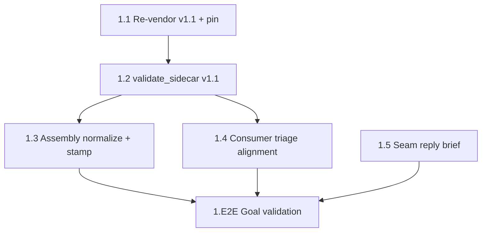

# Sprint Plan — Micro-Cycle: Seam-Alignment v1.1 Adoption (cycle-003)

**Date:** 2026-06-11 · **Cycle:** cycle-003 (`seam-alignment-v1.1-adoption`) · **Sprints:** 1 (global #16, local `sprint-1`)
**Source requirements:** Gygax cycle-009 seam brief — `construct-gygax/grimoires/gygax/designs/seam-alignment-v1.1-brief.md` (gygax `main` @ `64f6d75`). No PRD/SDD: micro-cycle scoped directly by the brief + operator instruction, following the cycle-008 brief/status-reply channel precedent.
**Predecessor:** cycle-002 playtest-instrument-v4.1 (archived; global sprints 12–15)

---

## Executive Summary

Gygax shipped `observed-trace/v1.1` — an **additive** minor revision that promotes three Arneson conventions to contract level:

> "v1.1 makes your triage convention, your provenance, and your difficulty stamping first-class on the Gygax side — no action required" (seam-alignment-v1.1-brief.md:107-108)

This single-sprint micro-cycle adopts v1.1 on the Arneson side and answers the brief's three open asks:

1. **Re-vendor** the v1.1 contract files (`observed-trace.v1.schema.json` + `observed-trace-batch.v1.md` at gygax ≥ `ecefcd5`) with VENDOR.yaml sha256 pin update. *Forcing function:* the `arneson-with-gygax` CI leg byte-diffs vendored copies against the live gygax checkout (`scripts/ci/vendor-drift-guard.sh`) — gygax `main` already carries v1.1 bytes, so the composed leg is red until we re-vendor.
2. **Accept v1.1 producers** in `validate_sidecar.py`: `run.status` `"infra-failure"` + optional `producer.provenance` (4 opaque string keys, unknown keys rejected).
3. **Implement the v1.1 SHOULD** at sidecar-assembly time: map the wrapper `INFRA_MARKER` to `run.status: "infra-failure"` (canonical triage order: status → narration marker → observation; **marker wins** over a producer-supplied observation) and **stamp `producer.provenance`** so batches are self-describing after separation from the sweep record.
4. **Reply brief to Gygax** (docs-only) carrying: the canonical 9-value signal taxonomy, our check-dominance position (keep our implementation + their conformance pin), and our OQ-B preference (batch-relative pinned in a future rev).

**Invariant:** all changes additive; every existing test stays green.

### Difficulty convention — explicitly no task

> "documentation-only — you already conform … sweeps populate the axis with zero producer work: just keep stamping the per-config value" (seam-alignment-v1.1-brief.md:39-45)

The re-vendored batch doc carries the convention text; nothing Arneson-side changes.

---

## Sprint 1 (global #16): observed-trace v1.1 Adoption + Seam Reply

**Scope:** MEDIUM (6 tasks) · **Start:** 2026-06-11 · **Mode:** single `/run sprint-1` session

**Sprint Goal:** Arneson validates, produces, and triages `observed-trace/v1.1` records — vendored pin updated, infra-failure mapped and provenance stamped at assembly — and the seam reply (taxonomy / check-dominance / OQ-B) is on disk for Gygax.

### Deliverables

- [ ] Vendored v1.1 contract files byte-identical to gygax `64f6d75`, VENDOR.yaml pins updated
- [ ] `validate_sidecar.py` accepts `infra-failure` + `producer.provenance` (unknown keys rejected)
- [ ] Assembly-time normalization: `INFRA_MARKER` → `infra-failure` mapping + provenance stamping (shared module + CLI)
- [ ] Consumer triage alignment: `sweep_report.py` / `validate_batch.py` recognize `infra-failure` status
- [ ] `grimoires/loa/discovery/gygax-seam-reply-v1.1.md` (taxonomy, check-dominance position, OQ-B preference)
- [ ] All pre-existing `test-*.sh` suites green unchanged; new behavior covered by new test cases

### Acceptance Criteria

- [ ] `shasum -a 256` of both vendored files matches VENDOR.yaml pins AND upstream gygax bytes (`df3f789b…` schema, `d04dabfa…` batch doc); `scripts/ci/vendor-drift-guard.sh` exits 0 against the sibling checkout
- [ ] `validate_sidecar.py` exits 0 on: a v1.0 sidecar (regression), an `infra-failure` sidecar without observation, a sidecar with full 4-key `producer.provenance`
- [ ] `validate_sidecar.py` exits 2 on: unknown `producer.provenance` key, non-string provenance value, `infra-failure` + `observation` present
- [ ] A sidecar with `status: "completed"` + narration matching `ERROR: \[[A-Za-z0-9_-]*(?:agent|wrapper)\]` is rewritten at assembly to `status: "infra-failure"` with observation removed (marker wins); a sidecar with non-conforming `ERROR: [x]` prose is NOT rewritten
- [ ] Sidecars with `status` already `runner-error`/`timeout`/`infra-failure` pass through assembly unchanged (status is first in triage order)
- [ ] Provenance stamping writes only the 4 contract keys; refuses (exit 1) to overwrite an existing key with a *different* value; idempotent on re-run
- [ ] `sweep_report.py` counts a `status: "infra-failure"` sidecar in the `infra` column (excluded from ratios)
- [ ] Reply brief quotes the 9-value taxonomy verbatim from `schemas/core/session-events-base.schema.yaml:84` and flags `bottleneck` (digest-ttrpg.schema.yaml:81) as digest-side drift
- [ ] All 10 existing `domains/agent-systems/scripts/test-*.sh` suites pass unchanged

### Technical Tasks

- [ ] **Task 1.1: Re-vendor v1.1 contract + update VENDOR.yaml pin** → **[G-1]**
  - Byte-exact copy from `construct-gygax` @ `64f6d75dfaac3ab857fc58c265308b65ca9835aa` (files last changed at `ecefcd5`, satisfying the brief's ≥ `ecefcd5` requirement, seam-alignment-v1.1-brief.md:56-58):
    - `schemas/observed-trace.v1.schema.json` → `domains/agent-systems/schemas/vendor/` (sha256 `df3f789b40fa21456c51432a3bcbcab36755bcba95ea54f0f62bfaa5be0fafcd`)
    - `schemas/observed-trace-batch.v1.md` → same (sha256 `d04dabfaca79687b6c21414095dae45576b17a0e7362b7a78de92a25e30081c3`)
  - Update `VENDOR.yaml`: both `sha256` pins, `upstream.git_sha: 64f6d75…`, `vendored_at: "2026-06-11"`. These remain GYGAX'S FILES — never edited here (VENDOR.yaml header contract).
  - Verify: `validate_sidecar.py` / `validate_batch.py` vendor self-checks pass; `ARNESON_GYGAX_ROOT=../construct-gygax ./scripts/ci/vendor-drift-guard.sh` exits 0.
  - Per VENDOR.yaml's own instruction: "REVISIT validate_sidecar.py / validate_batch.py against the new bytes before producing any batch" → Tasks 1.2/1.4 are that revisit.

- [ ] **Task 1.2: `validate_sidecar.py` v1.1 acceptance** → **[G-1]**
  - `STATUS_ENUM` (validate_sidecar.py:33) += `"infra-failure"`.
  - `_validate_producer` (validate_sidecar.py:106-121): allow optional `provenance` in the extra-keys set; validate as an object whose allowed keys are exactly `{agent_cmd_sha256, engine_git_sha, model_id, construct_sha}` (upstream schema `additionalProperties: false`), each value a string ("opaque strings, unknown keys rejected, displayed never interpreted", seam-alignment-v1.1-brief.md:32-33). One helper per block — only the producer helper and the run enum change (validator structure contract, validate_sidecar.py:14-16).
  - `_validate_allof` (validate_sidecar.py:231-232): extend the no-observation rule to `infra-failure` — upstream allOf[2] is `status != "completed" → no observation`, and the v1.1 batch doc pins "An `infra-failure` sidecar MUST NOT carry an `observation`".
  - Tests in `test-validate-sidecar.sh`: 3 accept + 3 reject cases per Acceptance Criteria; all existing cases untouched.

- [ ] **Task 1.3: Assembly-time normalization — marker→status mapping + provenance stamping** → **[G-2]**
  - New stdlib-only `domains/agent-systems/scripts/normalize_sidecars.py` (importable module + CLI, mirroring existing script conventions): for each sidecar JSON in a batch's `sidecars/`:
    1. **Triage mapping (canonical order, status first):** if `run.status` ∈ {`runner-error`, `timeout`, `infra-failure`} → untouched. Else if `narration` matches `INFRA_MARKER = ERROR: \[[A-Za-z0-9_-]*(?:agent|wrapper)\]` (byte-equal to validate_batch.py:31 / sweep_report.py:32, as the contract pins) → set `run.status: "infra-failure"` and **remove** any producer-supplied `observation` ("The marker wins over a producer-supplied observation", batch doc v1.1 triage section). This is stamping, not judging (G-4 posture per validate_batch.py:128-131 comment).
    2. **Provenance stamping:** repeated `--provenance <key>=<value>` flags (keys restricted to the 4 contract keys) merged into `producer.provenance`. Existing identical value = no-op; existing *different* value = exit 1 loudly (self-describing batches must not silently disagree). Idempotent.
  - `assemble_batch.py`: import and apply the normalize pass to each sidecar it copies (sim lane gets normalization for free); accept and forward optional `--provenance` flags.
  - `project_trace.py` (sim lane): stamp `producer.provenance: {model_id, construct_sha}` from the native preamble `provenance` block it already reads (project_trace.py:99-102 — currently only flattened into `producer.detail` prose).
  - `skills/playout/SKILL.md`: real/sweep lane — add the normalize+stamp step between State 4 (engine dispatch) and State 5 (conformance gate), passing `engine_git_sha` (known from State 2) and `agent_cmd_sha256` (already computed for the sweep record, SKILL.md:258) — "stamping the same values into sidecars makes a batch self-describing after it is separated from the sweep record" (seam-alignment-v1.1-brief.md:34-36). Clarify the State-5 bright line: contract-sanctioned v1.1 normalization at assembly is NOT "editing a sidecar to make validation pass".
  - New `test-normalize-sidecars.sh` following the existing test-script pattern; covers marker-wins, non-conforming-prose negative, status-first passthrough, provenance refuse-on-conflict, idempotency.

- [ ] **Task 1.4: Consumer triage alignment (`sweep_report.py`, `validate_batch.py`)** → **[G-2]**
  - `sweep_report.py` `triage()` (sweep_report.py:52-55): status set `("runner-error", "timeout")` += `"infra-failure"` — the canonical order is already implemented (status → marker → observation); only the new enum value is missing.
  - `validate_batch.py`: accept `infra-failure` wherever status is consulted; skip the marker honesty-warn (validate_batch.py:133-141) when `run.status` is already `"infra-failure"` (the record is explicitly triaged — warning would be noise for conforming v1.1 batches). Warn-not-reject posture unchanged; marker-only (pre-v1.1) batches still warn.
  - Test cases added to `test-sweep-report.sh` + `test-validate-batch.sh`; existing cases untouched.

- [ ] **Task 1.5: Seam reply brief (docs-only)** → **[G-3]**
  - `grimoires/loa/discovery/gygax-seam-reply-v1.1.md`, following the cycle-008 brief/status-reply channel precedent. Carries exactly three positions:
    1. **Signal taxonomy** (answers "still awaiting your 9-value list", seam-alignment-v1.1-brief.md:96): the canonical 9 values from `schemas/core/session-events-base.schema.yaml:84` — `safety, insight, concern, friction, praise, confusion, delight, surprise, boredom` — with the digest-ttrpg `bottleneck` key (domains/ttrpg/schemas/digest-ttrpg.schema.yaml:81) explicitly flagged as digest-side drift to be cleaned up on our side, NOT part of the taxonomy.
    2. **Check-dominance position** (answers "your call", seam-alignment-v1.1-brief.md:75-76): we keep our own `check_payoff_dominance.py` implementation with Gygax's conformance pin covering the seam — standalone-plus-composable, no hard sibling dependency. Acknowledge the two documented surface differences (sampling granularity; missing-intent exit semantics) and commit to flagging any fixture with sub-integer crossings.
    3. **OQ-B preference** (answers seam-alignment-v1.1-brief.md:98-103): we emit absolute `fixture` paths today (`assemble_batch.py` resolves `fixture_abs`), so cwd-relative resolution doesn't bite us; our preference is **batch-relative, pinned in a future rev**, for batch portability.
  - No references to private/upstream games anywhere in the brief; the construct stands alone.

- [ ] **Task 1.E2E: End-to-End Goal Validation** (P0 — Must Complete) → **[G-1] [G-2] [G-3]**
  - All 10 pre-existing `domains/agent-systems/scripts/test-*.sh` + new `test-normalize-sidecars.sh` green.
  - Hermetic pipeline proof: project → materialize → assemble (with `--provenance` flags) a sim batch containing one sidecar whose narration carries a conforming infra marker → assembled copy carries `status: "infra-failure"`, no observation, stamped provenance → `validate_sidecar.py` + `validate_batch.py` exit 0 against the **re-vendored** pin → `sweep_report.py` table shows the run in the `infra` column, excluded from ratios.
  - `vendor-drift-guard.sh` green against the gygax sibling checkout.
  - Reply brief exists, quotes the taxonomy verbatim, carries all three positions.
  - Additivity regression: existing v1.0 fixture sidecars (e.g. `resources/fixtures/synthetic-incentive/runs/*/sidecars/*.json`) still validate.

### Dependencies

- **Task ordering:** 1.1 → 1.2 → {1.3, 1.4} → 1.E2E; 1.5 independent (docs-only, can run any time before E2E).
- **External:** `construct-gygax` sibling checkout at ≥ `ecefcd5` (present locally at `64f6d75`; CI checks out gygax `main`). No gygax-side action required — "Nothing here requires synchronous action" (seam-alignment-v1.1-brief.md:5-6).
- **Stdlib-only rule:** all new/changed Python stays stdlib-only, matching every existing script in `domains/agent-systems/scripts/`.

### Risks & Mitigation

| Risk | Mitigation |
|------|------------|
| CI vendor-drift-guard tracks gygax `main` unpinned — composed leg red until re-vendor lands, and re-reddens on future gygax contract pushes | Task 1.1 lands first; known accepted posture ("Drift is loud, never approximated"). Reply brief notes we've adopted v1.1. |
| Marker-wins drops a producer-supplied observation (destructive rewrite) | Normalization touches only the assembled batch copy, never the source projected trace; contract mandates infra-failure carries no observation; negative test pins that non-conforming `ERROR: [x]` prose is untouched. |
| Provenance stamping silently overwriting engine-written values | Refuse-on-conflict (exit 1) + idempotency test. |
| `validate_batch.py` warn-suppression accidentally weakening the pre-v1.1 marker fallback | Suppress ONLY when status is already `infra-failure`; marker-only batches still warn — covered by existing test cases staying green. |
| Sub-integer payoff crossings diverging from gygax's integer-step sampling (brief §2 difference 1) | Out of scope; commitment recorded in reply brief to flag any such fixture when authored. |

### Success Metrics

- 11/11 test suites green (10 existing unchanged + 1 new)
- 2/2 vendored files byte-identical to upstream; 2/2 sha256 pins match
- 6/6 new validator cases behave per Acceptance Criteria
- 3/3 reply-brief positions delivered (taxonomy, check-dominance, OQ-B)
- 0 modifications to any pre-existing test expectation

---

## Appendix A: Task Dependencies

## Appendix C: Goal Traceability

No PRD exists for this micro-cycle; goals are auto-assigned from the operator-scoped requirements (logged to trajectory).

| ID | Goal | Contributing Tasks | Validation |
|----|------|--------------------|------------|
| G-1 | Vendored contract pinned at v1.1 (≥ `ecefcd5`); validators accept v1.1 producer records; drift guard green | 1.1, 1.2, 1.E2E | sha256 match + 6 validator cases + v1.0 regression |
| G-2 | Arneson-assembled batches implement the v1.1 SHOULD: marker→`infra-failure` at assembly (canonical triage order, marker wins) + self-describing `producer.provenance`; consumers triage the new status | 1.3, 1.4, 1.E2E | Hermetic pipeline proof + infra column in sweep table |
| G-3 | Seam reply delivered: 9-value taxonomy (+ `bottleneck` drift flag), check-dominance position, OQ-B preference | 1.5, 1.E2E | Brief on disk with all three positions, taxonomy verbatim from source |

All three goals have contributing tasks; the final (only) sprint carries the E2E validation task. No warnings.
