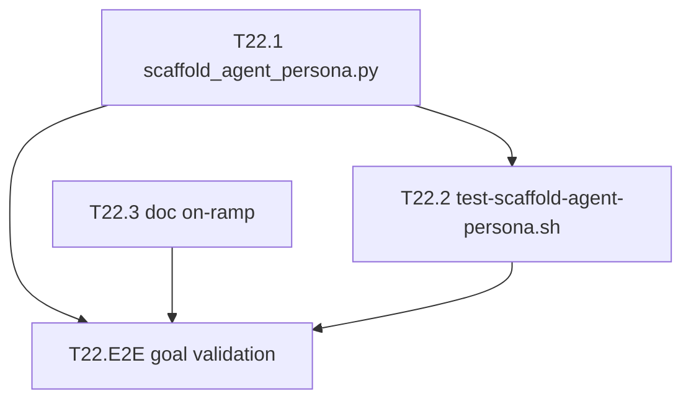

# Sprint Plan — cycle-005 · voice→agent-persona authoring bridge

> **Cycle:** cycle-005 (micro, 1 sprint) · **Label:** voice-persona-bridge
> **Global sprint:** 22 (local: sprint-1) · **Type:** feature (small)
> **Source of truth:** `grimoires/loa/context/voice-persona-bridge-brief.md` (brief-as-requirements; no separate PRD/SDD — micro-cycle precedent: cycle-003)
> **Execution path:** `/run sprint-22` (implement → review → audit). Not implemented during planning.
> **Date:** 2026-06-16

---

## Executive Summary

One SMALL sprint (3 tasks) delivers `scaffold_agent_persona.py` — a stdlib-only
scaffolder, sibling to `domains/agent-systems/scripts/scaffold_playtest.py`, that
emits a **schema-valid `agent-persona` skeleton** from a `/voice` output (or blank).

The bridge removes the hand-transcription step in `importing-an-agent.md`: authoring
a persona now starts from a valid file with provenance + a DRAFT-seeded disposition,
instead of a blank schema. Task-behavior fields stay **guided TODO stubs** the human
fills — the scaffolder never fabricates behavior from dialogue.

> From brief (L11-12): "A scaffolder that bootstraps a **schema-valid, runnable
> `agent-persona` skeleton** from a voice (or blank), so authoring starts from a
> valid file instead of a blank schema — removing the hand-transcription step and
> guaranteeing validity."

**Why one sprint:** three tightly-coupled deliverables (script + test + doc on-ramp)
around a single artifact, mirroring the existing `scaffold_playtest.py` shape.

---

## Primary Goals (extracted from brief)

| ID  | Goal | Measurement | Validation Method |
|-----|------|-------------|-------------------|
| G-1 | Bootstrap a schema-valid `agent-persona` skeleton from a voice or blank | `--from-voice akane` and `--blank` both emit YAML that round-trips through `restricted_yaml` and passes self-check (exit 0) | T22.2 test asserts schema-valid output for both paths |
| G-2 | Guarantee provenance + DRAFT disposition without fabricating task-behavior | `source.{ref,sha256,kind}` present; `disposition` seeded from voice prose marked "edit me"; capabilities/knowledge/rung_overlays are TODO stubs | T22.2 asserts seeded disposition + provenance + TODO stubs present |
| G-3 | Faster on-ramp for the manual import procedure | Short "scaffold a persona from a voice" note appended to `importing-an-agent.md` pointing at the new script | T22.3 doc review; on-ramp references `scaffold_agent_persona.py` |

> Goal-to-task mapping: see Appendix C.

---

## Grounding (source citations)

- **Target schema** — `domains/agent-systems/schemas/agent-persona.schema.yaml`:
  required fields are `persona_id`, `source{ref,sha256,kind}`, `disposition`,
  `capabilities` (list[string]), `knowledge{knows,does_not_know}`,
  `rung_overlays{blind,reward-aware,adversarial}`.
- **Template / exemplar** — `domains/agent-systems/resources/personas/neutral-agent.yaml`
  (the only existing persona; field order + `source.kind: behavioral-spec` shape).
- **Sibling scaffolder (pattern to mirror)** — `scaffold_playtest.py`:
  stdlib-only, `err()` prints `ERROR: [scaffold_playtest] ...`, exit `0/1/2`,
  self-check on write (R-2: "never ship a subtly-broken fixture"), `--id` kebab-case
  guard so it "can never influence the output path" (L161), `--out` `..`-traversal
  refusal (SEC-001, L185-190).
- **Round-trip parser** — `restricted_yaml.py` exposes `parse(text)` / `parse_file(path)`.
- **Voice fixture** — `grimoires/arneson/voices/npcs/akane.yaml` (has
  `display_name`, `emotional_register`, `speech_patterns`, etc. — the prose to seed
  `disposition` from). `akane-canon.yaml` also present.
- **Test discovery** — `scripts/test.sh` globs `domains/*/scripts/test-*.sh`
  (L17), so a sibling `test-scaffold-agent-persona.sh` is "picked up with zero wiring."
- **Doc on-ramp target** — `domains/agent-systems/docs/importing-an-agent.md`
  (49 lines; "documented procedure, not a script" — the note adds the script as a
  faster start, not a replacement for the prose-to-prose review).

---

## Sprint 22 (local sprint-1) — voice→agent-persona scaffolder

**Scope:** SMALL (3 tasks)

**Sprint Goal:** Ship a stdlib-only `scaffold_agent_persona.py` that emits a
schema-valid, provenance-pinned, DRAFT-seeded `agent-persona` skeleton from a voice
or blank, with a sibling test and a doc on-ramp — never fabricating task-behavior.

### Deliverables

- [ ] `domains/agent-systems/scripts/scaffold_agent_persona.py` — stdlib-only scaffolder
- [ ] `domains/agent-systems/scripts/test-scaffold-agent-persona.sh` — sibling domain test (auto-discovered by `scripts/test.sh`)
- [ ] On-ramp note appended to `domains/agent-systems/docs/importing-an-agent.md`

### Acceptance Criteria

**Functional (the script):**
- [ ] `--from-voice akane` reads `grimoires/arneson/voices/npcs/akane.yaml` and emits a schema-valid `agent-persona` skeleton to `domains/agent-systems/resources/personas/akane.yaml` (default `--out`), with:
  - [ ] `persona_id` = the npc id
  - [ ] `source: {ref: <voice file path>, sha256: <of that file>, kind: behavioral-spec}` — provenance traceable
  - [ ] `disposition`: a **DRAFT** seeded from the voice's personality/description prose, marked "edit me"
  - [ ] `capabilities` / `knowledge{knows,does_not_know}` / `rung_overlays{blind,reward-aware,adversarial}`: **guided TODO stubs** with **NAMED** rung keys (`blind`/`reward-aware`/`adversarial`, NOT numeric)
- [ ] `--blank --id <name>` emits a valid skeleton with no source-from-voice (`source.ref` points at its own spec stub, per `neutral-agent.yaml` precedent)
- [ ] `--out` defaults to `domains/agent-systems/resources/personas/<id>.yaml`; honored when given
- [ ] **Self-check on write**: emitted YAML is parsed back (round-trips through `restricted_yaml`) and all required `agent-persona` fields are asserted present + well-formed; **exit 2** if its own output is broken (mirrors `scaffold_playtest.py` R-2)
- [ ] **Deterministic**: byte-equal output across runs (stable field order, no clock/random)
- [ ] Missing/invalid voice → **exit 1** with `ERROR: [scaffold_agent_persona] ...`
- [ ] Input errors (missing required flag, bad `--id`, `..` traversal in `--out`) → **exit 1**; exit codes `0` ok / `1` input error / `2` self-check failed

**Test (T22.2):**
- [ ] `test-scaffold-agent-persona.sh` is a sibling to existing `domains/*/scripts/test-*.sh` and runs green under `scripts/test.sh`
- [ ] Asserts: `--from-voice akane` (fixture) → schema-valid skeleton with seeded disposition + provenance + TODO stubs; `--blank` path valid; missing-voice → exit 1; deterministic byte-equal across two runs

**Doc (T22.3):**
- [ ] `importing-an-agent.md` gains a short "scaffold a persona from a voice" note referencing `scaffold_agent_persona.py` as the fast on-ramp into the existing procedure (does not delete or contradict the prose-to-prose honesty rule)

**HARD GUARDRAILS (load-bearing — must hold):**
- [ ] **Scaffolds, does NOT auto-convert** — capabilities/knowledge/rung_overlays are TODO stubs; task-behavior is NEVER fabricated from dialogue/voice prose
- [ ] **NOT wired to the gap report** — no auto-optimization of a persona against divergence; no import of `gap_report.py`; human stays the author
- [ ] **Standalone-plus-composable** — no edit to the `/voice` skill; no cross-domain runtime coupling; the voice file is read for provenance/seed only
- [ ] **stdlib-only** — no third-party imports (matches `scaffold_playtest.py`)

### Technical Tasks

- [ ] **T22.1 — `scaffold_agent_persona.py`** → **[G-1] [G-2]**
  - Arg parse (manual, sibling-style): `--from-voice <npc-id>` XOR `--blank --id <name>`; `--out` (default `domains/agent-systems/resources/personas/<id>.yaml`). Reject providing both/neither input modes → exit 1.
  - `--id` / npc-id kebab-case guard so it can never influence the output path (port `scaffold_playtest.py` L161); `--out` `..`-traversal refusal (SEC-001).
  - `--from-voice`: read `grimoires/arneson/voices/npcs/<id>.yaml`; missing/unparseable → exit 1 with `ERROR: [scaffold_agent_persona] ...`. Compute `sha256` of the voice file; set `source = {ref, sha256, kind: behavioral-spec}`. Seed `disposition` (DRAFT, "edit me") from the voice's personality/description prose (e.g. `display_name` + an `emotional_register`/`speech_patterns` summary) — **descriptive grounding, not task-behavior**.
  - `--blank`: `source.ref` points at an own-spec stub (neutral-agent precedent); `disposition` is a blank "edit me" stub.
  - Emit `capabilities` (list), `knowledge.{knows,does_not_know}`, `rung_overlays.{blind,reward-aware,adversarial}` as **guided TODO stubs** with **named** rung keys. Stable field order; no clock/random (deterministic).
  - Self-check on write: re-parse via `restricted_yaml.parse_file`, assert required fields present/well-formed; exit 2 on broken output.
  - Exit `0/1/2`; `err()` prefix `ERROR: [scaffold_agent_persona]`.
- [ ] **T22.2 — `test-scaffold-agent-persona.sh`** → **[G-1] [G-2]**
  - Sibling `check name expected cmd...` harness (port `test-scaffold-playtest.sh` shape). Hermetic temp `--out`.
  - Cases: `--from-voice akane` → exit 0 + emitted file parses + has seeded disposition + `source.sha256` non-empty + named rung keys + TODO-stub markers; `--blank --id foo` → exit 0, valid, no voice source; missing voice (`--from-voice nope`) → exit 1; determinism (two runs → `diff` byte-equal). Guardrail assertions: no numeric rung keys; capabilities/knowledge are stubs not voice-derived.
- [ ] **T22.3 — doc on-ramp** → **[G-3]**
  - Append a short "Scaffold a persona from a voice" section to `importing-an-agent.md`: one-liner usage (`python3 scripts/scaffold_agent_persona.py --from-voice <id>`), what it seeds vs. what stays TODO, and a pointer back to step 3+ of the existing procedure (the human still authors task-behavior + reviews).
- [ ] **T22.E2E — End-to-End Goal Validation** (P0, Must Complete) → **[G-1] [G-2] [G-3]**
  - G-1: run `scaffold_agent_persona.py --from-voice akane --out <tmp>` then `restricted_yaml.parse_file(<tmp>)` succeeds AND the script's own self-check exits 0.
  - G-2: emitted file contains non-empty `source.sha256`, a `disposition` with the "edit me"/DRAFT marker, and TODO stubs (not voice-derived behavior) for capabilities/knowledge/rung_overlays.
  - G-3: `importing-an-agent.md` contains the on-ramp note naming `scaffold_agent_persona.py`.
  - Guardrails: `grep` confirms no `gap_report` import in the script; no change to any `/voice` skill file; no third-party import.

### Dependencies

- **Internal (existing, present):** `domains/agent-systems/schemas/agent-persona.schema.yaml`, `resources/personas/neutral-agent.yaml`, `scripts/restricted_yaml.py`, `scripts/scaffold_playtest.py` (pattern), `grimoires/arneson/voices/npcs/akane.yaml` (test fixture), `scripts/test.sh` (auto-discovery).
- **Cross-task:** T22.2 depends on T22.1 (tests the script); T22.3 independent; T22.E2E depends on T22.1 + T22.3.
- **External:** none. Python 3 stdlib only.

### Risks & Mitigation

| Risk | Mitigation |
|------|------------|
| Disposition seeding drifts toward fabricating task-behavior from dialogue | Seed `disposition` ONLY (descriptive prose); capabilities/knowledge/rung_overlays remain TODO stubs. T22.2 asserts the boundary; T22.E2E greps for guardrail violations. |
| Schema fields hand-mirrored and drift from `agent-persona.schema.yaml` | Self-check re-parses emitted YAML and asserts each required field; exit 2 on mismatch (mirrors scaffold_playtest R-2). |
| Voice YAML shape varies across npcs (akane vs future voices) | Seed defensively from a small set of well-known keys (`display_name`, personality/emotional prose) with graceful fallback to a generic "edit me" stub; never hard-require optional voice keys. |
| Non-determinism via dict ordering or timestamps | Emit fields in a fixed literal order; no `datetime`/`random`; T22.2 byte-equal `diff` across two runs. |
| `--out` default writes into `resources/personas/` during the test | Tests use a hermetic temp `--out`; never rely on the default path in CI. |
| Accidental coupling to gap report / `/voice` skill | No import of `gap_report.py`; no write outside the persona output path; T22.E2E grep guardrail. |

### Success Metrics

- `scripts/test.sh` runs `test-scaffold-agent-persona.sh` green (auto-discovered).
- `--from-voice akane` and `--blank --id foo` both produce skeletons that round-trip through `restricted_yaml` and pass the script's self-check (exit 0).
- Two consecutive runs produce byte-identical output (deterministic).
- Missing voice → exit 1; broken self-output → exit 2 (verified reachable in test).
- Zero third-party imports; zero edits to `/voice` skill files; zero `gap_report` references.

---

## Risk Register (cycle-level)

| ID | Risk | Severity | Mitigation | Owner Task |
|----|------|----------|------------|------------|
| R-1 | Scaffolder fabricates task-behavior from dialogue (guardrail breach) | High | TODO stubs only for capabilities/knowledge/rung_overlays; tested + grepped | T22.1, T22.2, T22.E2E |
| R-2 | Emitted skeleton diverges from schema | Med | Self-check re-parse + required-field asserts; exit 2 | T22.1 |
| R-3 | Hidden coupling to gap report or `/voice` skill | Med | Standalone script; grep guardrail in E2E | T22.E2E |
| R-4 | Non-deterministic output | Low | Fixed field order, no clock/random; byte-equal test | T22.1, T22.2 |

---

## Appendix C: Goal Traceability

| Goal | Description | Contributing Tasks |
|------|-------------|--------------------|
| G-1 | Schema-valid skeleton from voice or blank | T22.1, T22.2, T22.E2E |
| G-2 | Provenance + DRAFT disposition, no fabricated behavior | T22.1, T22.2, T22.E2E |
| G-3 | Faster on-ramp for manual import | T22.3, T22.E2E |

**Coverage check:** All goals (G-1, G-2, G-3) have ≥1 contributing task. ✓
**E2E validation:** T22.E2E present in the (only) sprint, P0. ✓
No warnings.

---

## Appendix A: Task Dependencies

